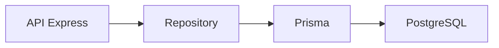

# UserManager API

Reto opcional de construcción de una API REST de gestión de usuarios.

## Descripción

Este proyecto tiene como objetivo construir paso a paso una API REST capaz de
gestionar usuarios, autenticación, roles, seguridad, base de datos e integración
con un frontend.

## Instalación

1. **Instalar dependencias:**

```bash
npm install
```

2. **Arrancar en modo desarrollo:**

```bash
npm run dev
```

La API se ejecutará inicialmente en:

```text
http://localhost:3000
```

## Endpoints disponibles

**1. Estado y Comprobación**

`GET /api/health` — Comprueba el estado general del servidor.

`GET /api/ping` — Endpoint simple de respuesta rápida (`pong`).

**2. Endpoints de Usuarios (En Memoria)**

`GET /api/users` — Devuelve el listado completo de usuarios cargados en memoria.

`GET /api/users/:id` — Devuelve un usuario concreto a partir de su ID (maneja errores 400 si el ID no es válido y 404 si no existe).

`POST /api/users` — Simulación para la creación de usuarios.

`PATCH /api/users/:id `— Simulación para la actualización parcial de un usuario.

`DELETE /api/users/:id` — Simulación para la eliminación de un usuario.

Estos endpoints todavía no trabajan con datos reales. De momento sirven para
practicar métodos HTTP, rutas, parámetros y body.

3. **Rutas Temporales de Debug**

Estas rutas se han creado para practicar cómo leer datos de una petición HTTP y podrán eliminarse en fases avanzadas.

```http
POST /api/debug/body
GET /api/debug/params/:id
GET /api/debug/query
GET /api/debug/headers
PATCH /api/debug/users/:id
```

## Validaciones básicas

La API realiza validaciones manuales antes de crear o actualizar usuarios.

Validaciones principales:

- `name` debe ser un texto no vacío.
- `email` debe ser un texto no vacío.
- `password` debe ser un texto no vacío.
- `password` debe tener al menos 6 caracteres.
- `email` debe contener `@`.
- `isActive` debe ser boolean.

Ejemplo de error:

```json
{
  "error": "El nombre debe ser un texto no vacío"
}
```

### Validación de email

La API normaliza los emails antes de guardarlos o compararlos.

Proceso aplicado:

- `trim()`
- `toLowerCase()`
- Validación básica de formato.
- Comprobación de duplicados.

Ejemplo:

```text
"  USUARIO@EMAIL.COM  " -> "usuario@email.com"
```

Si se intenta crear o actualizar un usuario con un email ya existente, la API
responde:

```json
{
  "error": "El email ya está registrado"
}
```

Código:

```http
409 Conflict
```

## Ejemplos de Respuestas

1. **Listado de Usuarios `GET /api/users`**

```JSON
{
  "message": "Listado de usuarios",
  "total": 3,
  "data": [
    {
      "id": 1,
      "name": "Ana García",
      "email": "ana@email.com",
      "role": "USER",
      "isActive": true
    }
  ]
}
```

---

2. **Consultar Usuario por ID `GET /api/users/1`**

Respuesta Correcta (200 OK):

```JSON
{
  "message": "Usuario encontrado",
  "data": {
    "id": 1,
    "name": "Ana García",
    "email": "ana@email.com",
    "role": "USER",
    "isActive": true
  }
}
```

Posibles Errores:

```json
400 Bad Request: {"error": "El ID debe ser un número"}

404 Not Found: {"error": "Usuario no encontrado"}
```

---

**3. Crear Usuario `POST /api/users`**

Petición (Body JSON):

```Json
{
  "name": "María López",
  "email": "maria@email.com",
  "password": "123456"
}
```

Respuesta Correcta (201 Created):

```json
{
  "message": "Usuario creado correctamente",
  "data": {
    "id": 4,
    "name": "María López",
    "email": "maria@email.com",
    "role": "USER",
    "isActive": true
  }
}
```

Posibles Errores:

Campos obligatorios faltantes (Error 400 Bad request):

```json
{
  "error": "name, email y password son obligatorios"
}
```

Longitud insuficiente de contraseña(Error 400 Bad request):

```json
{
  "error": "La contraseña debe tener al menos 6 caracteres"
}
```

Email duplicado(Error 409 Conflict):

```json
{
  "error": "El email ya está registrado"
}
```

---

**4. Actualizar Usuario `PATCH /api/users`**

Permite modificar parcialmente los datos de un usuario.

Campos permitidos:

```text
name
email
isActive
```

Body de ejemplo:

```json
{
  "name": "Ana Martínez"
}
```

Respuesta correcta:

```json
{
  "message": "Usuario actualizado correctamente",
  "data": {
    "id": 1,
    "name": "Ana Martínez",
    "email": "ana@email.com",
    "role": "USER",
    "isActive": true
  }
}
```

Posibles errores:

```json
{
  "error": "El ID debe ser un número",
  "received": "abc"
}
```

```json
{
  "error": "Usuario no encontrado",
  "id": 999
}
```

```json
{
  "error": "Debes enviar al menos un campo para actualizar"
}
```

```json
{
  "error": "El email ya está registrado"
}
```

---

**5. Eliminar o Desactivar Usuario `DELETE /api/users`**

```http
DELETE /api/users/:id
```

En este proyecto, esta ruta no borra físicamente el usuario. Realiza un borrado
lógico marcando:

```text
isActive = false
```

Respuesta correcta:

```json
{
  "message": "Usuario desactivado correctamente",
  "data": {
    "id": 1,
    "name": "Ana García",
    "email": "ana@email.com",
    "role": "USER",
    "isActive": false
  }
}
```

Posibles errores:

```json
{
  "error": "El ID debe ser un número",
  "received": "abc"
}
```

```json
{
  "error": "Usuario no encontrado",
  "id": 999
}
```

## Códigos de estado utilizados

La API utiliza códigos HTTP para indicar el resultado de cada petición.

| Código | Significado | Uso en el proyecto |
| ---: | --- | --- |
| 200 | OK | Consulta, actualización o desactivación correcta |
| 201 | Created | Usuario creado correctamente |
| 400 | Bad Request | Datos incorrectos o incompletos |
| 404 | Not Found | Usuario no encontrado |
| 409 | Conflict | Email duplicado |

Ejemplo de error 404:

```json
{
  "error": "Usuario no encontrado",
  "id": 999
}
```

Ejemplo de error 409:

```json
{
  "error": "El email ya está registrado"
}
```
## Gestión centralizada de errores

La API utiliza un middleware global para devolver errores con un formato común.

Formato general:

```json
{
  "error": "Mensaje del error",
  "statusCode": 400,
  "details": {},
  "path": "/api/users/abc",
  "method": "GET",
  "timestamp": "2026-01-01T10:00:00.000Z"
}
```

También se ha añadido un middleware para rutas no encontradas:

```http
GET /api/ruta-inventada
```

Respuesta:

```json
{
  "error": "Ruta no encontrada",
  "statusCode": 404
}
```

## Persistencia

Hasta el día 15, la API trabaja con usuarios en memoria.

Esto significa que los datos se pierden al reiniciar el servidor.

A partir de la siguiente fase, prepararemos una base de datos para guardar los
usuarios de forma persistente.

Tabla principal prevista:

```text
users
```

Campos principales:

```text
id
name
email
password_hash
role
is_active
created_at
updated_at
```
## Base de datos con Docker Compose

El proyecto utiliza Docker Compose para levantar PostgreSQL y Adminer.

Servicios:

```text
postgres  -> Base de datos PostgreSQL
adminer   -> Interfaz web para consultar la base de datos
```

Comando para arrancar:

```bash
docker compose up -d
```

Comando para parar:

```bash
docker compose down
```

Adminer:

```text
http://localhost:8080
```

Datos de conexión:

```text
Sistema: PostgreSQL
Servidor: postgres
Usuario: usermanager
Contraseña: usermanager_password
Base de datos: usermanager_db
```

## Modelo persistente User

El modelo principal del proyecto será `User`.

Campos principales:

```text
id
name
email
passwordHash
role
isActive
createdAt
updatedAt
```

Reglas importantes:

```text
email único
passwordHash nunca se devuelve
role por defecto USER
isActive por defecto true
createdAt y updatedAt automáticos
```
Este diseño se convertirá más adelante en un modelo Prisma.

## ORM y acceso a datos

El proyecto usará Prisma como ORM principal para comunicarse con PostgreSQL.

Se ha elegido Prisma porque:

```text
Encaja bien con TypeScript.
Permite definir modelos claros.
Incluye migraciones.
Genera un cliente tipado.
Permite explorar datos con Prisma Studio.
```

Flujo previsto:

```mermaid
API Express → Repository → Prisma → PostgreSQL
```



SQL directo, TypeORM y Sequelize se han considerado como alternativas, pero no serán el camino principal del reto.

## Prisma

Instalación:

```bash
npm install -D prisma
npm install @prisma/client
```

Inicialización:

```bash
npx prisma init --datasource-provider postgresql
```

Archivos importantes:

```text
prisma/schema.prisma
.env
.env.example
```

Validar esquema:

```bash
npx prisma validate
```

Generar cliente:

```bash
npx prisma generate
```

## Modelo Prisma User

El modelo principal del proyecto será `User`.

```prisma
enum Role {
  USER
  ADMIN
}

model User {
  id           Int      @id @default(autoincrement())
  name         String
  email        String   @unique
  passwordHash String
  role         Role     @default(USER)
  isActive     Boolean  @default(true)
  createdAt    DateTime @default(now())
  updatedAt    DateTime @updatedAt
}
```

Reglas principales:

```text
email único
passwordHash obligatorio
role por defecto USER
isActive por defecto true
createdAt automático
updatedAt automático al modificar
```

## Migraciones con Prisma

El proyecto usa Prisma Migrate para versionar la estructura de la base de datos.

Primera migración:

```bash
npx prisma migrate dev --name init
```

Esto genera:

```text
prisma/migrations/<timestamp>_init/migration.sql
```

Y crea en PostgreSQL:

```text
User
_prisma_migrations
```

La tabla `User` almacena los usuarios de la aplicación.

La tabla `_prisma_migrations` guarda el historial interno de migraciones de Prisma.

## Prisma Studio

Prisma Studio permite explorar visualmente los datos de la base de datos.

Comando:

```bash
npx prisma studio
```

O mediante script:

```bash
npm run prisma:studio
```

URL habitual:

```text
http://localhost:5555
```

Uso en el proyecto:

```text
Comprobar tablas.
Revisar usuarios.
Ver datos iniciales del seed.
Comprobar cambios realizados desde la API.
Detectar errores de persistencia.
```

Prisma Studio es una herramienta de desarrollo. La gestión real de usuarios se hará desde la API.
## Documentación del reto

- [Día 1 - Diseño inicial](docs/dia-01-diseno-inicial-usermanager.md)
- [Día 2 - Preparación del Proyecto](docs/dia-02-preparacion-proyecto.md)
- [Día 3 - Primer Endpoint](docs/dia-03-primer-endpoint.md)
- [Día 4 - Métodos HTTP](docs/dia-04-metodos-http.md)
- [Día 5 - JSON, body, params y headers](docs/dia-05-json-body-params-headers.md)
- [Día 6 - Cliente HTTP y depuración](docs/dia-06-cliente-http-depuracion.md)
- [Día 7 - Listado de usuarios en memoria](docs/dia-07-listado-usuarios.md)
- [Día 8 - Consultar usuario por ID](docs/dia-08-consultar-usuario-id.md)
- [Día 9 - Crear usuarios en memoria](docs/dia-09-crear-usuarios.md)
- [Día 10 - Actualizar usuarios en memoria](docs/dia-10-actualizar-usuarios.md)
- [Día 11 - Eliminar o desactivar usuarios en memoria](docs/dia-11-eliminar-desactivar-usuarios.md)
- [Día 12 - Validación manual básica](docs/dia-12-validacion-manual-basica.md)
- [Día 13 - Validación de email y duplicados](docs/dia-13-validacion-email-duplicados.md)
- [Día 14 - Códigos de estado HTTP](docs/dia-14-codigos-estado-http.md)
- [Día 15 - Middleware centralizado de errores](docs/dia-15-middleware-errores.md)
- [Día 16 - Base de datos y persistencia](docs/dia-16-base-datos-persistencia.md)
- [Día 17 - PostgreSQL con Docker Compose](docs/dia-17-postgresql-docker-compose.md)
- [Día 18 - Diseño del modelo persistente User](docs/dia-18-diseno-modelo-persistente-user.md)
- [Día 19 - ORM o acceso a datos](docs/dia-19-orm-acceso-datos.md)
- [Día 20 - Instalación y configuración inicial de Prisma](docs/dia-20-instalacion-prisma.md)
- [Día 21 - Modelo Prisma User](docs/dia-21-modelo-prisma-user.md)
- [Día 22 - Primera migración con Prisma](docs/dia-22-primera-migracion-prisma.md)
- [Día 23 - Prisma Studio](docs/dia-23-prisma-studio.md)


