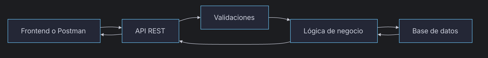

# Día 1:Descripción del Proyecto

UserManager API es una API REST para gestionar usuarios de una aplicación.
Permitirá registrar usuarios, iniciar sesión, consultar perfiles, modificar datos, gestionar roles y proteger rutas privadas mediante autenticación.

---

## Recursos Principales

| Recurso    | Explicación | 
| ------     | -----
| `/auth`    | Servirá para registrar usuarios e iniciar sesión   
| `/users`   | Servirá para consultar, crear, modificar y eliminar usuarios   
| `/health`  | Servirá para comprobar que la API está funcionando   

---

## Modelo de Usuario

- `id`: Identificador único de cada usuario (PK).
- `name`: Nombre del usuario.
- `email`: Correo de cada usuario.
- `passwordHash`: Contraseña cifrada.
- `role`: USER/ADMIN.
- `isActive`: Indica si el usuario está activo o desactivado.
- `createdAt`: Fecha de creación.
- `updatedAt`: Fecha de última modificación.

---

## Endpoints Principales


| Método | Ruta | Descripción | Acceso |
| :--- | :--- | :--- | :--- |
| GET | `/api/health` | Comprueba si la API funciona | Público |
| POST | `/api/auth/register` | Registra un usuario | Público |
| POST | `/api/auth/login` | Inicia sesión | Público |
| GET | `/api/users/me` | Consulta mi perfil | Usuario autenticado |
| GET | `/api/users` | Lista todos los usuarios | **ADMIN** |
| GET | `/api/users/:id` | Consulta un usuario por ID | **ADMIN** o propio usuario |
| PATCH | `/api/users/:id` | Modifica un usuario | **ADMIN** o propio usuario |
| DELETE | `/api/users/:id` | Elimina o desactiva un usuario | **ADMIN** |
| PATCH | `/api/users/me/password` | Cambia mi contraseña | Usuario autenticado |
| PATCH | `/api/users/:id/role` | Cambia el rol de un usuario | **ADMIN** |
| PATCH | `/api/users/:id/status` | Activa o desactiva un usuario | **ADMIN** |

---

## Flujo General



El cliente envía una petición a la API. La API valida los datos, aplica la
lógica necesaria, consulta o modifica la base de datos y devuelve una respuesta.

---

## Reglas 
### Iniciales
- El email no se puede repetir.
- La contraseña no se guarda en texto plano.
- La API nunca devuelve passwordHash.
- Un USER solo puede acceder a su propia información.
- Un ADMIN puede gestionar usuarios.
- Un usuario inactivo no puede iniciar sesión.

### Propuestas
- La contraseña debe tener al menos 8 caracteres.
- Formato de email valido.
- Un usuario no puede cambiar su propio rol.
- El nombre de usuario no puede estar vacio.

---

## Posibles Errores

- Intentar registar un email ya existente -> `409 Conflict`
- Intentar consultar un usuario que no existe -> `404 Not Found`
- La petición está mal formada -> `400 Bad Request`
- No has iniciado sesión o el token no es válido -> `401 Unauthorized`
- Has iniciado sesión, pero no tienes permisos -> `403 Forbidden`
- Error interno del servidor -> `500 Server Error`

---

## Respuesta JSON
`GET /api/users/me`

```Json
{
  "id": 1,
  "name": "Daniel Martín",
  "email": "daniel@email.com",
  "role": "ADMIN",
  "isActive": true,
  "lastOnline": 2026-07-23
}
```
---

## ¿Qué es una API y para qué sirve?

Una API (*Application Programming Interface*) es un "puente" que conecta dos mundos para que una aplicación funcione, es decir el backend con el frontend. Normalmente en formato JSON.

Para ello se sirve de métodos HTTP que conectan endpoints del backend y lo devuelven al frontend, donde los principales son: 
- `GET` -> LEER
- `POST` -> CREAR
- `PUT`-> ACTUALIZAR
- `PATCH`CAMBIOS PARCIALES
- `DELETE` -> ELIMINAR
