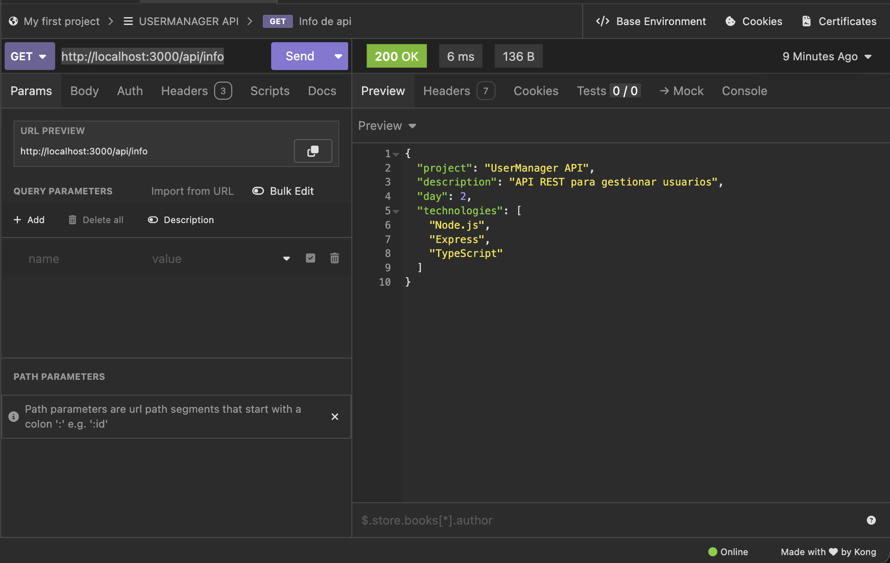
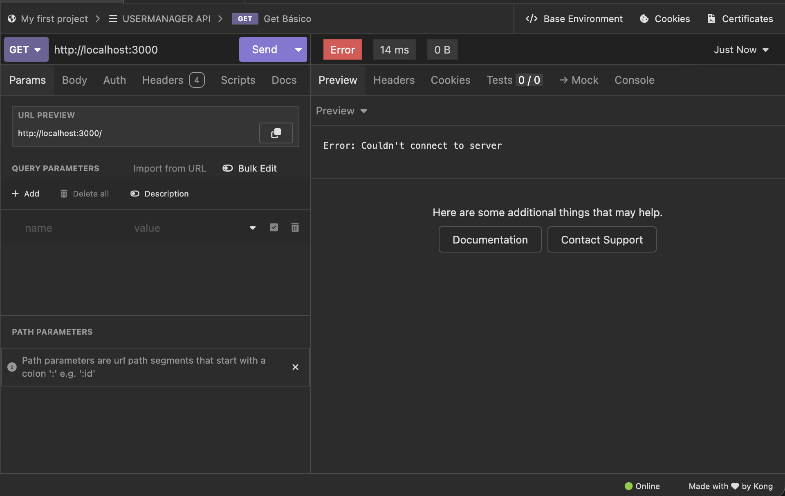
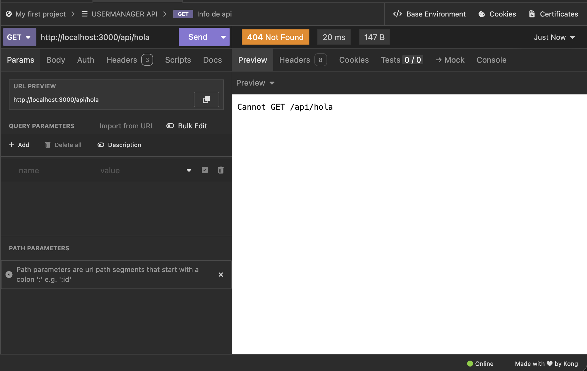
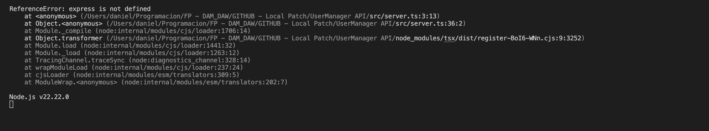

# Día 2: Preparación del proyecto

## Qué he hecho

- He inicializado el proyecto Node.js.
- He instalado Express.
- He configurado TypeScript.
- He creado la carpeta src.
- He creado el archivo src/server.ts.
- He arrancado el servidor en local.
- He probado la respuesta desde navegador y desde Insomnia.

--- 

## Comando para arrancar el proyecto

```bash
npm run dev
```
--- 

## URL de prueba

```text
http://localhost:3000
```
--- 

### Respuesta obtenida

```json
{
     "name": "UserManager API",
     "version": "1.0.0",
     "status": "running",
     "author": "Daniel M.H.",
    "endpoints de ejemplo": {
        "GET /users": "Obtiene todos los usuarios",
        "POST /users": "Crea un nuevo usuario",
        "GET /users/:id": "Obtiene un usuario por ID",
        "PUT /users/:id": "Actualiza un usuario por ID",
        "DELETE /users/:id": "Elimina un usuario por ID",}
}
```


--- 

## URL de de segunda ruta

```text
http://localhost:3000/api/info
```


### Respuesta obtenida

```json
{
	"project": "UserManager API",
	"description": "API REST para gestionar usuarios",
	"day": 2,
	"technologies": [
		"Node.js",
		"Express",
		"TypeScript"
	]
}
```


---

## Explicación personal

- ¿Qué hace el archivo src/server.ts?
```text
El archivo server.ts nos sirve para manejar el servidor de la aplicación, desde aquí podremos recibir consultas GET,PUT, POST...
```
- ¿Qué hace app.listen?
Nos sirve para escuchar al servidor e indicar el puerto de entrada.

- ¿Qué hace app.get?
Nos sirve para obtener información del servidor.

- ¿Por qué usamos express.json?

Usamos express como framework para simplificar las consultas al servidor, pero el metodo express.json permiteque el servidor entienda y procese los datos en formato JSON.

---

## Investigar un error
- Cambiamos el puerto:

Cuando cambiamos el puerto e intentamos acceder a la ruta nos sale el siguiente error:

Nos indica que no se ha podido conectara al servidor, lo solucionamos cambiando al puerto correcto

- Escribimosm mal una ruta:

Cuando escribimos mal una ruta nos sale el clásico error 404:

Hemos de asegurarnos de que siempre escribimos la ruta correcta.

- Borrar temporalmente una importación:

Cuando por ejemplo comentamos `//import express from "express";` nos sale el error de que express no esta definido y por lo tanto no podemos usar el servidor.
