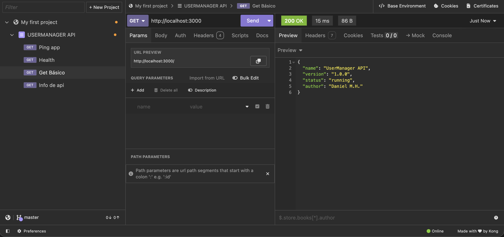
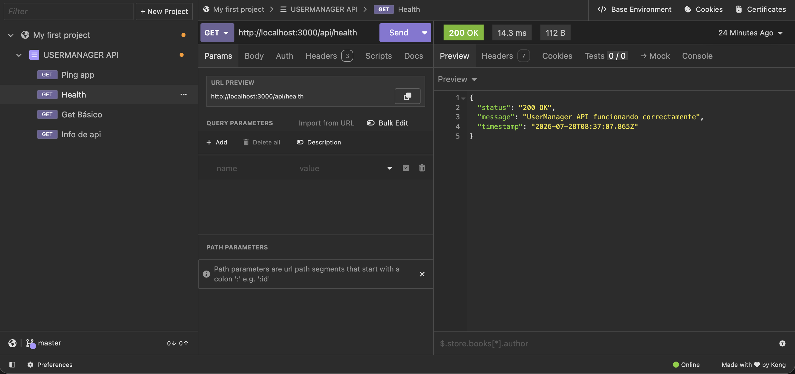
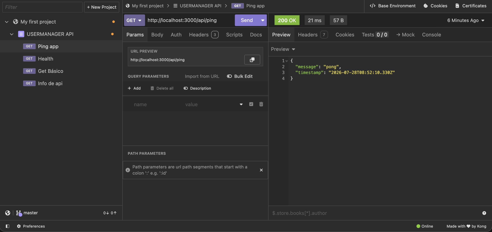

# Día 3: Primer endpoint

## Qué he hecho

- He creado el endpoint `GET /api/health` y `GET /api/ping`.
- He devuelto una respuesta JSON.
- He usado el status code `200`.
- He probado la ruta desde navegador.
- He probado la ruta desde Thunder Client o Postman.
- He probado una ruta incorrecta para comprobar qué ocurre.

## Endpoint creados:

```http
GET /api/health

GET /api/ping

```

### Respuesta obtenida

```json
{
  "status": "ok",
  "message": "UserManager API funcionando",
  "timestamp": "..."
}

{
 "message": "pong",
 "timestamp": "2026-01-01T10:00:00.000Z "
}
```

## Explicación personal

El endpoint `/api/health` sirve para comprobar que la API está funcionando
correctamente. Cuando recibe una petición `GET`, devuelve un JSON con el estado
de la aplicación.

El endpoint `/api/ping`sirve para comprobar que el servidor responde corretamente.

## Tablas comparando las 3 rutas /, /api/health y /api/ping

| Ruta | Método | Para qué sirve |
| --- | --- | --- |
| `/` | `GET` | Mensaje inicial de la API |
| `/api/health` | `GET` | Comprobar el estado de la API |
| `/api/ping` | `GET` | Comprobar respuesta rápida del servidor |

## Pruebas realizadas
```text
GET http://localhost:3000/
GET http://localhost:3000/api/health
GET http://localhost:3000/api/ping
````
| Petición | Código | Resultado obtenido |
| :--- | :---: | :--- |
| `GET /` | 200 | `{"name": "UserManager API", "version": "1.0.0", "status": "running", "author": "Daniel M.H."}` |
| `GET /api/health` | 200 | `{"status": "200 OK", "message": "UserManager API funcionando correctamente", "timestamp": "..."}` |
| `GET /api/ping` | 200 | `{"message": "pong", "timestamp": "..."}` |

- `GET /`

- `GET /api/health`

- `GET /api/ping`

