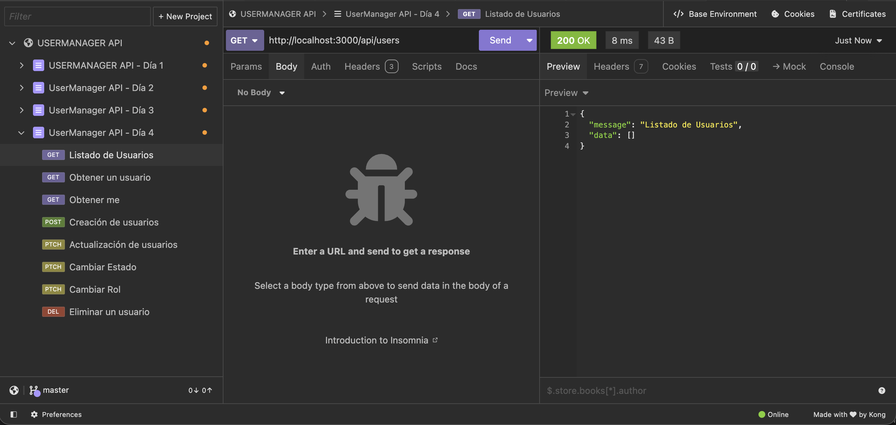
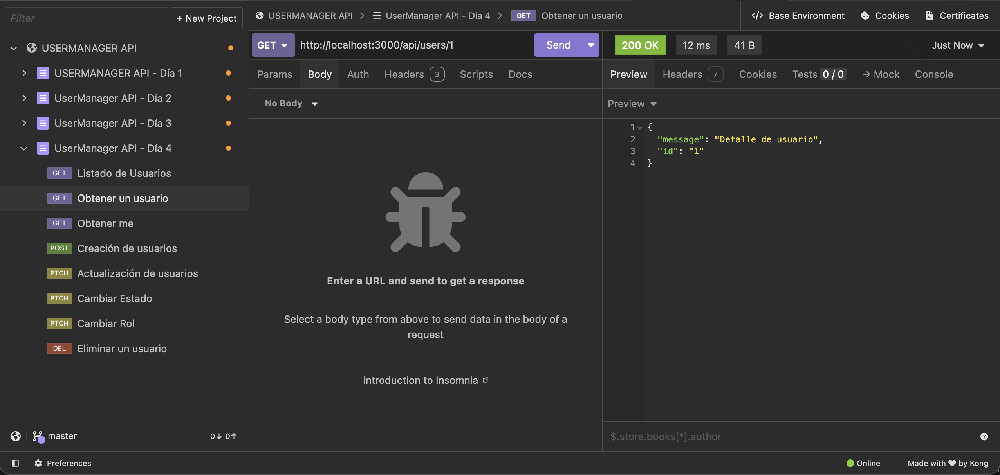
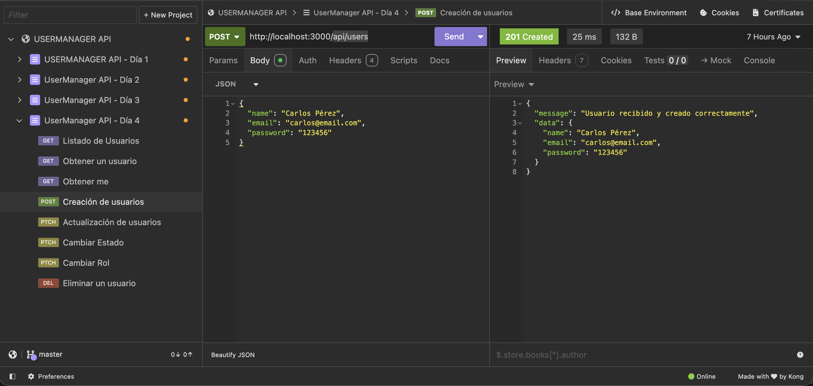
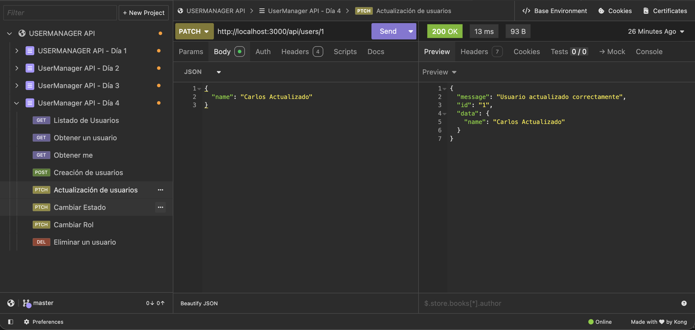
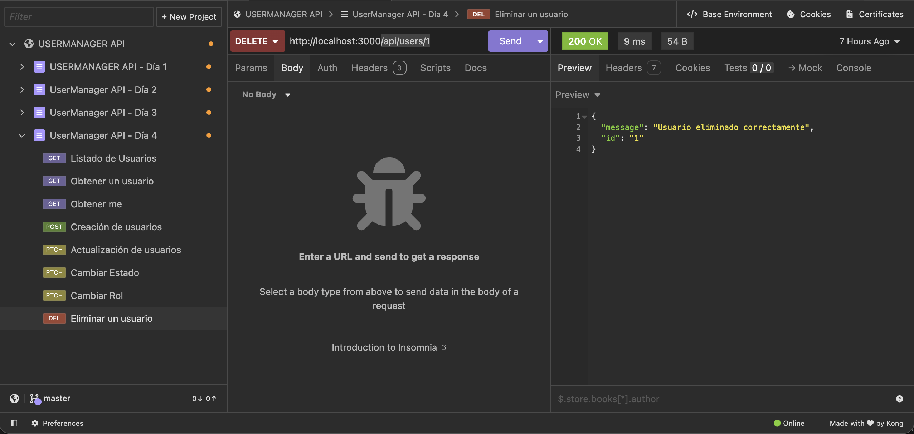

# Día 4: Métodos HTTP

## Qué he hecho

- He creado rutas simuladas para usuarios.
- He probado `GET /api/users`.
- He probado `GET /api/users/:id`.
- He probado `POST /api/users` enviando JSON.
- He probado `PATCH /api/users/:id` enviando JSON.
- He probado `DELETE /api/users/:id`.
- He probado `PATCH /api/users/:id/status` enviando JSON.
- He probado `PATCH /api/users/:id/role` enviando JSON.
- He creado una colección de pruebas en Thunder Client o Postman.

## Endpoints trabajados

```http
GET /api/users
GET /api/users/:id
POST /api/users
PATCH /api/users/:id
PATCH /api/users/:id/status
PATCH /api/users/:id/role
DELETE /api/users/:id
```

## Tabla con pruebas realizadas

| Petición       | Método   | Código esperado | Resultado obtenido                                                             |
| -------------- | -------- | --------------: | ------------------------------------------------------------------------------ |
| `/api/users`   | `GET`    |             200 | `{"message": "Listado de Usuarios", "data": []}`                               |
| `/api/users/1` | `GET`    |             200 | `{"message": "Detalle de usuario", "id": "1"}`                                 |
| `/api/users`   | `POST`   |             201 | `{"message": "Usuario recibido y creado correctamente", "data": { ... }}`      |
| `/api/users/1` | `PATCH`  |             200 | `{"message": "Usuario actualizado correctamente", "id": "1", "data": { ... }}` |
| `/api/users/1` | `DELETE` |             200 | `{"message": "Usuario eliminado correctamente", "id": "1"}`                    |

---

## Para qué sirve cada método:

| Método   | ¿Para qué sirve?                                                 | Ejemplo en UserManager API                                                                                       |
| -------- | ---------------------------------------------------------------- | ---------------------------------------------------------------------------------------------------------------- |
| `GET`    | Sirve para realizar consultas u obtener información del servidor | `app.get("/api/users", ...)` para listar usuarios o `app.get("/api/users/:id", ...)` para ver el detalle de uno. |
| `POST`   | Sirve para crear contenido nuevo en la base de datos             | `app.post("/api/users", ...)` para registrar un nuevo usuario recibiendo datos en el body.                       |
| `PATCH`  | Sirve para modificar información existente en la base de datos   | `app.patch("/api/users/:id/status", ...)` para actualizar únicamente el estado del usuario.                      |
| `DELETE` | Sirve para eliminar entradas de la base de datos                 | `app.delete("/api/users/:id", ...)` para borrar a un usuario por su ID.                                          |

- `GET /api/users`
  

- `GET /api/users/1`
  

- `POST /api/users`
  

- `PATCH /api/users/1`
  

- `DELETE /api/users/1`
  
