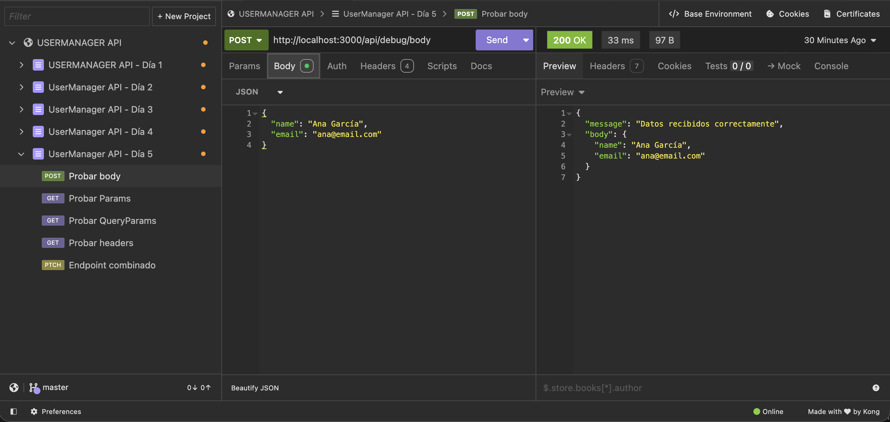
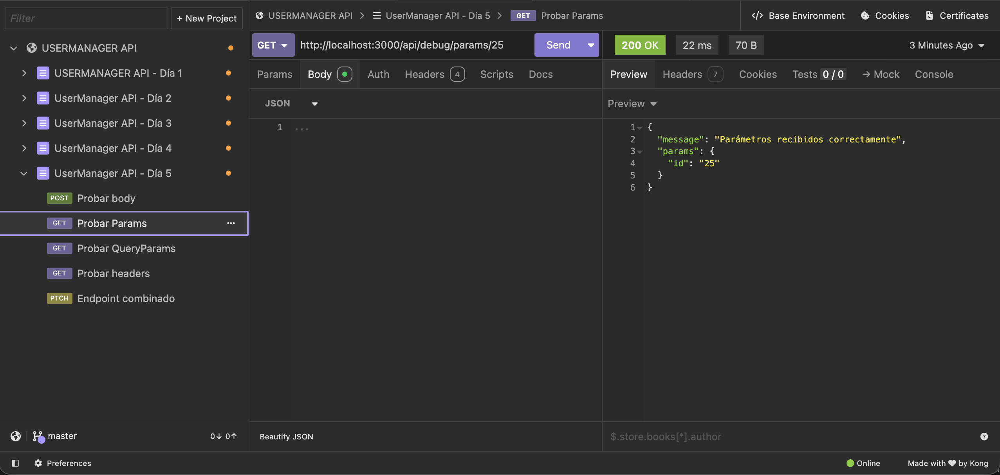
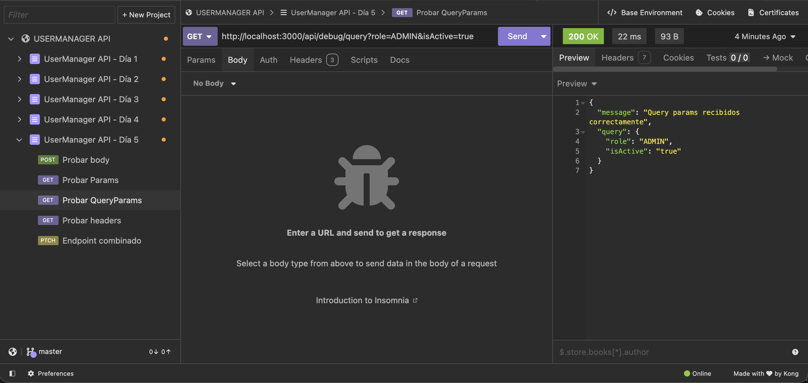
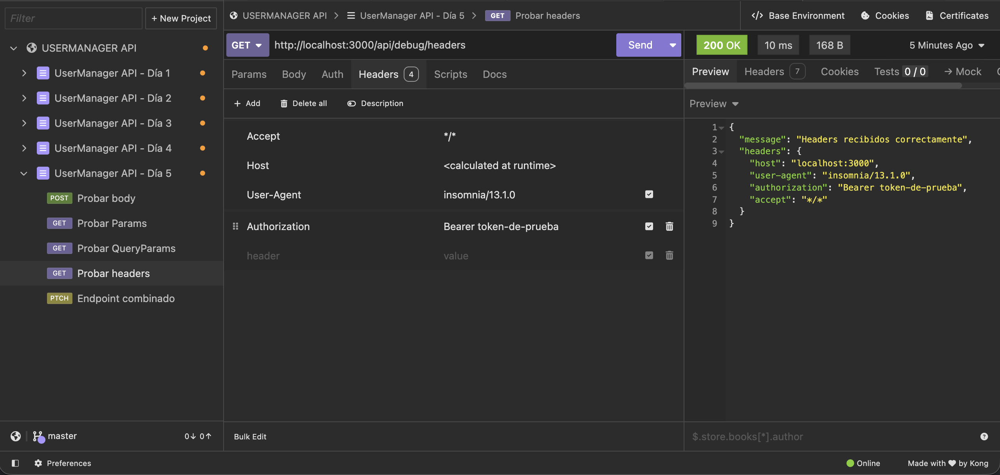
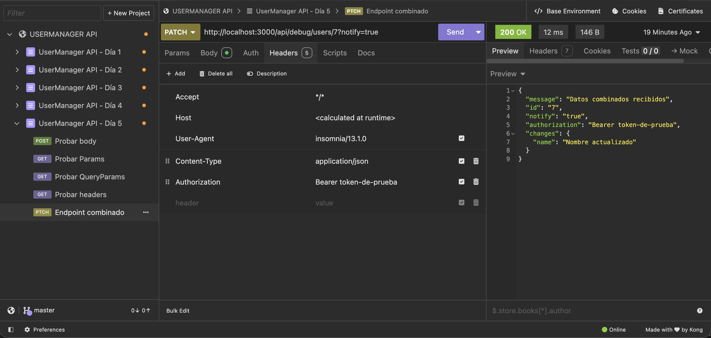

# Día 5: JSON, body, params y headers

## Qué he hecho

- He repasado qué es JSON.
- He aprendido para qué sirve el body.
- He probado route params.
- He probado query params.
- He probado headers.
- He creado rutas temporales de debug.
- He creado una colección de pruebas en Thunder Client o Postman.

## Rutas trabajadas

```http
POST /api/debug/body
GET /api/debug/params/:id
GET /api/debug/query
GET /api/debug/headers
PATCH /api/debug/users/:id
```

## Explicación personal

El body sirve para enviar datos principales al servidor.
Los params sirven para identificar recursos concretos en la ruta.
Los query params sirven para enviar filtros u opciones en la URL.
Los headers sirven para enviar información adicional de la petición.

## Tabla con las pruebas realizadas

| Petición | Dato probado | Código esperado | Resultado obtenido |
| --- | --- | ---: | --- |
| `POST /api/debug/body` | Body | 200 | `{"message": "Datos recibidos correctamente", "body": { ... }}` |
| `GET /api/debug/params/25` | Params | 200 | `{"message": "Parámetros recibidos correctamente", "params": {"id": "25"}}` |
| `GET /api/debug/query?role=ADMIN&isActive=true` | Query params | 200 | `{"message": "Query params recibidos correctamente", "query": {"role": "ADMIN", "isActive": "true"}}` |
| `GET /api/debug/headers` | Headers | 200 | `{"message": "Headers recibidos correctamente", "headers": { "host": "...", ... }}` |
| `PATCH /api/debug/users/7?notify=true` | Combinado | 200 | `{"message": "Datos combinados recibidos", "id": "7", "notify": "true", "authorization": "Bearer ...", "changes": { ... }}` |

- `POST /api/debug/body`


- `GET /api/debug/params/25`


- `GET /api/debug/query?role=ADMIN&isActive=true`


- `GET /api/debug/headers` 


- `PATCH /api/debug/users/7?notify=true` 


## ¿Dónde viaja cada dato?


| Dato | ¿Dónde viajaría? | Ejemplo |
| --- | --- | --- |
| ID de usuario | Parámetros de ruta (`req.params`) - OBLIGATORIOS| `GET /api/users/25` o `DELETE /api/users/25` |
| Email de registro | En el Body (`req.body`) | `POST /api/users` enviando `{"email": "daniel@email.com", ...}` |
| Filtro por rol | Parámetros de consulta (`req.query`) -OPCIONALES | `GET /api/users/search?role=ADMIN` |
| Token JWT | En el Header (`req.headers`) | Cabecera `Authorization: Bearer eyJhbGciOi...` |
| Nueva contraseña | En el Body (`req.body`) | `PATCH /api/users/me/password` enviando `{"newPassword": "secret123"}` |
