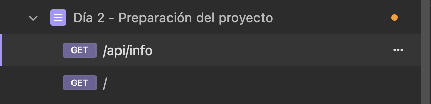
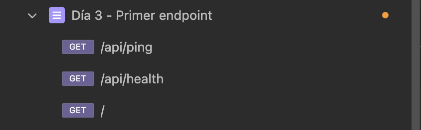
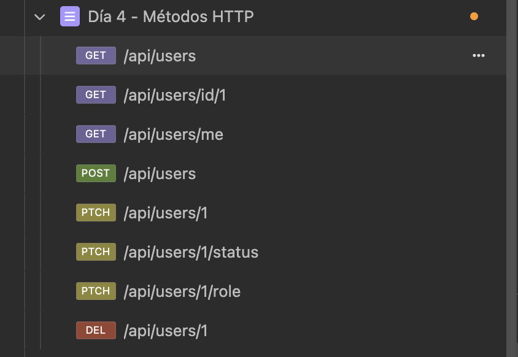
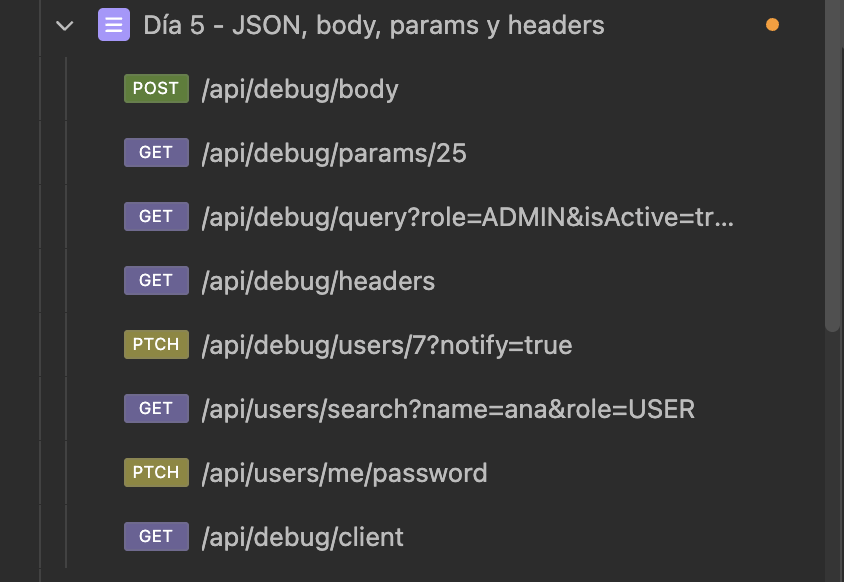
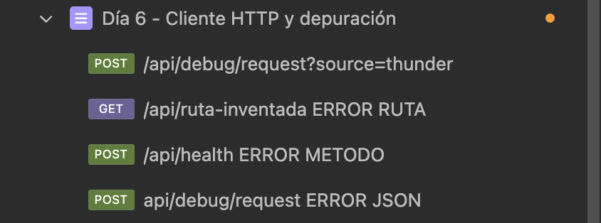
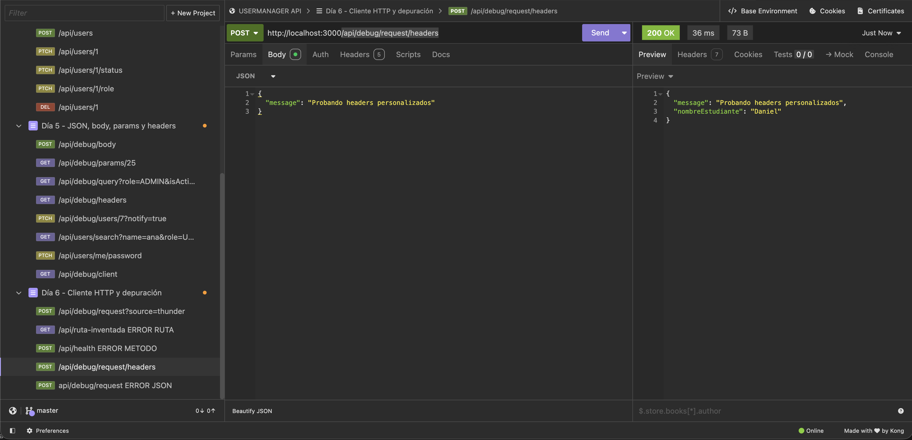
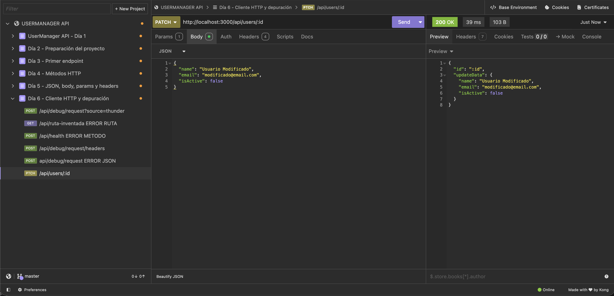

# Día 6: Cliente HTTP y depuración

## Qué he hecho

- He organizado una colección de pruebas de la API.
- He probado rutas básicas.
- He probado peticiones con body.
- He probado peticiones con params, query params y headers.
- He creado una ruta temporal de depuración.
- He provocado errores controlados para entender qué ocurre.
- He revisado respuestas y códigos de estado.

## Colección creada

Nombre de la colección:
**UserManager API**
```text
Preparación del proyecto - Día 2
```


```text
Primer Endpoint - Día 3
```


```text
Métodos HTTP - Día 4
```


```text
JSON, body, params y headers - Día 5
```


```text
Cliente HTTP y depuración- Día 6
```


## Ruta temporal de depuración

```http
POST /api/debug/request
```

## Explicación personal

Un cliente HTTP sirve para enviar peticiones a una API y analizar las
respuestas. Es útil porque permite probar métodos, headers, body, params y
códigos de estado de una forma más completa que el navegador.


## Tabla de pruebas realizadas

| Petición | Qué prueba | Código esperado | Código obtenido | Observaciones |
| --- | --- | ---: | ---: | --- |
| `GET /api/health` | Health endpoint | 200 | 200 | Responde correctamente con el estado del servidor (ej. `{"status": "ok"}`). |
| `GET /api/users` | Listado simulado | 200 | 200 | Devuelve la lista simulada de usuarios en formato JSON. |
| `POST /api/users` | Body JSON | 201 | 201 | Confirma la creación del usuario recibiendo los datos enviándolos en `req.body`. |
| `PATCH /api/users/1` | Params + body | 200 | 200 | Captura el ID `1` desde `req.params` y aplica la actualización parcial recibida en el body. |
| `POST /api/debug/request?source=thunder` | Request completa | 200 | 200 | Refleja method, path, headers, body y los query params (`source: "thunder"`). Los params de ruta quedan vacíos `{}`. |
| `GET /api/ruta-inventada` | Ruta inexistente | 404 | 404 | Express no encuentra ninguna coincidencia de ruta y devuelve automáticamente `Cannot GET /api/ruta-inventada`. |
| `POST /api/health` | Método incorrecto | 404 | 404 | Aunque la URL existe para `GET`, no está definida para el verbo `POST`, por lo que Express responde `404 Not Found`. |


---
## Header personalizado
```typescript
app.post("/api/debug/request/headers", (req, res) => {
    const {message} = req.body;
    const nombreEstudiante = req.headers["x-student-name"];
    res.status(200).json ({
        message,
        nombreEstudiante
    });
});
```


---
```typescript
app.patch("/api/users/:id", (req, res) => {
    const {id} = req.params;
    const updateData = req.body;
    res.status(200).json({
        id,
        updateData
    });
});
```



---

## Mi guía para depurar una petición

## Mi guía para depurar una petición

Cuando una petición HTTP falla o no devuelve el resultado esperado en el cliente (Insomnia / Postman / Frontend), sigo estos pasos de verificación en orden:

1. **Comprobar el estado del servidor:**
   * Verificar en la terminal que el proceso de Node.js / Express o FastAPI está activo y escuchando en el puerto correcto (ej. `localhost:3000`).

2. **Inspeccionar la consola / terminal del servidor:**
   * Mirar si ha saltado un error de sintaxis en el código, una excepción no controlada...

3. **Verificar el código de estado HTTP (Status Code):**
   * **404 Not Found:** La ruta no existe o el método usado no está definido para esa URL.
   * **400 Bad Request / 422 Unprocessable Entity:** Los datos enviados no cumplen con el formato o contrato requerido.
   * **401 Unauthorized / 403 Forbidden:** Falta el token de autenticación o no hay permisos suficientes.
   * **500 Internal Server Error:** Ocurrió un fallo no controlado dentro del código del backend.

4. **Revisar el Método HTTP y la URL exacta:**
   * Confirmar que el verbo HTTP (`GET`, `POST`, `PATCH`, `PUT`, `DELETE`) coincide con la definición del endpoint.
   * Revisar que no haya erratas en la ruta (ej. `/api/users` vs `/api/user`) o en los parámetros de ruta (`:id`).

5. **Validar las Cabeceras (Headers):**
   * Asegurar que se envía `Content-Type: application/json` cuando la petición lleva un cuerpo JSON.
   * Verificar que la cabecera `Authorization: Bearer <token>` está presente si el endpoint requiere autenticación.

6. **Inspeccionar el Cúerpo (Body) de la Petición:**
   * Comprobar que el JSON enviado está bien formado (sin comas sobrantes o comillas faltantes) y que las claves coinciden exactamente con lo que espera la API.

7. **Probar el endpoint con un log temporal (`console.log` / `print`):**
   * Imprimir en consola `req.params`, `req.query`, `req.headers` o `req.body` justo al entrar en el handler para confirmar que los datos llegan tal y como se esperan.


## Comparar navegador y cliente HTTP

| Herramienta | Ventajas | Limitaciones |
| --- | --- | --- |
| **Navegador** | Renderiza la interfaz visual (HTML/CSS), fácil de usar e ideal para peticiones `GET` públicas. | Solo permite peticiones `GET` de forma directa; no deja modificar libremente cabeceras ni enviar `body` JSON manualmente. |
| **Thunder Client / Postman** | Permite probar todos los verbos HTTP (`POST`, `PATCH`, `DELETE`), modificar cabeceras (`Authorization`), enviar JSONs y guardar colecciones. | No renderiza la interfaz visual ni ejecuta scripts de interfaz como lo hace un navegador real. |
