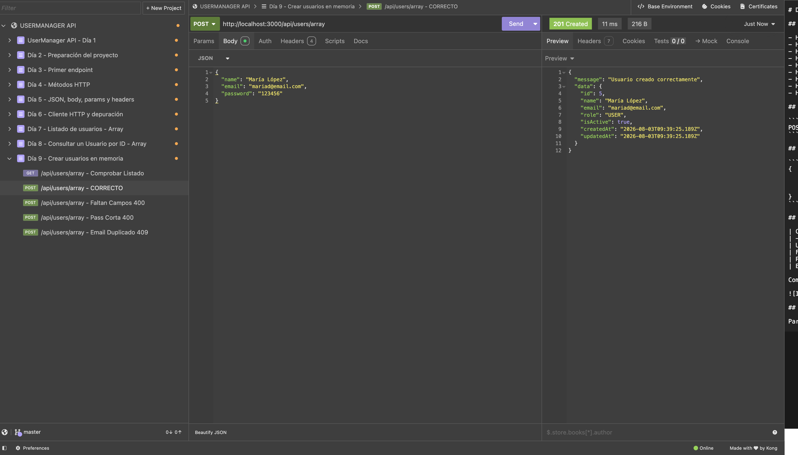
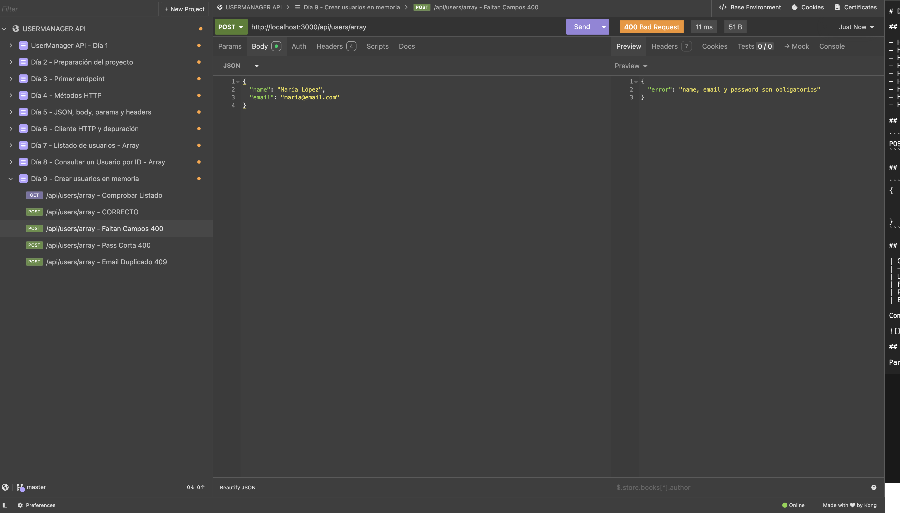

# Día 9: Crear usuarios en memoria

## Qué he hecho

- He actualizado el endpoint `POST /api/users`.
- He leído datos desde `req.body`.
- He validado campos obligatorios.
- He validado longitud mínima de contraseña.
- He comprobado email duplicado.
- He generado un nuevo ID.
- He creado un objeto `User`.
- He añadido el usuario al array con `push`.
- He devuelto `201 Created` cuando el usuario se crea correctamente.

## Endpoint trabajado

```http
POST /api/users
```

## Body de ejemplo

```json
{
  "name": "María López",
  "email": "maria@email.com",
  "password": "123456"
}
```

## Casos probados

| Caso | Código esperado | Resultado |
| :--- | :---: | :--- |
| **Usuario correcto** | 201 |  |
| **Faltan campos** | 400 |  |
| **Password corta** | 400 |  |
| **Email duplicado** | 409 |  |
---
## Explicación personal

Para crear un usuario se leen los datos desde `req.body`, se validan, se
comprueba que el email no esté repetido, se genera un nuevo id y se añade el
usuario al array con `push`.

## Datos sensibles

### ¿Por qué la API nunca debe devolver la contraseña en la respuesta?

La API no debe devolver la contraseña en la respuesta por motivos de seguridad. Aunque el cliente haya enviado la contraseña en el cuerpo (*body*) de la petición al registrarse o iniciar sesión, incluirla en la respuesta JSON del servidor expone la aplicación a graves riesgos:

1. **Evitar fugas en logs y herramientas de monitoreo:**
   Muchas herramientas de red, registros del servidor (*server logs*), la pestaña de red del navegador (*DevTools*) y clientes de pruebas como Insomnia o Postman guardan un historial de las respuestas HTTP recibidas. Si la contraseña viaja de vuelta en el cuerpo de la respuesta, quedará almacenada en texto plano en todos estos registros a los que pueden tener acceso administradores u otros programas.

2. **Principio de menor privilegio:**
   El cliente (frontend, app móvil, etc.) solo necesita saber si el usuario se ha creado correctamente y recibir la información pública o de perfil (como `id`, `name`, `email`, `role`). Devolver la contraseña no aporta ningún valor al cliente y solo incrementa el riesgo de exposición.

3. **Prevención contra ataques Man-in-the-Middle (MitM) y extensiones del navegador:**
   Si la respuesta viaja por un canal no seguro o es interceptada por extensiones maliciosas instaladas en el navegador del usuario, la contraseña en texto plano queda completamente al descubierto.

4. **Preparación para la persistencia real:**
   En un entorno real de producción, las contraseñas nunca se guardan en texto plano en la base de datos; se encriptan mediante algoritmos de hash (como *bcrypt* o *argon2*). Devolver el hash tampoco es seguro, por lo que la regla de oro en el diseño de APIs REST es **excluir siempre el campo `password` del objeto devuelto al cliente**.