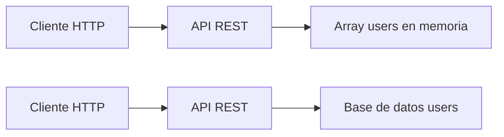

# Día 16 - Base de datos y persistencia

## Qué he hecho

- He comprobado que los datos en memoria se pierden al reiniciar el servidor.
- He entendido qué significa persistencia.
- He comparado datos en memoria y base de datos.
- He diseñado la tabla users.
- He definido campos, tipos conceptuales y restricciones.
- He escrito una propuesta SQL conceptual.
- He explicado cómo cambiará la arquitectura del proyecto.

## Problema detectado

Al crear un usuario en memoria y reiniciar el servidor, el usuario desaparece.

Esto ocurre porque los datos están guardados dentro del proceso de Node.js y no
en una base de datos persistente.

## Diseño de la tabla users

| Campo TypeScript | Campo en base de datos | Tipo conceptual      | Descripción                   |
| ---------------- | ---------------------- | -------------------- | ----------------------------- |
| `id`             | `id`                   | número               | Identificador único           |
| `name`           | `name`                 | texto                | Nombre del usuario            |
| `email`          | `email`                | texto                | Email único                   |
| `passwordHash`   | `password_hash`        | texto                | Contraseña hasheada           |
| `role`           | `role`                 | texto                | USER o ADMIN                  |
| `isActive`       | `is_active`            | booleano             | Estado del usuario            |
| `createdAt`      | `created_at`           | Timestamp / DateTime | Fecha de creación             |
| `updatedAt`      | `updated_at`           | Timestamp / DateTime | Fecha de úlitma actualización |
| `lastLoginAt`    | `last_login_at`        | Timestamp / DateTime | Fecha de último login         |
| `avatarUrl`      | `avatar_url`           | texto                | Urlr de la imagen de perfil   |
| `phone`          | `phone`                | texto                | Teléfono movil                |
| `bio`            | `bio`                  | texto                | Descrición del usuario        |

## Defino restricciones

| Campo           | Restricción            | Motivo                                                   |
| --------------- | ---------------------- | -------------------------------------------------------- |
| `id`            | PRIMARY KEY            | Identifica cada usuario                                  |
| `name`          | NOT NULL               | Todo usuario debe tener nombre                           |
| `email`         | NOT NULL, UNIQUE       | Todo usuario debe tener email y no se puede repetir      |
| `password_hash` | NOT NULL               | Todo usuario necesita credenciales                       |
| `role`          | NOT NULL               | Todo usuario debe tener un rol                           |
| `is_active`     | NOT NULL, DEFAULT true | Todo usuario debe tener estado                           |
| `created_at`    | NOT NULL               | Debe registrarse cuándo se creó                          |
| `last_login_at` | NOT NULL               | Debe registrarse cuándo último login                     |
| `updated_at`    | NOT NULL               | Debe registrarse cuándo se actualizó                     |
| `avatar_url`    | NULL                   | Puedes elegir o no ponerte perfil                        |
| `phone`         | NULL, UNIQUE           | Puede elegir telefono o no, pero si elige debe ser único |
| `bio`           | NULL                   | Puede elegir si bio o no                                 |

## Propuesta SQL conceptual

```sql
CREATE TABLE users (
  id SERIAL PRIMARY KEY,
  name VARCHAR(100) NOT NULL,
  email VARCHAR(150) NOT NULL UNIQUE,
  password_hash VARCHAR(255) NOT NULL,
  role VARCHAR(20) NOT NULL,
  is_active BOOLEAN NOT NULL DEFAULT true,
  created_at TIMESTAMP NOT NULL DEFAULT CURRENT_TIMESTAMP,
  updated_at TIMESTAMP NOT NULL DEFAULT CURRENT_TIMESTAMP
);
```

## Cambio de arquitectura



## Explicación personal

Necesitamos una base de datos porque los datos en memoria se pierden cuando se
reinicia el servidor. Una base de datos permite guardar la información de forma
persistente y recuperarla más adelante.

## ¿Qué es la persistencia?

En desarrollo de software, la **persistencia de datos** es la capacidad de conservar la información a lo largo del tiempo, garantizando que los datos no se pierdan cuando la aplicación se apaga, se reinicia o se detiene el servidor.

---

### Memoria volátil vs. Almacenamiento persistente

Para entender la importancia de la persistencia, es útil contrastar dónde guardamos la información:

- **Sin persistencia (Memoria RAM / Volátil):** Es lo que ocurre cuando guardamos datos en variables o arrays directamente en el código (como `const users = []`). La memoria RAM es rápida, pero temporal. En el momento en que detienes el proceso con `Ctrl + C` o reinicias el servidor (`npm run dev`), la memoria se vacía por completo y **todos los usuarios creados desaparecen**.
- **Con persistencia (Disco / No volátil):** Consiste en escribir la información en un soporte físico o servicio externo (como un archivo `.json` en disco o una base de datos). Al reiniciar la aplicación, el servidor lee de nuevo ese soporte y recupera el estado exacto en el que estaban los datos.

---

### ¿Cómo se logra la persistencia en una API?

En el desarrollo backend, existen diferentes niveles para conseguir que los datos sean persistentes:

1. **Archivos locales:** Guardar los datos en archivos de texto o formato `JSON` en el sistema de archivos del servidor.
2. **Bases de datos relacionales (SQL):** Guardar la información en tablas estructuradas con sistemas como PostgreSQL, MySQL o SQLite.
3. **Bases de datos no relacionales (NoSQL):** Almacenar información en documentos flexibles con sistemas como MongoDB.

Sin persistencia, sería imposible construir aplicaciones reales, ya que los usuarios perderían su cuenta, sus carritos de compra o sus publicaciones cada vez que el servidor se actualizara o reiniciara.

## Tabla comparativa: Memoria y Base de datos

| Aspecto                                   | Memoria (RAM / Arrays)                                    | Base de datos                                              |
| ----------------------------------------- | --------------------------------------------------------- | ---------------------------------------------------------- |
| **¿Los datos se conservan al reiniciar?** | **No** (se borran al apagar o reiniciar el servidor)      | **Sí** (se guardan de forma permanente en disco)           |
| **¿Sirve para pruebas iniciales?**        | **Sí** (ideal para prototipos rápidos y aprender)         | **Sí** (imprescindible para pruebas de integración reales) |
| **¿Sirve para una aplicación real?**      | **No** (se perdería la información de los usuarios)       | **Sí** (es el estándar de la industria)                    |
| **¿Permite trabajar con muchos datos?**   | **No** (limitado por la memoria RAM del servidor)         | **Sí** (optimizado para millones de registros con índices) |
| **¿Permite restricciones como UNIQUE?**   | **No nativo** (hay que programar las validaciones a mano) | **Sí** (el propio motor de BD las valida automáticamente)  |

## Independencia entre API y base de datos

Una de las principales ventajas de la arquitectura REST es el **desacoplamiento** entre la capa de presentación (el cliente) y la capa de persistencia (el almacenamiento en el servidor).

---

### El contrato de la API (_API Contract_)

El cliente (ya sea un frontend en React, una aplicación móvil o una herramienta como Postman) nunca interactúa directamente con la base de datos. En su lugar, la comunicación se rige por un **contrato de interfaz** basado en:

- **Endpoints y métodos HTTP:** Rutas fijas como `GET /api/users` o `POST /api/users`.
- **Estructura de intercambio:** Peticiones y respuestas en formato **JSON**.
- **Códigos de estado HTTP:** Respuestas estandarizadas (`200 OK`, `400 Bad Request`, `404 Not Found`, etc.).

---

### ¿Por qué el origen de los datos es transparente para el cliente?

Mientras el servidor respete la estructura del contrato (los mismos campos en los JSON de respuesta y los mismos códigos de estado), **al cliente le da exactamente igual dónde o cómo se guardan los datos internamente**.

Esto permite evolucionar la arquitectura del servidor en fases sin romper la aplicación:

1. **Fase inicial (Prototipado):** La API lee y escribe datos en un **array en memoria** (`const users = []`).
2. **Fase intermedia:** La API pasa a guardar la información en un **archivo JSON local** con el módulo `fs`.
3. **Fase de producción:** La API sustituye la lógica por consultas a una **base de datos real** (como PostgreSQL, MySQL o SQLite).

En cualquiera de estos tres escenarios, **el código del cliente no cambia en absoluto**, porque sigue realizando la misma petición HTTP y recibiendo el mismo objeto JSON.
