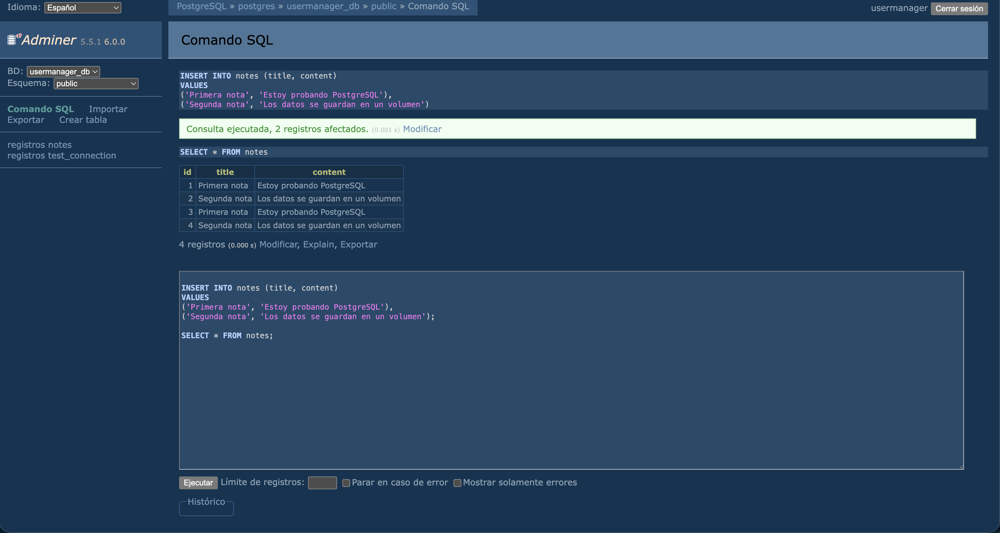

# Día 17 - PostgreSQL con Docker Compose

## Qué he hecho

- He comprobado que Docker está instalado.
- He creado un archivo `docker-compose.yml`.
- He levantado un servicio PostgreSQL.
- He levantado un servicio Adminer.
- He accedido a Adminer desde el navegador.
- He creado una tabla de prueba.
- He insertado un dato de prueba.
- He comprobado la persistencia usando un volumen.

## Servicios creados

| Servicio | Imagen | Puerto | Función |
| --- | --- | --- | --- |
| postgres | postgres:16 | 5432 | Base de datos PostgreSQL |
| adminer | adminer:latest | 8080 | Interfaz web para consultar la base de datos |

## Datos de conexión

| Campo | Valor |
| --- | --- |
| Sistema | PostgreSQL |
| Servidor | postgres |
| Usuario | usermanager |
| Contraseña | usermanager_password |
| Base de datos | usermanager_db |

## Comandos usados

| Comando | Qué hace |
| --- | --- |
| `docker compose up -d` | Levanta los contenedores |
| `docker compose down` | Para y elimina contenedores, conserva volúmenes |
| `docker compose down -v` | Para contenedores y borra volúmenes |
| `docker ps` | Muestra contenedores en ejecución |
| `docker compose ps` | Muestra servicios del proyecto |
| `docker compose logs` | Muestra logs de los servicios |


## Prueba de conexión

```sql
CREATE TABLE test_connection (
  id SERIAL PRIMARY KEY,
  message VARCHAR(100) NOT NULL
);

INSERT INTO test_connection (message)
VALUES ('PostgreSQL funciona correctamente');

SELECT * FROM test_connection;
```

## Explicación personal

Docker Compose permite levantar la base de datos y otras herramientas necesarias
usando un único archivo de configuración. Gracias al volumen, los datos de
PostgreSQL se conservan aunque paremos y volvamos a arrancar los contenedores.

## Explicación del docker-compose.yml

Un archivo `docker-compose.yml` permite definir y ejecutar aplicaciones compuestas por múltiples contenedores Docker mediante un único fichero de configuración en formato YAML.

A continuación se detalla la función de sus claves principales:

---

### 1. `services`
Es el nodo raíz donde se definen **cada uno de los contenedores o microservicios** que componen la aplicación (por ejemplo: la base de datos, el servidor de API backend y el frontend). Cada elemento bajo `services` actuará como un contenedor independiente en el entorno de ejecución.

### 2. `image`
Especifica la **imagen base de Docker** que se descargará (desde un registro como Docker Hub) para crear el contenedor. 
* *Ejemplo:* `image: postgres:15-alpine` le indica a Docker que descargue y levante un contenedor con PostgreSQL versión 15 optimizado.

### 3. `container_name`
Asigna un **nombre personalizado y fijo** al contenedor en ejecución. Si no se especifica, Docker Compose genera automáticamente un nombre basado en la carpeta del proyecto y un número secuencial (ej: `usermanagerapi`). Asignar un `container_name` facilita la identificación al listar o inspeccionar contenedores en la terminal.

### 4. `environment`
Define **variables de entorno** dentro del contenedor. Se utiliza para configurar credenciales, puertos, parámetros de conexión a bases de datos o secretos de ejecución sin necesidad de introducirlos directamente en el código fuente.
* *Ejemplo:*
  ```yaml
  environment:
    POSTGRES_USER: usuario_dam
    POSTGRES_PASSWORD: mi_password_segura
    POSTGRES_DB: user_manager_db
   ```

### 5. `ports`
Mapea o redirige puertos entre el equipo anfitrión (tu máquina física/host) y el contenedor. La sintaxis siempre sigue la estructura `"PUERTO_LOCAL:PUERTO_CONTENEDOR"`.

Ejemplo: `"5432:5432"` permite que la base de datos PostgreSQL escuchando internamente en el puerto 5432 del contenedor sea accesible desde `localhost:5432` en tu ordenador.

### 6. `volumes`
Proporciona persistencia de datos o montaje de archivos. Dado que los contenedores son efímeros (los datos se borran al destruir el contenedor), los volúmenes enlazan un directorio del anfitrión o un volumen gestionado por Docker con una ruta interna del contenedor.

Ejemplo: `postgres_data:/var/lib/postgresql/data` garantiza que la información de la base de datos se mantenga guardada en disco aunque se detenga o elimine el contenedor.

### 7. `depends_on`
Establece el orden de arranque e interdependencia entre servicios. Le indica a Docker Compose que no inicie un contenedor hasta que el contenedor del que depende haya arrancado previamente.

Ejemplo: En la API, declarar `depends_on: [db]` asegura que el contenedor de la base de datos se inicie antes de que la API intente arrancar y conectarse.

## Tabla de Prueba



## Arquitectura del entorno de datos

A continuación se muestra el diagrama de arquitectura en Mermaid que representa la estructura del sistema y la relación entre sus servicios:

```mermaid
flowchart LR
  A[API REST Express] -. se conectará más adelante .-> B[PostgreSQL]
  C[Adminer] --> B
  D[Volumen postgres_data] --> B
  ```

### Explicación de los elementos

* **`A [API REST Express]`:** Representa el servicio backend desarrollado con Node.js y Express. Es la capa de aplicación encargada de recibir las peticiones HTTP del cliente, procesar la lógica de negocio y devolver las respuestas JSON.
* **`B [PostgreSQL]`:** Es el motor de base de datos relacional (SGBD). Es el núcleo del sistema donde se estructuran las tablas (como `users`) y se aplican las restricciones de integridad (`PRIMARY KEY`, `NOT NULL`, `UNIQUE`).
* **`C [Adminer]`:** Es una herramienta web de gestión de bases de datos que se ejecuta en un contenedor independiente. Proporciona una interfaz gráfica (GUI) accesible desde el navegador para consultar, editar e inspeccionar de forma visual los datos almacenados en PostgreSQL sin tener que usar comandos de terminal.
* **`D [Volumen postgres_data]`:** Es el volumen gestionado por Docker que garantiza la **persistencia**. Enlaza el sistema de archivos del contenedor con el disco duro de la máquina anfitriona (*host*), asegurando que los registros de la base de datos no se borren cuando el contenedor de PostgreSQL se detenga o elimine.

### Explicación de las conexiones

* **Línea discontinua (`-. se conectará más adelante .->`):** Representa una conexión lógica en fase de integración. Señala que el objetivo final de la API es abandonar el almacenamiento en memoria para realizar consultas SQL (CRUD) directamente sobre el contenedor de PostgreSQL.
* **Líneas continuas (`-->`):** Indican dependencias activas entre componentes. Adminer interactúa directamente con PostgreSQL para administrar sus tablas, mientras que PostgreSQL depende del Volumen `postgres_data` para guardar sus archivos físicos en disco.