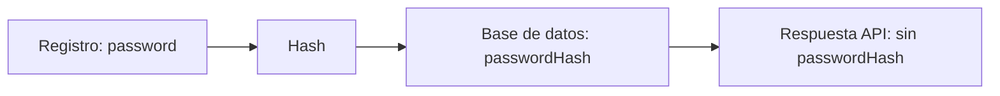
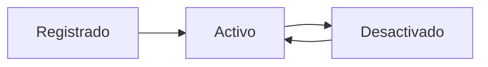

# Día 18 - Diseño del modelo persistente User

## Qué he hecho

- He analizado qué datos necesita guardar un usuario.
- He diferenciado entre usuario en memoria y usuario persistente.
- He definido los campos principales del modelo User.
- He identificado qué campos son obligatorios.
- He identificado qué campos deben ser únicos.
- He marcado passwordHash como dato sensible.
- He definido las reglas de role e isActive.
- He preparado el diseño para convertirlo más adelante en un modelo Prisma.

## Campos del modelo User

| Campo          | Tipo conceptual  | Obligatorio | Único | Valor por defecto | Se devuelve al cliente |
| -------------- | ---------------- | ----------- | ----- | ----------------- | ---------------------- |
| `id`           | número           | sí          | sí    | automático        | sí                     |
| `name`         | texto            | sí          | no    | no                | sí                     |
| `email`        | texto            | sí          | sí    | no                | sí                     |
| `passwordHash` | texto            | sí          | no    | no                | no                     |
| `role`         | `USER` / `ADMIN` | sí          | no    | `USER`            | sí                     |
| `isActive`     | booleano         | sí          | no    | `true`            | sí                     |
| `createdAt`    | fecha            | sí          | no    | automático        | sí                     |
| `updatedAt`    | fecha            | sí          | no    | automático        | sí                     |
| `lastLoginAt`  | fecha            | no          | no    | null              | sí                     |
| `avatarUrl`    | texto            | no          | no    | null              | sí                     |
| `phone`        | texto            | no          | si    | no                | sí                     |
| `bio`          | texto            | no          | no    | no                | sí                     |

## Reglas del modelo

- El email no se puede repetir.
- El email debe guardarse normalizado.
- La contraseña nunca se guarda en texto plano.
- `passwordHash` nunca se devuelve al cliente.
- Todo usuario tiene un rol.
- El rol por defecto es `USER`.
- Todo usuario se crea activo.
- Un usuario desactivado no puede iniciar sesión.
- `createdAt` se genera al crear el usuario.
- `updatedAt` cambia cuando el usuario se modifica.

## Entrada, persistencia y salida

| Representación | Qué significa                    | Contiene password | Contiene passwordHash |
| -------------- | -------------------------------- | ----------------- | --------------------- |
| Entrada        | Datos que envía el cliente       | sí                | no                    |
| Persistencia   | Datos guardados en base de datos | no                | sí                    |
| Salida         | Datos que devuelve la API        | no                | no                    |

### Ejemplo de entrada

```json
{
  "name": "Ana García",
  "email": "ana@email.com",
  "password": "123456"
}
```

### Ejemplo de salida

```json
{
  "id": 1,
  "name": "Ana García",
  "email": "ana@email.com",
  "role": "USER",
  "isActive": true,
  "createdAt": "...",
  "updatedAt": "..."
}
```

## Posible modelo Prisma futuro

```prisma
model User {
  id           Int      @id @default(autoincrement())
  name         String
  email        String   @unique
  passwordHash String
  role         Role     @default(USER)
  isActive     Boolean  @default(true)
  createdAt    DateTime @default(now())
  updatedAt    DateTime @updatedAt
}

enum Role {
  USER
  ADMIN
}
```

Este modelo todavía no se implementa hoy. Servirá como referencia para los próximos días.

## Diagrama de flujo



La contraseña llega desde el cliente solo durante el registro o login. Después se transforma en un hash y se guarda como passwordHash. La API nunca debe devolver password ni passwordHash.

## Por qué guardamos passwordHash y no password

Guardar contraseñas en texto plano es una vulnerabilidad crítica. En su lugar, almacenamos un **`passwordHash`**, una versión cifrada e irreversible generada por algoritmos de seguridad (como `bcrypt`).

### Riesgos de guardar texto plano

- **Fugas de datos:** Si la base de datos se filtra, los atacantes obtienen las contraseñas reales.
- **Efecto dominó:** Los atacantes usan esas claves para acceder a otros servicios de las víctimas (email, banca).
- **Privacidad:** Administradores o desarrolladores podrían ver las contraseñas de los usuarios.

### ¿Cómo funciona el `passwordHash`?

- **Es unidireccional:** Es imposible revertir el hash para obtener la contraseña original.
- **Verificación en login:** El servidor aplica la función de hashing a la clave introducida y compara si el resultado coincide con el hash guardado.
- **Salting (Sal):** Añade un texto aleatorio único a cada contraseña antes de procesarla, asegurando que dos usuarios con la misma clave tengan hashes completamente diferentes.

## Definir permisos por rol

| Acción                    | USER | ADMIN |
| ------------------------- | ---- | ----- |
| Ver su perfil             | sí   | sí    |
| Listar todos los usuarios | no   | sí    |
| Cambiar su nombre         | sí   | sí    |
| Cambiar su rol            | no   | sí    |
| Desactivar usuarios       | no   | sí    |
| Cambiar su contraseña     | sí   | sí    |

## Ciclo de vida de un usuario



Registrado: La cuenta ha sido creada en el sistema, pero el usuario aún no ha verificado su identidad (por ejemplo, mediante correo de confirmación) ni ha completado el acceso inicial.

Activo: El usuario ha validado su cuenta y dispone de acceso completo a todas las funcionalidades del sistema con sus permisos correspondientes.

Desactivado: La cuenta ha sido suspendida temporalmente —ya sea por solicitud del usuario o por decisión del sistema— restringiendo el acceso y las operaciones, pero conservando su información.

Reactivado: La cuenta ha superado el estado de suspensión tras una verificación o solicitud, restaurando el acceso completo y devolviendo al usuario al estado Activo.

## Dudas para elegir herramienta de acceso a datos

- ¿Qué herramienta se usa más con TypeScript?
- ¿Cuál permite definir modelos de forma más clara?
- ¿Cuál ayuda más a evitar errores?
- ¿Cuál es más fácil de aprender?
