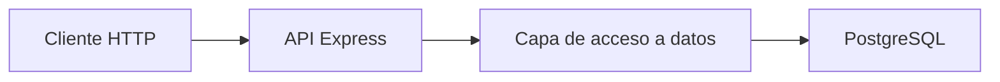
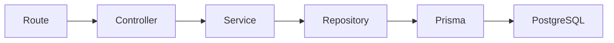
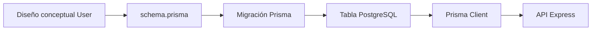

# Día 19 - ORM o acceso a datos

## Qué he hecho

- He entendido qué significa acceso a datos.
- He comparado SQL directo, Prisma, TypeORM y Sequelize.
- He aprendido qué es un ORM.
- He analizado ventajas e inconvenientes de cada opción.
- He relacionado el acceso a datos con el modelo User.
- He decidido usar Prisma como ORM principal del proyecto.

## Qué es el acceso a datos

El acceso a datos es la parte del backend encargada de leer y escribir información en la base de datos.

En este proyecto, la API necesitará acceder a PostgreSQL para crear, consultar, modificar y desactivar usuarios.

El flujo será:



## Comparación de opciones

| Opción      | Cómo se trabaja                           | Ventaja principal        | Inconveniente principal              |
| ----------- | ----------------------------------------- | ------------------------ | ------------------------------------ |
| SQL directo | Escribiendo consultas SQL                 | Muy transparente         | Más código manual                    |
| Prisma      | Modelos en schema.prisma y cliente tipado | Muy claro con TypeScript | Hay que aprender su ecosistema       |
| TypeORM     | Clases, entidades y decoradores           | Orientado a objetos      | Más configuración inicial            |
| Sequelize   | Modelos ORM clásicos                      | Muy conocido en Node.js  | Menos natural con TypeScript moderno |

## SQL directo frente a Prisma

Ejemplo conceptual con SQL directo:

```ts
const result = await pool.query("SELECT * FROM users WHERE id = $1", [id]);
```

Ejemplo conceptual con Prisma:

```ts
const user = await prisma.user.findUnique({
  where: { id },
});
```

Ambos enfoques buscan un usuario por id, pero Prisma lo expresa desde el modelo User.

## Decisión técnica

Para este reto usaremos **Prisma**.

Motivos:

- Encaja muy bien con TypeScript.
- Permite definir modelos de forma clara.
- Genera un cliente tipado.
- Incluye migraciones.
- Incluye Prisma Studio.
- Reduce SQL repetitivo.
- Se integra bien con una arquitectura por capas.

SQL directo sigue siendo importante para entender qué ocurre por debajo, pero no será el camino principal del proyecto.

## Prisma dentro de la arquitectura

Más adelante, Prisma se usará desde la capa de repositorio.

Flujo previsto:



Responsabilidades:

- **Route**: define la ruta.
- **Controller**: gestiona req y res.
- **Service**: aplica reglas de negocio.
- **Repository**: accede a los datos.
- **Prisma**: comunica con PostgreSQL.

## Relación con el modelo User

En el día 18 diseñamos el modelo persistente User.

Campos principales:

- id
- name
- email
- passwordHash
- role
- isActive
- createdAt
- updatedAt

En los próximos días este diseño se convertirá en un modelo Prisma dentro del archivo schema.prisma.

## Diagrama



Este diagrama muestra cómo el diseño conceptual del usuario terminará convirtiéndose en una tabla real en PostgreSQL, accesible desde la API mediante Prisma Client.

## Qué es un ORM

Un **ORM** (_Object-Relational Mapper_) es una herramienta que actúa como puente entre el lenguaje de programación (TypeScript/JavaScript) y la base de datos relacional. Permite consultar y manipular datos utilizando objetos y métodos nativos en lugar de escribir SQL manual.

### ¿Qué problema resuelve?

- **Sin ORM:** Es necesario escribir consultas SQL como cadenas de texto a mano (`db.query("SELECT * FROM users")`), lo que provoca código repetitivo, falta de autocompletado en el editor y riesgo de **Inyección SQL**.
- **Con ORM:** Se utilizan métodos nativos del propio lenguaje (por ejemplo, `prisma.user.findMany()`) y el ORM se encarga de traducirlos a SQL automáticamente.

### Ventajas principales

- **Seguridad:** Parametriza las consultas por defecto para prevenir ataques de Inyección SQL.
- **Type Safety:** Integración total con TypeScript, ofreciendo autocompletado y detección de errores en tiempo de compilación.
- **Productividad:** Simplifica la creación y actualización del esquema de la base de datos mediante migraciones de código.

## Por qué elegimos Prisma

Prisma es un ORM moderno de última generación que simplifica drásticamente el trabajo con bases de datos relacionales en Node.js. Para este proyecto, resulta una excelente elección por las siguientes razones principales:

1. **Integración nativa con TypeScript (_Type Safety_):** Prisma genera tipos estáticos automáticamente a partir de nuestro esquema de base de datos. Esto nos ofrece autocompletado inteligente en el editor (IntelliSense) y detecta errores de tipado en tiempo de compilación antes de ejecutar el código.
2. **Definición de modelos de forma clara y declarativa:** A través de un único archivo centralizado (`schema.prisma`), podemos definir la estructura de las tablas, relaciones, tipos de datos y restricciones (`NOT NULL`, `UNIQUE`, valores por defecto) con una sintaxis limpia y fácil de leer.
3. **Gestión de migraciones integrada (_Prisma Migrate_):** Permite evolucionar el esquema de la base de datos de forma segura. Cada cambio se guarda en archivos de migración versionables, facilitando la sincronización de la base de datos entre diferentes entornos de desarrollo y producción.
4. **Herramienta visual gráfica (_Prisma Studio_):** Incluye una interfaz web ejecutable desde la terminal (`npx prisma studio`) que permite visualizar, filtrar, insertar y editar registros de la base de datos directamente desde el navegador sin depender de clientes SQL externos.
5. **Reducción de SQL manual y abstracción limpia:** Elimina la necesidad de escribir consultas SQL concatenadas a mano para las operaciones CRUD cotidianas, protegiendo la aplicación frente a ataques de inyección SQL de forma automática.

## SQL directo y Prisma

| Aspecto                        | SQL directo                                                    | Prisma                                                         |
| ------------------------------ | -------------------------------------------------------------- | -------------------------------------------------------------- |
| **Cómo se escriben consultas** | Cadenas de texto plano en lenguaje SQL (`SELECT * FROM users`) | Métodos de JavaScript/TypeScript (`prisma.user.findMany()`)    |
| **Relación con TypeScript**    | Nula o manual (hay que definir las interfaces a mano)          | Total (_Type Safety_ autogenerado a partir del esquema)        |
| **Facilidad inicial**          | Requiere dominar sintaxis SQL y conectores de BD               | Muy alta (sintaxis intuitiva y autocompletado en el editor)    |
| **Control sobre SQL**          | Absoluto (escribes exactamente la sentencia que se ejecuta)    | Indirecto (Prisma traduce y optimiza las consultas por ti)     |
| **Cantidad de código manual**  | Alta (escribir queries, mapear objetos, gestionar errores)     | Baja (elimina casi todo el código repetitivo o _boilerplate_)  |
| **Migraciones**                | Manuales (crear y ejecutar archivos `.sql` a mano)             | Automáticas (_Prisma Migrate_ genera y aplica las migraciones) |
| **Herramienta visual**         | Requiere clientes externos (DBeaver, Adminer, pgAdmin)         | Incluye _Prisma Studio_ integrado en el navegador              |

## Prisma Studio

**Prisma Studio** es un entorno gráfico e interactivo (GUI) que se ejecuta localmente en el navegador mediante el comando `npx prisma studio`. Durante el reto, nos permitirá inspeccionar y manipular la base de datos de forma visual sin necesidad de escribir consultas SQL ni depender de clientes externos.

### ¿Para qué nos servirá durante el reto?

- **Visualizar datos:** Consultar de forma clara y estructurada el contenido de la tabla `users` (y futuras tablas) con soporte para filtrado, ordenación y paginación.
- **Crear registros manualmente:** Insertar usuarios de prueba directamente desde la interfaz para probar endpoints o validar comportamientos de la API.
- **Editar y eliminar registros:** Modificar campos específicos en tiempo real (por ejemplo, cambiar un rol de `USER` a `ADMIN` o desactivar un usuario cambiando `isActive` a `false`) para simular distintos escenarios.
- **Verificar migraciones:** Confirmar visualmente que la estructura definida en `schema.prisma` se ha trasladado correctamente a la base de datos tras ejecutar `npx prisma migrate dev`.
- **Comprobar el _seeding_ inicial:** Asegurar que los scripts de datos iniciales o de prueba (_seeds_) han poblado la base de datos correctamente al arrancar el entorno de desarrollo.

## Relación de Prisma con la arquitectura por capas

En una arquitectura por capas bien estructurada (como _Clean Architecture_ o _Layered Architecture_), respetamos el principio de **separación de responsabilidades** (_Separation of Concerns_).

Prisma no debe desperdigarse por toda la aplicación; debe quedar confinado exclusivamente a la capa de acceso a datos.

| Capa           | Responsabilidad                                                        | ¿Usa Prisma directamente? |
| -------------- | ---------------------------------------------------------------------- | :-----------------------: |
| **Route**      | Define los endpoints y los verbos HTTP.                                |          **No**           |
| **Controller** | Extrae datos de la petición (`req`) y envía la respuesta HTTP (`res`). |          **No**           |
| **Service**    | Ejecuta la lógica y reglas de negocio de la aplicación.                |          **No**           |
| **Repository** | Abstrae las consultas a la base de datos (CRUD).                       |          **Sí**           |
| **Prisma**     | Motor ORM que traduce las llamadas y se comunica con PostgreSQL.       |          **Sí**           |

---

### ¿Por qué esta separación es crucial?

1. **Aislamiento de dependencias:** Si en el futuro decides cambiar Prisma por otro ORM (o por SQL directo), solo tendrás que modificar la capa de **Repository**. Los controladores y servicios seguirán funcionando sin tocar una sola línea de código.
2. **Facilidad de testeo (Unit Testing):** Al no usar Prisma en la capa de **Service**, puedes probar la lógica de negocio fácilmente sustituyendo el _Repository_ por un _mock_ (un repositorio falso en memoria) durante los tests.
