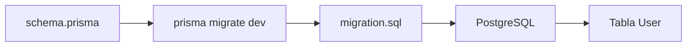
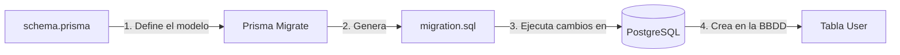

# Día 22 - Primera migración con Prisma

## Qué he hecho

- He revisado que PostgreSQL esté arrancado.
- He comprobado la variable DATABASE_URL.
- He validado el archivo schema.prisma.
- He ejecutado la primera migración con Prisma.
- He creado la carpeta prisma/migrations.
- He revisado el archivo migration.sql.
- He comprobado que existe la tabla User.
- He comprobado que existe la tabla \_prisma_migrations.
- He entendido la diferencia entre modelo, migración y tabla.

## Comando principal

```bash
npx prisma migrate dev --name init
```

## Archivos generados

```text
prisma/migrations/
  <timestamp>_init/
    migration.sql
```

## Tablas creadas

```text
User
_prisma_migrations
```

## Campos de la tabla User

```text
id
name
email
passwordHash
role
isActive
createdAt
updatedAt
```

## Explicación personal

La migración convierte el modelo User de schema.prisma en una tabla real dentro de PostgreSQL. A partir de ahora la estructura de la base de datos queda versionada en el repositorio.

## Modelo, migración y tabla

| Concepto  | Dónde está                          | Para qué sirve                             |
| --------- | ----------------------------------- | ------------------------------------------ |
| Modelo    | prisma/schema.prisma                | Define cómo queremos que sea la estructura |
| Migración | prisma/migrations/.../migration.sql | Guarda el cambio generado                  |
| Tabla     | PostgreSQL                          | Almacena los datos reales                  |

## Qué hace prisma migrate dev

El comando `prisma migrate dev` lee el archivo schema.prisma, detecta cambios en el modelo, genera una migración SQL, la aplica sobre la base de datos de desarrollo y actualiza el historial de migraciones.



## Qué es una migración

Una **migración de base de datos** es un cambio incremental y versionado en la estructura (o esquema) de una base de datos. Si pensamos en **Git** como el sistema de control de versiones para el código fuente, las migraciones son exactamente el equivalente para la base de datos.

Permiten crear, modificar o eliminar tablas, columnas, índices y relaciones de forma **ordenada, automatizada y reproducible**, evitando la necesidad de ejecutar scripts SQL manuales en cada máquina.

---

### ¿Por qué son fundamentales?

- **Control de versiones del esquema:** Cada modificación de la base de datos queda registrada como un paso en el tiempo (un archivo con código SQL o formato del ORM).
- **Consistencia en el trabajo en equipo:** Garantizan que todos los desarrolladores del proyecto trabajen exactamente con la misma estructura de datos en sus entornos locales.
- **Despliegues seguros a producción:** Permiten actualizar la estructura de la base de datos en servidores de producción sin perder ni corromper los datos reales existentes de los usuarios.
- **Trazabilidad y reversibilidad (_Rollback_):** Permiten saber qué cambio se hizo, quién lo hizo y cuándo. Si una modificación causa un error, es posible revertir la base de datos a un estado estable anterior.

---

### ¿Cómo funciona por dentro?

Cuando utilizamos un ORM o herramienta de migración (como Prisma, TypeORM o Knex), el proceso sigue este flujo:

1. **Definición del cambio:** Modificamos el modelo de datos en el código fuente (por ejemplo, añadiendo un campo `role` al modelo `User`).
2. **Generación del archivo de migración:** La herramienta compara el esquema nuevo con la base de datos actual y genera un archivo con las sentencias DDL (_Data Definition Language_) necesarias (por ejemplo: `ALTER TABLE "User" ADD COLUMN "role" TEXT;`).
3. **Aplicación y registro:** Se ejecutan las instrucciones en la base de datos y su nombre se registra en una tabla especial de metadatos (por ejemplo, `_prisma_migrations`). Así, el sistema sabe en todo momento qué migraciones se han aplicado ya y cuáles están pendientes.

## Análisis del archivo de migración (`migration.sql`)

A continuación se analizan los fragmentos clave del código SQL auto-generado por Prisma al ejecutar la primera migración del sistema.

---

### 1. Creación del Enum `Role`

Define un tipo de dato personalizado para limitar los roles de los usuarios dentro de la base de datos a valores explícitos (`USER` o `ADMIN`).

```sql
-- CreateEnum
CREATE TYPE "Role" AS ENUM ('USER', 'ADMIN');
```

### 2. Creación de la tabla User

Crea la estructura principal para almacenar los usuarios con sus respectivos campos, tipos de datos y valores por defecto (USER por defecto para el rol, true para isActive y la fecha/hora actual para createdAt).

```sql
-- CreateTable
CREATE TABLE "User" (
    "id" SERIAL NOT NULL,
    "name" TEXT NOT NULL,
    "email" TEXT NOT NULL,
    "passwordHash" TEXT NOT NULL,
    "role" "Role" NOT NULL DEFAULT 'USER',
    "isActive" BOOLEAN NOT NULL DEFAULT true,
    "createdAt" TIMESTAMP(3) NOT NULL DEFAULT CURRENT_TIMESTAMP,
    "updatedAt" TIMESTAMP(3) NOT NULL,

    CONSTRAINT "User_pkey" PRIMARY KEY ("id")
);
```

### 3. Clave Primaria (PRIMARY KEY)

Garantiza la identidad única de cada registro dentro de la tabla User. Se define utilizando la columna id de tipo SERIAL (autoincremental).

```sql
CONSTRAINT "User_pkey" PRIMARY KEY ("id")
```

### 4. Índice Único para el Email

Crea una restricción e índice de rendimiento sobre el campo email para asegurar que no puedan existir dos usuarios registrados con la misma dirección de correo electrónico.

```sql
-- CreateIndex
CREATE UNIQUE INDEX "User_email_key" ON "User"("email");
```

---

## Comparar `migrate dev`y `db push`

| Comando              | Crea migraciones | Se guarda en el repositorio | Uso principal                                                                                             |
| -------------------- | ---------------- | --------------------------- | --------------------------------------------------------------------------------------------------------- |
| `prisma migrate dev` | Sí               | Sí                          | Desarrollo local cuando se requiere un historial ordenado de cambios para aplicarlos en producción.       |
| `prisma db push`     | No               | No                          | Prototipado rápido y pruebas locales donde solo se busca sincronizar el esquema sin guardar un historial. |

## Flujo de migración con Prisma y PostgreSQL

El siguiente diagrama representa el flujo de transformación desde la definición del modelo de datos en el código fuente hasta la creación física de la estructura dentro de la base de datos:



---

## Por qué versionar la base de datos

Crear o modificar tablas a mano mediante herramientas con interfaz gráfica como **Adminer** puede parecer rápido al principio, pero genera graves problemas a medida que el proyecto avanza. Versionar la base de datos a través de migraciones es imprescindible por los siguientes motivos:

- **El proyecto debe poder reconstruirse:** Si la base de datos se destruye, o si cambiamos de equipo de desarrollo, debemos poder desplegar todo el sistema desde cero en cuestión de segundos de forma automática y sin margen de error.
- **Facilita el trabajo en equipo:** Tus compañeros de desarrollo necesitan exactamente la misma estructura de datos para que el código les funcione. Con las migraciones, tan solo tienen que hacer un `git pull` y ejecutar las migraciones pendientes para estar 100% sincronizados.
- **Los cambios quedan registrados:** Modificar la base de datos manualmente crea "cambios invisibles". Las migraciones dejan un historial claro de qué se modificó, cuándo y por qué, ofreciendo trazabilidad y permitiendo revertir cambios si algo sale mal.
- **La base de datos evoluciona junto al código:** Cada nueva funcionalidad del backend (como añadir un nuevo campo al usuario) requiere un cambio equivalente en la base de datos. Al guardar los archivos de migración en el repositorio de Git, la base de datos y el código fuente crecen a la par en la misma versión del proyecto.
