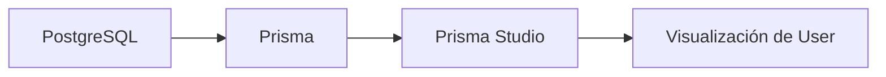

# Día 23 - Prisma Studio

## Qué he hecho

- He arrancado PostgreSQL con Docker Compose.
- He comprobado que existe la migración inicial.
- He ejecutado Prisma Studio.
- He abierto la tabla User.
- He revisado las columnas del modelo.
- He comprobado visualmente los campos id, name, email, passwordHash, role, isActive, createdAt y updatedAt.
- He creado un usuario temporal.
- He comprobado valores automáticos.
- He probado la restricción de email único.
- He probado el enum Role.
- He modificado isActive.
- He eliminado el usuario temporal.

## Comando usado

```bash
npx prisma studio
```

O mediante script:

```bash
npm run prisma:studio
```

## URL habitual

```text
http://localhost:5555
```

## Tabla revisada

```text
User
```

## Campos observados

```text
id
name
email
passwordHash
role
isActive
createdAt
updatedAt
```

## Diferencia entre migración y seed

| Concepto  | Qué hace                                          |
| --------- | ------------------------------------------------- |
| Migración | Crea o modifica la estructura de la base de datos |
| Seed      | Inserta datos iniciales                           |

## Explicación personal

Prisma Studio es una herramienta visual que permite ver y editar los datos de la base de datos. Me ayuda a comprobar que la migración ha creado correctamente la tabla User y que las restricciones del modelo funcionan.

## Prisma Studio frente a Adminer

| Herramienta   | Para qué sirve                              |
| ------------- | ------------------------------------------- |
| Adminer       | Gestionar la base de datos de forma general |
| Prisma Studio | Ver y editar datos desde el modelo Prisma   |

Adminer muestra la base de datos desde un punto de vista más general. Prisma Studio está más integrado con el proyecto Prisma.

## Diagrama



Prisma Studio se conecta a la base de datos usando la configuración de Prisma y permite visualizar los modelos como tablas editables.

## Para qué sirve Prisma Studio

**Prisma Studio** es un panel de administración visual que se abre en el navegador (`npx prisma studio`) para explorar y gestionar la base de datos de forma interactiva, sin necesidad de escribir sentencias SQL ni configurar clientes externos.

### Utilidad principal durante el desarrollo:

- **Visualización rápida de datos:** Permite consultar tablas, columnas y relaciones de forma gráfica y navegable.
- **Comprobación de migraciones:** Facilita verificar al instante que los nuevos campos, tablas o relaciones se han creado correctamente tras aplicar una migración.
- **Edición de registros temporales:** Permite crear, actualizar o borrar datos de prueba directamente desde la interfaz con un par de clics.
- **Validación de endpoints de la API:** Sirve para confirmar en tiempo real si una petición del backend (como un registro de usuario o una actualización) se ha guardado de verdad en la base de datos.
- **Detección de errores de persistencia:** Ayuda a localizar fallos en la lógica del código, como valores nulos no deseados, campos con formatos incorrectos o relaciones mal asociadas.

## Herramientas de prueba

| Herramienta            | Qué prueba                                                                                                                                                   |
| ---------------------- | ------------------------------------------------------------------------------------------------------------------------------------------------------------ |
| **Thunder / Postman**  | Endpoints de la API REST (códigos de estado HTTP, cabeceras, payloads JSON y lógica del backend de forma aislada).                                           |
| **Prisma Studio**      | Persistencia y modelos del ORM (consulta, edición rápida y validación de registros mapeados por el esquema de Prisma).                                       |
| **Adminer**            | Estado y estructura nativa de la base de datos PostgreSQL (tablas reales, tipos SQL, claves, índices y ejecución directa de consultas SQL).                  |
| **Frontend entregado** | Flujo completo de la aplicación de extremo a extremo (_E2E_) y experiencia de usuario (formularios, validaciones en interfaz e integración real con la API). |

## Observación de restricciones en la base de datos

A continuación se documentan las pruebas y observaciones visuales realizadas sobre las restricciones (_constraints_) del modelo `User` en la base de datos a través de **Adminer** y **Prisma Studio**:

---

### 1. `email` único (`UNIQUE`)

- **Observación visual:**
  - En **Adminer**, dentro de la pestaña de estructura de la tabla `User`, el campo `email` tiene asociado el índice `User_email_key` de tipo `UNIQUE`.
  - En **Prisma Studio**, el campo se muestra como identificador secundario.
- **Comportamiento observado:**
  - Al intentar insertar un segundo registro con un correo electrónico que ya existe en la base de datos, el motor de PostgreSQL rechaza la operación inmediatamente.
  - Se produce un error de violación de restricción única (`duplicate key value violates unique constraint "User_email_key"` en SQL / código `P2002` en Prisma), impidiendo duplicados y asegurando la integridad de los datos.

---

### 2. `role` limitado a `USER` o `ADMIN` (`ENUM`)

- **Observación visual:**
  - En **Adminer**, el tipo de la columna no es un simple texto (`TEXT` o `VARCHAR`), sino el tipo personalizado `"Role"`.
  - En **Prisma Studio**, al hacer doble clic para editar el campo `role`, la interfaz no muestra un campo de texto libre, sino un desplegable con las únicas dos opciones válidas: `USER` y `ADMIN`.
- **Comportamiento observado:**
  - Al intentar forzar la inserción de un rol no permitido (por ejemplo, `'SUPERADMIN'` o `'GUEST'`), la base de datos aborta la consulta indicando que el valor no pertenece al enum: `invalid input value for enum "Role"`.
  - El valor por defecto al crear un nuevo registro sin especificar rol se asigna automáticamente como `USER`.

---

### 3. `isActive` booleano (`BOOLEAN`)

- **Observación visual:**
  - En **Adminer**, la columna figura con el tipo nativo `boolean` y valor predeterminado `true`.
  - En **Prisma Studio**, el campo se representa visualmente como un interruptor (_toggle_) o casilla de verificación (_checkbox_).
- **Comportamiento observado:**
  - La columna solo acepta estados binarios (`true` / `false` o `1` / `0` a nivel SQL).
  - No es posible introducir texto libre ni valores numéricos arbitrarios. Al crear un nuevo usuario omitiendo este campo, se guarda automáticamente como `true`.

## Prueba de inserción y borrado manual

Se ha realizado una prueba creando un registro manual en la tabla `User` (a través de Prisma Studio / Adminer) y eliminándolo posteriormente para comprobar el ciclo completo de escritura y borrado de la base de datos.

---

## Por qué no conviene dejar datos manuales antes del seed

Un script de **seed** (_sembrado de datos_) tiene como objetivo poblar la base de datos con un conjunto predefinido y controlado de registros iniciales para desarrollo y testing. Dejar registros creados a mano antes de ejecutar el seed genera los siguientes problemas:

- **Conflictos con restricciones únicas (`UNIQUE`):** Si un registro manual utiliza un correo electrónico que el script de seed intenta insertar más adelante, el proceso de sembrado fallará abruptamente con un error de clave duplicada (`P2002`).
- **Desalineación de secuencias de IDs (`SERIAL`):** Al insertar registros manuales, la secuencia autoincremental de IDs avanza (por ejemplo, del ID 1 al ID 2). Si el seed espera IDs específicos para relacionar tablas (como asignar un usuario con ID 1 a una publicación), la base de datos quedará con identificadores desfasados o incoherentes.
- **Pérdida de reproducibilidad e idempotencia:** El entorno de desarrollo debe ser 100% predecible. Los datos residuales hacen que el estado de la base de datos dependa de lo que cada desarrollador haya probado a mano, haciendo que los tests fallen de manera impredecible en unas máquinas y en otras no.
- **Violación de integridad referencial:** Si creamos datos a mano que dependen o de los que dependen otras tablas y luego el seed intenta vaciar o sobrescribir tablas principales, pueden saltar errores de claves foráneas (_foreign key constraints_).

> **Buenas prácticas:** Antes de ejecutar el comando de seed, la base de datos debe estar limpia (o el propio script de seed debe encargarse de purgar las tablas con `deleteMany()` antes de insertar) para garantizar un estado inicial idéntico en cada ejecución.

## Preparación para el seed

Para cubrir todos los casos de uso esenciales del sistema de autenticación, control de permisos y estados de cuenta, el script de sembrado (_seed_) debe inicializar la base de datos con al menos **tres perfiles de usuario representativos**:

---

## Preparación para el seed

## Para cubrir todos los casos de uso, pruebas de permisos y validaciones de seguridad en la API, se define una batería de **6 usuarios iniciales** con diferentes combinaciones de roles, estados y propósitos:

### Detalle de los usuarios propuestos

- **1. Admin Principal**
  - **Email:** `admin@email.com`
  - **Rol:** `ADMIN`
  - **Estado:** Activo (`isActive: true`)
  - **Uso:** Usuario raíz para autenticarse y probar endpoints de administración general.

- **2. Admin Secundario**
  - **Email:** `support.admin@email.com`
  - **Rol:** `ADMIN`
  - **Estado:** Activo (`isActive: true`)
  - **Uso:** Pruebas de permisos compartidos y verificación de que un admin puede editar a otro.

- **3. Admin Inactivo**
  - **Email:** `disabled.admin@email.com`
  - **Rol:** `ADMIN`
  - **Estado:** Inactivo (`isActive: false`)
  - **Uso:** Verificar que el middleware de autenticación bloquea la generación de tokens o el acceso incluso si el usuario posee privilegios de `ADMIN`.

- **4. Usuario Estándar (Demo)**
  - **Email:** `user@email.com`
  - **Rol:** `USER`
  - **Estado:** Activo (`isActive: true`)
  - **Uso:** Usuario base para probar que las rutas restringidas a administradores devuelven un error `403 Forbidden`.

- **5. Usuario Inactivo (Suspendido)**
  - **Email:** `inactive@email.com`
  - **Rol:** `USER`
  - **Estado:** Inactivo (`isActive: false`)
  - **Uso:** Probar el manejo de errores en el endpoint de login (`401 Unauthorized` o mensaje específico de cuenta desactivada).

- **6. Usuario Prueba Búsquedas**
  - **Email:** `maria.del.carmen@email.com`
  - **Rol:** `USER`
  - **Estado:** Activo (`isActive: true`)
  - **Uso:** Comprobar consultas complejas, ordenación alfabética, paginación y listados en endpoints `GET /users`.
