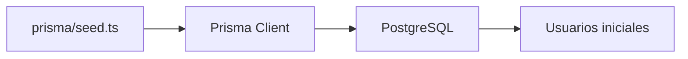
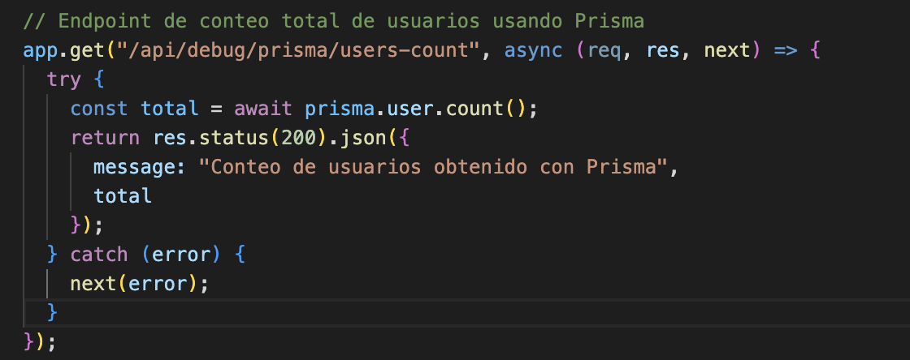
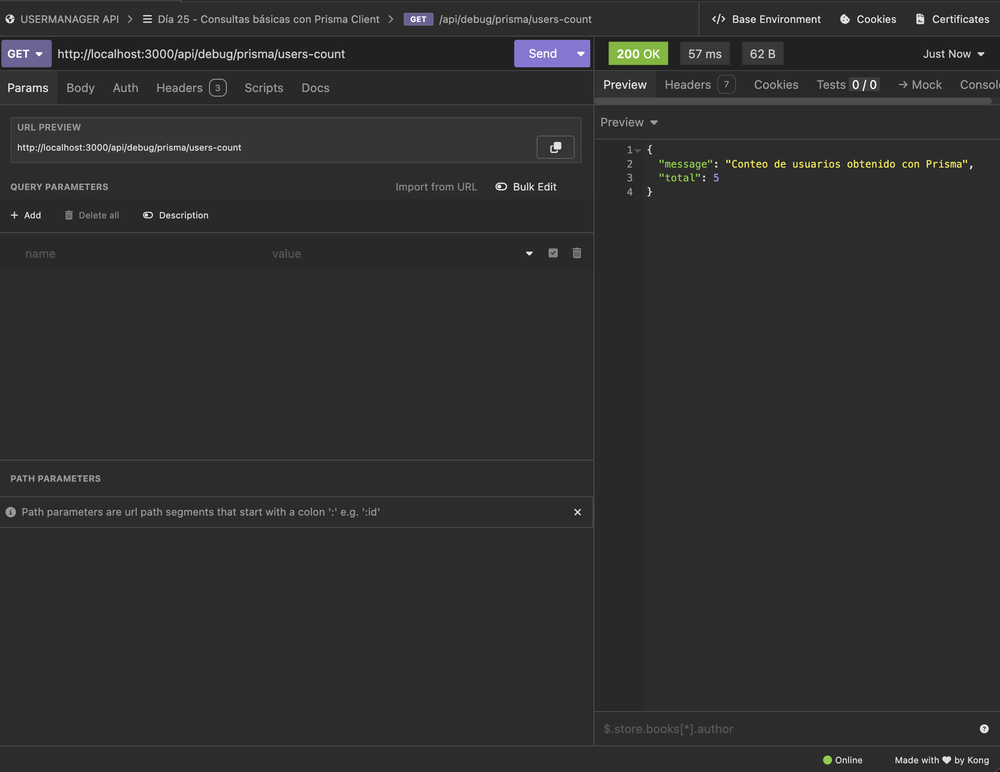
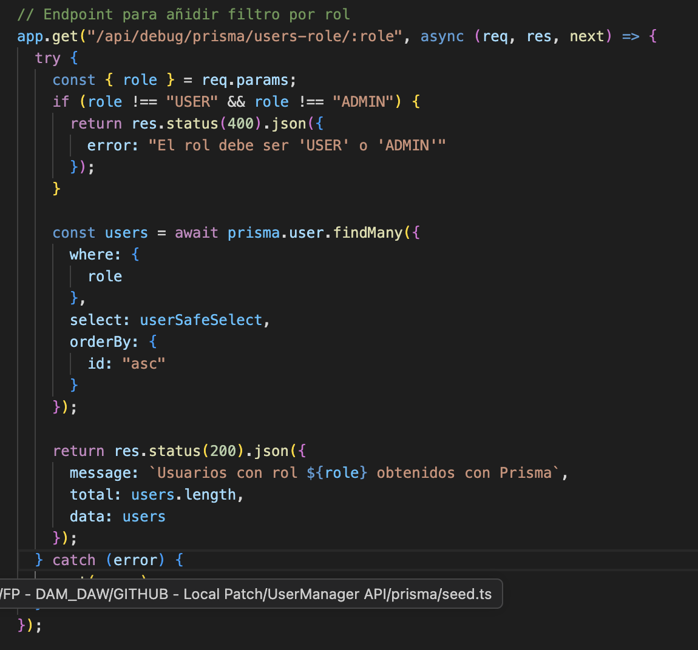
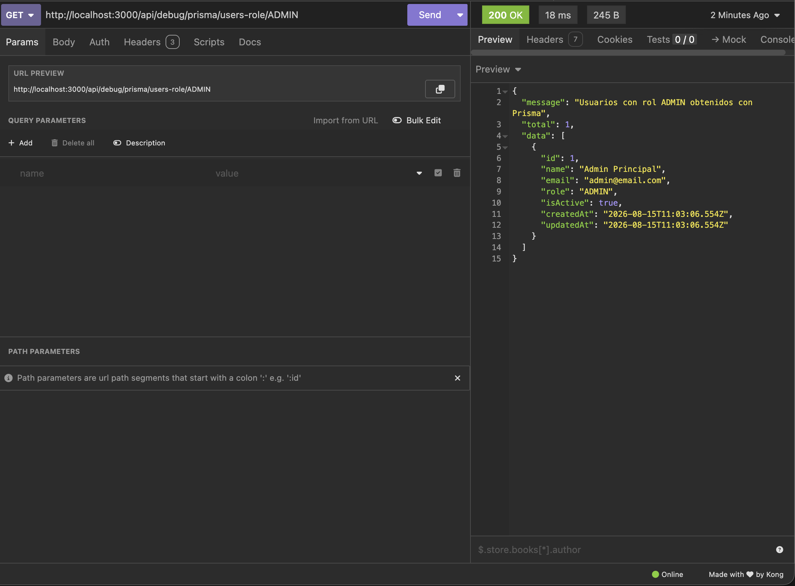

# Día 25 - Consultas básicas con Prisma Client

## Qué he hecho

- He comprobado que PostgreSQL está funcionando.
- He ejecutado el seed del día 24.
- He generado Prisma Client.
- He creado src/prisma.ts.
- He configurado Prisma Client con PrismaPg.
- He importado el cliente generado desde src/generated/prisma/client.
- He creado rutas temporales de debug.
- He consultado usuarios con findMany.
- He consultado usuarios activos con where.
- He buscado usuarios por ID con findUnique.
- He creado usuarios con prisma.user.create.
- He usado select para no devolver passwordHash.
- He comprobado los datos con Prisma Studio.
- He ejecutado npm run build.

## Rutas creadas

| Método | Ruta | Acción |
| --- | --- |---|
| GET | `/api/debug/prisma/users` | Listar usuarios |
| GET | `/api/debug/prisma/users-active` | Listar usuarios activos |
| GET | `/api/debug/prisma/users/:id` | Buscar usuario por ID |
| POST | `/api/debug/prisma/users` | Crear usuario |

## Archivo creado

```text
src/prisma.ts
```

## Configuración usada

```ts
import "dotenv/config";
import { PrismaPg } from "@prisma/adapter-pg";
import { PrismaClient } from "./generated/prisma/client";

const connectionString = process.env.DATABASE_URL;

if (!connectionString) {
  throw new Error("DATABASE_URL no está configurada");
}

const adapter = new PrismaPg({
  connectionString
});

export const prisma = new PrismaClient({ adapter });
```

## Selector seguro

```ts
const userSafeSelect = {
  id: true,
  name: true,
  email: true,
  role: true,
  isActive: true,
  createdAt: true,
  updatedAt: true
} as const;
```

## Regla importante

```text
passwordHash no debe devolverse en las respuestas de la API.
```

## Consultas trabajadas

```text
findMany
findUnique
create
where
select
orderBy
```

## Explicación personal

Hoy la API ha empezado a comunicarse con PostgreSQL mediante Prisma Client. Las rutas creadas son temporales y sirven para comprobar que Express puede leer y crear usuarios reales en la base de datos.
## Diagrama

La API usa una instancia compartida de Prisma Client configurada con el adapter de PostgreSQL. Las rutas de Express llaman a Prisma y Prisma consulta la base de datos.

## Antes y después

| Antes | Ahora |
| --- | --- |
| Los usuarios estaban en un array | Los usuarios están en PostgreSQL |
| Al reiniciar se perdían los datos | Los datos persisten |
| Se usaba `users.find(...)` | Se usa `prisma.user.findUnique(...)` |
| Se usaba `users.push(...)` | Se usa `prisma.user.create(...)` |
| No había base de datos real | Prisma consulta PostgreSQL |

## Ruta de conteo copn Prisma



## Filtro por rol



## Para qué sirve `select`

La cláusula **`select`** en Prisma (equivalente a especificar columnas en un `SELECT` de SQL) permite definir de forma explícita qué campos exactos del modelo queremos que la base de datos devuelva en una consulta.

---

### ¿Qué problemas tendríamos si devolviéramos todos los campos?

Si no usamos `select`, Prisma devuelve por defecto el registro completo con todas sus columnas, lo que genera dos problemas críticos:

* **Fuga de datos sensibles (Grave fallo de seguridad):** En entidades como `User`, la tabla almacena el campo `passwordHash` (el hash de la contraseña). Si devolvemos el objeto entero en las respuestas de la API (`res.json(users)`), estaremos enviando las contraseñas cifradas al cliente/frontend, exponiendo el sistema a ataques de fuerza bruta o filtraciones.
* **Sobrecarga innecesaria de red y memoria:** Consultar y transferir campos grandes o irrelevantes para esa vista consume ancho de banda y memoria innecesarios en el servidor y en la respuesta HTTP.

---

### Ejemplo práctico

```typescript
// Seguro: Solo extraemos y exponemos datos públicos
const user = await prisma.user.findUnique({
  where: { id },
  select: {
    id: true,
    name: true,
    email: true,
    role: true,
    isActive: true,
    // passwordHash se excluye automáticamente
  },
});
```
## Por qué usamos PrismaPg

En **Prisma 7**, la arquitectura de conexión evoluciona hacia el uso de **Driver Adapters** (adaptadores de controladores). En lugar de que el motor interno de Prisma gestione la conexión TCP de forma monolítica, se delega la comunicación a un adaptador nativo de JavaScript/TypeScript optimizado para PostgreSQL: **`PrismaPg`** (basado en el driver oficial `pg`).

---

### Instanciación del cliente

Por esta razón, la inicialización de **Prisma Client** se realiza pasando explícitamente la instancia del adaptador con la cadena de conexión:

```typescript
const adapter = new PrismaPg({
  connectionString
});

export const prisma = new PrismaClient({ adapter });
```
*Beneficios principales*

- **Arquitectura desacoplada y moderna**: Separa la generación de consultas del manejo directo de la red y del pool de conexiones.

- **Control optimizado del connection pooling**: Permite aprovechar al máximo la gestión de conexiones y sockets de la librería oficial de PostgreSQL en Node.js.

- **Compatibilidad con entornos Edge / Serverless:** Facilita que la aplicación pueda ejecutarse en plataformas modernas (como Cloudflare Workers, Vercel o Docker) con menor sobrecarga y tiempos de arranque más rápidos.

## Preparación para separar rutas

A medida que la API incorpora más funcionalidades, centralizar toda la lógica en `server.ts` deja de ser sostenible.

---

### 1. ¿Qué rutas de debug hemos creado?

Se han implementado **6 endpoints** bajo el prefijo `/api/debug/prisma`:

* `GET /api/debug/prisma/users`: Lista todos los usuarios ordenados por ID ascendente.
* `GET /api/debug/prisma/users-active`: Filtra y devuelve únicamente los usuarios con `isActive: true`.
* `GET /api/debug/prisma/users/:id`: Busca un usuario específico por su ID numérico (con control de 400 y 404).
* `GET /api/debug/prisma/users-count`: Devuelve el número total de usuarios registrados (`prisma.user.count()`).
* `GET /api/debug/prisma/users-role/:role`: Filtra usuarios por rol (`USER` o `ADMIN`).
* `POST /api/debug/prisma/users`: Valida datos de entrada (formato, longitud) y crea un nuevo usuario gestionando colisiones de email único (error P2002 / 409).

---

### 2. ¿Por qué `server.ts` empieza a crecer demasiado?

`server.ts` está acumulando múltiples responsabilidades que deberían estar desacopladas (*violación del Principio de Responsabilidad Única*):
* Configuración e inicialización del servidor Express.
* Definición de middlewares globales.
* Lógica de validación de parámetros y payloads HTTP.
* Consultas directas a la base de datos mediante Prisma Client.
* Manejo de errores específicos de base de datos y respuestas JSON.

---

### 3. ¿Qué código podríamos mover a una carpeta `routes`?

Podemos extraer a un archivo dedicado (por ejemplo, `src/routes/debug.routes.ts` o `src/routes/users.routes.ts`) utilizando `express.Router()`:
* **Los manejadores de ruta:** Todas las definiciones `router.get(...)` y `router.post(...)`.
* **Constantes de consulta:** Objetos de proyección como `userSafeSelect`.
* **Funciones auxiliares específicas:** Helpers como `isPrismaUniqueError()`.

---

### 4. ¿Qué pasará cuando añadamos más endpoints?

Si no modularizamos el código antes de añadir endpoints reales (autenticación, gestión de perfiles, permisos o nuevos recursos):
* **Pérdida de legibilidad y mantenibilidad:** `server.ts` se convertirá en un archivo monolítico de cientos de líneas difícil de navegar.
* **Conflictos en Git (*Merge Conflicts*):** Varios desarrolladores modificando el mismo archivo central simultáneamente generarán bloqueos continuos.
* **Dificultad para testear y escalar:** Resultará complejo aplicar middlewares específicos (como autenticación JWT o autorización por roles) solo a un grupo concreto de rutas.