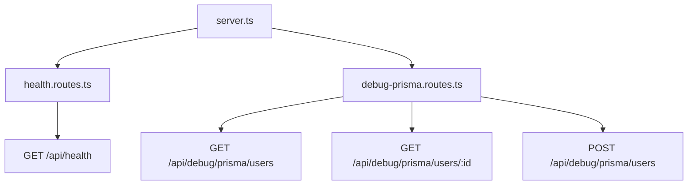

# Día 26 - Separar rutas

## Qué he hecho

- He empezado la fase de arquitectura por capas.
- He creado la carpeta src/routes.
- He creado health.routes.ts.
- He movido la ruta GET /api/health fuera de server.ts.
- He creado debug-prisma.routes.ts.
- He movido las rutas temporales de Prisma fuera de server.ts.
- He montado los routers usando app.use.
- He comprobado que las rutas siguen funcionando.
- He dejado server.ts más limpio.

## Archivos creados

```text
src/routes/health.routes.ts
src/routes/debug-prisma.routes.ts
```

## Estructura actual

```text
src/
  prisma.ts
  server.ts
  routes/
    health.routes.ts
    debug-prisma.routes.ts
```

## Rutas montadas

| Router            | Prefijo en server.ts | Ruta interna    | Ruta final                       |
| ----------------- | -------------------- | --------------- | -------------------------------- |
| healthRouter      | `/api/health`        | `/`             | `/api/health`                    |
| debugPrismaRouter | `/api/debug/prisma`  | `/users`        | `/api/debug/prisma/users`        |
| debugPrismaRouter | `/api/debug/prisma`  | `/users/:id`    | `/api/debug/prisma/users/:id`    |
| debugPrismaRouter | `/api/debug/prisma`  | `/users-active` | `/api/debug/prisma/users-active` |

## Explicación personal

Separar rutas permite que server.ts no tenga toda la lógica de la API. A partir de ahora, server.ts se encarga de configurar la aplicación y montar routers, mientras que los archivos de routes agrupan endpoints relacionados.

## Diagrama



server.ts ya no define todas las rutas directamente. Ahora monta routers separados, y cada router agrupa rutas relacionadas.

## Mapa de rutas

| Router            | Prefijo en server.ts | Ruta interna        | Método | Ruta final                           |
| ----------------- | -------------------- | ------------------- | ------ | ------------------------------------ |
| healthRouter      | `/api/health`        | `/`                 | `GET`  | `/api/health`                        |
| debugPrismaRouter | `/api/debug/prisma`  | `/users`            | `GET`  | `/api/debug/prisma/users`            |
| debugPrismaRouter | `/api/debug/prisma`  | `/users-active`     | `GET`  | `/api/debug/prisma/users-active`     |
| debugPrismaRouter | `/api/debug/prisma`  | `/users-count`      | `GET`  | `/api/debug/prisma/users-count`      |
| debugPrismaRouter | `/api/debug/prisma`  | `/users-role/:role` | `GET`  | `/api/debug/prisma/users-role/:role` |
| debugPrismaRouter | `/api/debug/prisma`  | `/users/:id`        | `GET`  | `/api/debug/prisma/users/:id`        |
| debugPrismaRouter | `/api/debug/prisma`  | `/users`            | `POST` | `/api/debug/prisma/users`            |
| authRouter        | `/api/auth`          | `/debug`            | `GET`  | `/api/auth/debug`                    |

## Qué hace `app.use`

`app.use()` monta enrutadores modulares (`express.Router`) en la aplicación principal asignándoles un **prefijo de URL común**.

La dirección final que escucha el servidor es la combinación de ambos:

> **Prefijo en server.ts** + **Ruta interna en el router** = **Ruta final**

### Ventajas principales:

- **Evita repeticiones:** No es necesario reescribir la base de la URL (ej. `/api/debug/prisma`) en cada endpoint.
- **Modularidad:** Permite aislar cada recurso en su propio archivo dentro de `src/routes/`.
- **Middlewares compartidos:** Facilita aplicar seguridad, validaciones o autenticación a todo un bloque de rutas en una sola línea.

## Comparar antes y después

| Antes                                  | Después                                   |
| -------------------------------------- | ----------------------------------------- |
| Todas las rutas estaban en `server.ts` | Las rutas están agrupadas en `src/routes` |
| `server.ts` crecía demasiado           | `server.ts` queda más limpio              |
| Era difícil localizar endpoints        | Cada archivo agrupa rutas relacionadas    |

## Preparación para controladores

Actualmente, aunque hemos modularizado algunas rutas, `server.ts` sigue conteniendo la lógica completa de muchos endpoints en funciones anónimas inline. Para mantener una arquitectura limpia y desacoplada, el siguiente paso es delegar esa responsabilidad a **controladores**.

---

### 1. ¿Qué lógica sigue mezclada dentro de las rutas?

- **Extracción y parseo de datos:** Conversión de tipos manual (`Number(req.params.id)`), lectura de `req.body`, `req.query` y `req.headers`.
- **Validación de reglas de negocio:** Comprobaciones de formatos de email, longitud de contraseñas (`isValidPassword`), strings vacíos y normalizaciones.
- **Manipulación y acceso a datos:** Búsquedas (`find`, `findIndex`), cálculos de IDs (`Math.max`), mutaciones de arrays (`push`, reasignaciones) y llamadas directas al modelo de datos.
- **Construcción de respuestas HTTP:** Definición manual de códigos de estado (`200`, `201`, `400`, `404`, `409`) y formateo de los payloads JSON de respuesta.

---

### 2. ¿Qué partes podrían moverse a funciones controladoras?

Todas las funciones callback `(req, res, next) => { ... }` asociadas a cada endpoint deben extraerse a un archivo de controladores :

- `getUsers` / `getUserById` / `getUserProfile`
- `createUser`
- `updateUser` / `updateUserStatus` / `updateUserRole`
- `deleteUser` / `reactivateUser`

De este modo, el archivo de rutas solo se encarga de asociar el método HTTP y el path con su controlador correspondiente:

```typescript
// users.routes.ts queda limpio y declarativo:
router.get("/", getUsers);
router.get("/:id", getUserById);
router.post("/", createUser);
```

### 3. ¿Qué debería hacer un controlador?

El controlador actúa como puente entre el protocolo HTTP (Express) y la lógica de negocio de la aplicación. Su responsabilidad se limita a:

- Recibir la petición: Extraer y sanitizar los parámetros de entrada (req.params, req.query, req.body).

- Ejecutar o delegar la acción: Llamar a los servicios, funciones auxiliares o al cliente de base de datos (Prisma).

- Manejar excepciones: Capturar posibles fallos y derivarlos al middleware de error mediante next(error).

- Devolver la respuesta HTTP: Responder al cliente con el código de estado adecuado (200, 201, etc.) y el cuerpo en formato JSON.
