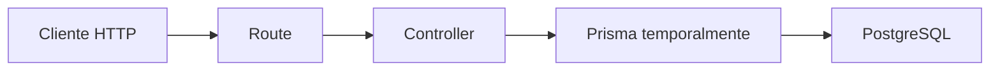

# Día 27 - Controladores

## Qué he hecho

- He creado la carpeta src/controllers.
- He creado health.controller.ts.
- He movido la lógica de GET /api/health a getHealth.
- He creado user.controller.ts.
- He movido la lógica de usuarios a funciones controladoras.
- He simplificado health.routes.ts.
- He simplificado debug-prisma.routes.ts.
- He comprobado que las rutas siguen funcionando.
- He comprobado que los datos siguen llegando a PostgreSQL mediante Prisma.

## Archivos creados

```text
src/controllers/health.controller.ts
src/controllers/user.controller.ts
```

## Estructura actual

```text
src/
  prisma.ts
  server.ts
  routes/
    health.routes.ts
    debug-prisma.routes.ts
  controllers/
    health.controller.ts
    user.controller.ts
```

## Controladores creados

| Controlador | Función |
| --- | --- |
| `getHealth` | Devuelve el estado de la API |
| `getUsers` | Lista usuarios |
| `getActiveUsers` | Lista usuarios activos |
| `getUserById` | Busca un usuario por ID |
| `createDebugUser` | Crea un usuario temporal con Prisma |

## Antes y después

Antes:

```ts
debugPrismaRouter.get("/users", async (req, res, next) => {
  // lógica completa aquí
});
```

Después:

```ts
debugPrismaRouter.get("/users", getUsers);
```

## Explicación personal

Los controladores permiten separar la definición de rutas de la lógica que responde a cada petición. Esto hace que los archivos de rutas sean más fáciles de leer y prepara el proyecto para añadir servicios y repositorios.

## Diagrama controladores

En este día el controlador todavía usa Prisma directamente. En los próximos días se añadirá una capa de servicio y una capa de repositorio para separar mejor las responsabilidades.

## Tabla de responsabilidades

Añade al documento:

| Archivo                  | Responsabilidad                    |
| ------------------------ | ---------------------------------- |
| `server.ts`              | Configura Express y monta routers  |
| `health.routes.ts`       | Define rutas de health             |
| `health.controller.ts`   | Responde al health check           |
| `debug-prisma.routes.ts` | Define rutas temporales de usuario |
| `user.controller.ts`     | Gestiona las peticiones de usuario |

## Qué es un controlador

Un **controlador** es la función que gestiona el ciclo de una petición HTTP en el backend: recibe los datos de la solicitud (`req`), coordina la lógica de negocio o la consulta a la base de datos, y envía la respuesta final (`res`) al cliente con su código de estado correspondiente.

### Funciones clave:
* **Procesar la entrada:** Extrae y valida los datos de `req.params`, `req.query` o `req.body`.
* **Coordinar la acción:** Llama a los modelos de datos (Prisma) o servicios necesarios.
* **Emitir la respuesta:** Envía el resultado en JSON (ej. `200 OK`, `201 Created`) o delega los fallos con `next(error)`.

## Identificación de lógica pendiente de mover a un servicio

Actualmente, `user.controller.ts` asume responsabilidades que pertenecen a la **lógica de negocio** y al **acceso a datos**. Para preparar la arquitectura en capas (Día 28), se identifican las siguientes partes para extraer a `user.service.ts`:

---

### 1. Acceso a base de datos y consultas Prisma
* **Llamadas directas a Prisma Client:** Todas las operaciones `prisma.user.findMany()`, `prisma.user.count()`, `prisma.user.findUnique()` y `prisma.user.create()`.
* **Proyección de campos seguros:** La constante `userSafeSelect` debe residir en el servicio o repositorio para centralizar qué datos de usuario son públicos.

### 2. Sanitización y normalización de datos
* **Limpieza de strings:** `String(name).trim()` y `String(password).trim()`.
* **Normalización de emails:** `String(email).trim().toLowerCase()` para evitar inconsistencias en búsquedas y restricciones únicas.

### 3. Reglas de validación de negocio
* **Validación de campos obligatorios y formato:** Comprobaciones de nombre no vacío y estructura de email (`includes("@")`, `includes(". ")`).
* **Longitud y fortaleza de contraseña:** Validación de la regla de longitud mínima (`password.length >= 6`).
* **Validación de dominio de roles:** Comprobación de roles permitidos (`USER` o `ADMIN`) en `getUsersByRole`.

### 4. Transformación de datos y seguridad
* **Generación del hash de contraseña:** La lógica de creación del `passwordHash` (actualmente `hash_temporal_${cleanPassword}` y en el futuro con `bcrypt` o `argon2`) nunca debe estar en el controlador.

### 5. Control de conflictos y excepciones de dominio
* **Gestión de emails duplicados:** La detección y captura del error `P2002` de Prisma (o la comprobación previa de existencia) para devolver un error de dominio comprensible en lugar de acoplar el controlador a códigos de error internos de Prisma.
* **Control de existencia:** La decisión de lanzar un error tipo `NotFoundError` cuando un usuario no existe tras `findUnique`.

---

> **Objetivo final:** El controlador solo debe encargarse de leer la `Request` HTTP, pasar los datos limpios al servicio `userService.createUser(...)`, capturar el resultado y responder con el código HTTP correspondiente (`res.status(201).json(...)`).

---
## Comparar routes y controllers

Completa esta tabla:

| Capa              | Qué sabe               | Qué no debería saber          |
| ----------------- | ---------------------- | ----------------------------- |
| Route             | URL y método HTTP      | Lógica interna compleja       |
| Controller        | req, res, status, json | Detalles profundos de negocio |
| Service futuro    | Reglas de negocio      | Detalles de Express           |
| Repository futuro | Acceso a datos         | Reglas HTTP                   |