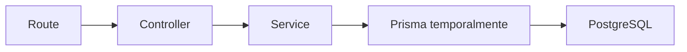

# Día 28 - Servicios

## Qué he hecho

- He creado la carpeta src/services.
- He creado la carpeta src/errors.
- He creado la clase AppError.
- He creado user.service.ts.
- He movido lógica de negocio desde el controlador al servicio.
- He creado getUsersService.
- He creado getActiveUsersService.
- He creado getUserByIdService.
- He creado createDebugUserService.
- He limpiado user.controller.ts.
- He comprobado que las rutas siguen funcionando.
- He probado errores de validación y email duplicado.

## Archivos creados

```text
src/errors/AppError.ts
src/services/user.service.ts
```

## Estructura actual

```text
src/
  prisma.ts
  server.ts
  controllers/
    health.controller.ts
    user.controller.ts
  errors/
    AppError.ts
  routes/
    health.routes.ts
    debug-prisma.routes.ts
  services/
    user.service.ts
```

## Servicios creados

| Servicio | Responsabilidad |
| --- | --- |
| `getUsersService` | Obtener todos los usuarios |
| `getActiveUsersService` | Obtener usuarios activos |
| `getUserByIdService` | Buscar un usuario por ID |
| `createDebugUserService` | Validar y crear un usuario temporal |

## Antes y después

Antes, el controlador validaba datos y consultaba Prisma directamente.

Ahora, el controlador llama al servicio:

```ts
const createdUser = await createDebugUserService(req.body);
```

Y el servicio contiene la lógica de validación y creación.

## Explicación personal

Un servicio contiene reglas de negocio. En este proyecto, user.service.ts se encarga de validar datos, normalizar email, comprobar errores y crear usuarios. El controlador queda más centrado en recibir la petición y devolver la respuesta HTTP.

## Diagrama servicios


En este día el servicio todavía usa Prisma directamente. En el próximo paso se creará una capa de repositorio para separar el acceso a datos.

## Responsabilidades actuales

| Capa | Responsabilidad |
| --- | --- |
| Route | Define URL y método HTTP |
| Controller | Lee req, llama al servicio y responde |
| Service | Aplica reglas de negocio |
| Prisma | Accede temporalmente a PostgreSQL |


## Qué es lógica de negocio

La **lógica de negocio** es el conjunto de reglas, políticas y condiciones del mundo real que dictan cómo debe funcionar una aplicación y cómo se deben gestionar sus datos. Representa las "reglas del juego" del proyecto y existe independientemente de la tecnología o la base de datos utilizada (debe residir en la capa de **servicios**).

---

### Ejemplos prácticos en nuestra aplicación:

* **Restricciones de identidad y formato:** Un email no puede repetirse en el sistema y una contraseña debe tener un mínimo de 6 caracteres para ser válida.
* **Control de estado y accesos:** Un usuario marcado como inactivo (`isActive: false`) tiene prohibido iniciar sesión o realizar acciones en la plataforma.
* **Jerarquía de permisos:** Solo un usuario con rol `ADMIN` está autorizado para modificar roles o eliminar cuentas de otros usuarios; un `USER` estándar solo puede gestionar su propio perfil.
* **Transformación y seguridad de datos:** Toda contraseña debe ser obligatoriamente procesada con un algoritmo de hashing seguro antes de guardarse en la base de datos.


## Comparar controlador y servicio


| Aspecto                        | Controller | Service |
| ------------------------------ | ---------- | ------- |
| Trabaja con `req` y `res`      |     SI     |    NO   |
| Devuelve `res.status().json()` |     SI     |    NO   |
| Aplica reglas de negocio       |     NO     |    SI   |  
| Normaliza email                |     NO     |    SI   |
| Llama a funciones de datos     |     NO     |    SI   |
| Conoce códigos HTTP            |     SI     |    NO   |


## Preparación para repositorios

Para completar la arquitectura en tres capas (**Controlador → Servicio → Repositorio**), el siguiente paso es aislar el acceso a la base de datos para que el servicio no dependa directamente de Prisma.

---

### 1. ¿Qué consultas Prisma hay todavía dentro del servicio?

* `prisma.user.findMany()` (listado general, activos y filtrado por rol).
* `prisma.user.findUnique()` (búsqueda por `id` o por `email`).
* `prisma.user.count()` (conteo total de usuarios).
* `prisma.user.create()` (inserción del nuevo registro en la base de datos).

---

### 2. ¿Qué funciones podrían moverse a `user.repository.ts`?

* `findUsers(filters?)` y `findActiveUsers()`
* `findUserById(id)` y `findUserByEmail(email)`
* `countUsers()`
* `createUser(userData)`
* La proyección de campos `userSafeSelect`

---

### 3. ¿Qué debería hacer un repositorio?

El **repositorio** es la capa dedicada exclusivamente al **acceso y persistencia de datos**.

* **Su única responsabilidad:** Ejecutar operaciones de lectura y escritura en la base de datos (SQL / Prisma).
* **Sin lógica de negocio:** No valida formatos, no hashea contraseñas ni decide permisos; simplemente recibe datos limpios del servicio, ejecuta la consulta y devuelve los registros brutos.
* **Desacoplamiento:** Permite cambiar de ORM o motor de base de datos en el futuro sin tener que modificar una sola línea de los servicios o controladores.