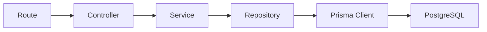

# Día 29 - Repositorio con Prisma

## Qué he hecho

- He creado la carpeta src/repositories.
- He creado user.repository.ts.
- He movido las consultas Prisma desde el servicio al repositorio.
- He creado funciones de acceso a datos.
- He creado findAllUsers.
- He creado findActiveUsers.
- He creado findUserById.
- He creado findUserByEmail.
- He creado createUser.
- He modificado user.service.ts para usar el repositorio.
- He comprobado que user.controller.ts no necesita conocer el repositorio.
- He probado que las rutas siguen funcionando.

## Archivos creados

```text
src/repositories/user.repository.ts
```

## Estructura actual

```text
src/
  prisma.ts
  server.ts
  controllers/
    health.controller.ts
    user.controller.ts
  errors/
    AppError.ts
  repositories/
    user.repository.ts
  routes/
    health.routes.ts
    debug-prisma.routes.ts
  services/
    user.service.ts
```

## Funciones del repositorio

| Función           | Responsabilidad            |
| ----------------- | -------------------------- |
| `findAllUsers`    | Obtener todos los usuarios |
| `findActiveUsers` | Obtener usuarios activos   |
| `findUserById`    | Buscar usuario por ID      |
| `findUserByEmail` | Buscar usuario por email   |
| `createUser`      | Crear usuario              |

## Flujo actual

```text
Route → Controller → Service → Repository → Prisma → PostgreSQL
```

## Explicación personal

El repositorio se encarga del acceso a datos. El servicio ya no usa Prisma directamente, sino que llama a funciones del repositorio. Esto permite separar mejor las reglas de negocio del acceso a la base de datos.

## Diagrama Repositorio



El repositorio es la capa que usa Prisma Client. El servicio deja de conocer los detalles concretos de acceso a base de datos.

## Comparación entre capas

| Capa       | Qué hace                            | Ejemplo                  |
| ---------- | ----------------------------------- | ------------------------ |
| Route      | Define URL y método                 | `GET /users`             |
| Controller | Lee req y responde con res          | `getUsers`               |
| Service    | Aplica reglas de negocio            | `getUserByIdService`     |
| Repository | Consulta o modifica datos           | `findUserById`           |
| Prisma     | Ejecuta consultas contra PostgreSQL | `prisma.user.findUnique` |

## Antes y después

Antes, el servicio consultaba Prisma directamente:

```ts
return prisma.user.findMany({
  select: userSafeSelect,
});
```

Ahora, el servicio llama al repositorio:

```ts
return findAllUsers();
```

Y el repositorio se encarga de Prisma:

```ts
export function findAllUsers() {
  return prisma.user.findMany({
    select: userSafeSelect,
  });
}
```

## Qué es un repositorio

Un **repositorio** es la capa encargada de centralizar y aislar todas las operaciones de lectura y escritura en la base de datos.

Actúa como intermediario entre los servicios y la persistencia, permitiendo que la lógica de negocio no tenga que conocer los detalles técnicos del ORM (Prisma) ni del motor de base de datos (PostgreSQL).

---

### Responsabilidades clave

- **Ejecutar consultas de base de datos:** Realiza operaciones directas de persistencia (`findMany`, `findUnique`, `create`, `count`).
- **Centralizar proyecciones:** Define y gestiona los campos que se extraen de las tablas (como `userSafeSelect`).
- **Desacoplar la arquitectura:** Si en el futuro se cambia de ORM o de base de datos, solo se modifica el repositorio, dejando intactos los servicios y controladores.

## Service y Repository

| Aspecto                            | Service | Repository |
| ---------------------------------- | ------- | ---------- |
| Valida reglas de negocio           | Sí      | No         |
| Normaliza email                    | Sí      | No         |
| Decide si lanzar `AppError`        | Sí      | No         |
| Usa Prisma Client                  | No      | Sí         |
| Ejecuta `findMany`                 | No      | Sí         |
| Devuelve datos de la base de datos | No      | Sí         |

## Preparación para CRUD persistente ordenado

### 1. ¿Qué rutas temporales de debug deberían convertirse en rutas reales?

Todas las rutas creadas bajo el prefijo `/api/debug/prisma/*` (como `/users`, `/users/:id`, `/users-active` y la creación con contraseñas temporales) deben migrar a la ruta canónica del recurso: **`/api/users`**.

---

### 2. ¿Qué endpoints definitivos de usuarios necesitamos?

- **`GET /api/users`**: Listado general de usuarios.
- **`GET /api/users/:id`**: Obtención de un usuario específico por su ID.
- **`POST /api/users`**: Registro y creación de un nuevo usuario.
- **`PATCH /api/users/:id`**: Actualización parcial de campos de un usuario (nombre, email, etc.).
- **`DELETE /api/users/:id`**: Desactivación lógica (_soft delete_) o eliminación de un usuario.

---

### 3. ¿Qué funciones faltan en el repositorio (`user.repository.ts`)?

- **`updateUser(id: number, data: UpdateUserData)`**: Ejecuta `prisma.user.update` para modificar los campos seleccionados preservando `userSafeSelect`.
- **`deleteUser(id: number)`** o **`softDeleteUser(id: number)`**: Ejecuta la baja lógica actualizando `isActive: false` (o `prisma.user.delete` si fuera borrado físico).

---

### 4. ¿Qué funciones faltan en el servicio (`user.service.ts`)?

- **`updateUserService(id: number, data: UpdateUserInput)`**:
  - Valida que el ID sea válido y que el usuario exista.
  - Verifica que al menos un campo a modificar haya sido enviado.
  - Valida y normaliza el formato del nuevo email y comprueba que no pertenezca a otro usuario.
  - Llama a `userRepository.updateUser`.
- **`deleteUserService(id: number)`**:
  - Verifica si el usuario existe y si ya se encuentra desactivado.
  - Aplica la regla de negocio de baja lógica y llama a `userRepository.softDeleteUser`.
