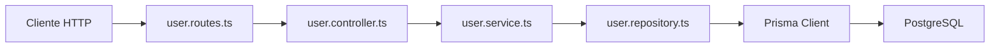

# Día 30 - CRUD persistente ordenado con Prisma y capas

## Qué he hecho

- He creado user.routes.ts.
- He montado userRouter en server.ts.
- He creado rutas reales de usuario.
- He añadido updateUser en el repositorio.
- He añadido deactivateUser en el repositorio.
- He creado createUserService.
- He creado updateUserService.
- He creado deactivateUserService.
- He creado controladores para crear, actualizar y desactivar usuarios.
- He probado GET /api/users.
- He probado GET /api/users/:id.
- He probado POST /api/users.
- He probado PATCH /api/users/:id.
- He probado DELETE /api/users/:id.
- He comprobado los cambios con Prisma Studio.

## Rutas reales creadas

| Método | Ruta | Acción |
| --- | --- |---|
| GET | `/api/users` | Listar usuarios |
| GET | `/api/users/:id` | Consultar usuario |
| POST | `/api/users` | Crear usuario |
| PATCH | `/api/users/:id` | Actualizar usuario |
| DELETE | `/api/users/:id` | Desactivar usuario |

## Flujo actual

```text
Route → Controller → Service → Repository → Prisma → PostgreSQL
```

## Archivos modificados o creados

```text
src/routes/user.routes.ts
src/controllers/user.controller.ts
src/services/user.service.ts
src/repositories/user.repository.ts
src/server.ts
```

## Borrado lógico

El endpoint DELETE no elimina físicamente el usuario.

En su lugar, actualiza:

```text
isActive = false
```

Esto permite conservar el registro en la base de datos.

## Explicación personal

El CRUD persistente permite que la API gestione usuarios reales guardados en PostgreSQL. La arquitectura por capas ayuda a que cada parte del código tenga una responsabilidad clara.

## Diagrama COMPLETO CRUD

El CRUD real de usuarios sigue el flujo completo por capas. Las rutas no acceden a Prisma directamente y los controladores tampoco. El acceso a datos queda concentrado en el repositorio.

##  Ejemplos de body

| Método   | Ruta             | Body necesario               |
| -------- | ---------------- | ---------------------------- |
| `POST`   | `/api/users`     | `name`, `email`, `password`  |
| `PATCH`  | `/api/users/:id` | `name`, `email` o `isActive` |
| `DELETE` | `/api/users/:id` | ninguno                      |


## Comparar CRUD en memoria y CRUD persistente


| Operación  | En memoria                  | Con Prisma             |
| ---------- | --------------------------- | ---------------------- |
| Listar     | `users`                     | `findAllUsers()`       |
| Buscar     | `users.find(...)`           | `findUserById(id)`     |
| Crear      | `users.push(...)`           | `createUser(data)`     |
| Actualizar | modificar array             | `updateUser(id, data)` |
| Desactivar | cambiar `isActive` en array | `deactivateUser(id)`   |

## Preparación para limpieza y refactor

---

### 1. ¿Qué rutas de debug pueden eliminarse?

* **Endpoints de prueba de Express en `server.ts`:** `/api/debug/body`, `/api/debug/params/:id`, `/api/debug/query`, `/api/debug/headers`, `/api/debug/request`, etc.
* **Endpoints temporales de depuración con Prisma:** Todo el bloque bajo el prefijo `/api/debug/prisma/*` (como `/api/debug/prisma/users`, `users-active`, `users-role`, etc.), ya que han sido reemplazados por el CRUD oficial en `/api/users`.
* **Endpoints y base de datos simulada en memoria:** El array `const users = [...]` y todas las rutas antiguas de CRUD en memoria de `server.ts`.

---

### 2. ¿Qué nombres de funciones podrían mejorarse?

* **Corrección de camelCase en Repositorio:** Cambiar `findusersByRole` a **`findUsersByRole`** y `usersCount` a **`countUsers`** para mantener coherencia con `findActiveUsers` o `findUserById`.
* **Eliminación de prefijos "Debug":** Renombrar `createDebugUser` a **`createUser`** en el controlador.
* **Estandarización de sufijos:** Homogeneizar los nombres entre capas (por ejemplo, en el servicio usar `getUsers`, `getUserById`, `createUser`, `updateUser` dentro del módulo `userService`).

---

### 3. ¿Qué código se repite?

* **Validación y parseo de IDs:** La conversión `const id = Number(req.params.id)` y la comprobación `if (Number.isNaN(id))` repetidas en cada endpoint con parámetro `:id`.
* **Sanitización manual de strings:** Las llamadas continuas a `.trim()` y `.toLowerCase()` en nombres, emails y contraseñas.
* **Estructura de respuestas HTTP:** La construcción manual de objetos de respuesta con `{ message, total, data }`.

---

### 4. ¿Qué validaciones podrían extraerse?

* **Helpers de validación de formatos:** Funciones como `isValidBasicEmail`, `isValidPassword`, `isNonEmptyString` e `isBoolean` deben moverse a un archivo reutilizable (por ejemplo, `src/utils/validators.ts`).
* **Clase `AppError`:** Extraer la definición de la clase a `src/errors/app-error.ts` para evitar dependencias circulares con `server.ts`.
* **Captura de errores de base de datos:** Aislar la verificación de errores de unicidad de Prisma (código `P2002`) en un helper o en el middleware de errores.

---

### 5. ¿Qué archivos han crecido demasiado?

* **`server.ts`:** Es el archivo más sobrecargado. Debe limpiarse para contener únicamente:
  1. Configuración del servidor Express (`express.json()`).
  2. Registro de middlewares globales (CORS, logs).
  3. Montaje de los routers modulares (`app.use("/api/users", usersRouter)`).
  4. Middlewares de 404 y de errores.
  5. Arranque del servidor con `app.listen()`.