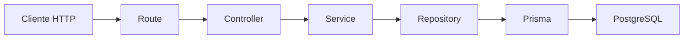

# Día 31 - Limpieza y refactor

## Qué he hecho

- He revisado el proyecto después de crear el CRUD persistente.
- He eliminado o apartado rutas temporales de debug.
- He limpiado server.ts.
- He revisado user.routes.ts.
- He limpiado user.controller.ts.
- He revisado user.service.ts.
- He revisado user.repository.ts.
- He creado utilidades reutilizables.
- He creado parse.utils.ts.
- He creado string.utils.ts.
- He eliminado imports innecesarios.
- He comprobado que las rutas principales siguen funcionando.
- He ejecutado npm run build.
- He actualizado el README.

## Estructura después del refactor

```text
src/
  prisma.ts
  server.ts
  controllers/
    health.controller.ts
    user.controller.ts
  errors/
    AppError.ts
  repositories/
    user.repository.ts
  routes/
    health.routes.ts
    user.routes.ts
  services/
    user.service.ts
  utils/
    parse.utils.ts
    string.utils.ts
```

## Rutas principales

| Método | Ruta | Acción |
| --- | --- |---|
| GET | `/api/health` | Estado de la API |
| GET | `/api/users` | Listar usuarios |
| GET | `/api/users/:id` | Consultar usuario |
| POST | `/api/users` | Crear usuario |
| PATCH | `/api/users/:id` | Actualizar usuario |
| DELETE | `/api/users/:id` | Desactivar usuario |

## Cambios de refactor

| Antes | Después |
| --- | --- |
| Rutas temporales de debug | Rutas reales `/api/users` |
| Parseo de ID repetido | `parseIdParam` |
| Funciones de string dentro del servicio | `string.utils.ts` |
| Imports no usados | Imports limpiados |
| README desactualizado | README actualizado |

## Flujo actual

```text
Route → Controller → Service → Repository → Prisma → PostgreSQL
```

## Explicación personal

Refactorizar permite mejorar la estructura del código sin cambiar el comportamiento externo de la API. Después de este día, el proyecto queda más limpio y preparado para empezar la fase de seguridad.


## Checklist de pruebas después del refactor

| Prueba | Resultado |
| --- | --- |
| `GET /api/health` | 200 OK |
| `GET /api/users` | 200 OK |
| `GET /api/users/1` | 200 OK |
| `GET /api/users/999` | 404 Not Found |
| `GET /api/users/abc` | 400 Bad Request|
| `POST /api/users` | 201 Created |
| `PATCH /api/users/:id` | 200 OK |
| `DELETE /api/users/:id` | 200 OK |
| `npm run build` | Sin errores |

## Deuda técnica pendiente

* **Contraseñas inseguras:** Se utiliza un `passwordHash` temporal simulado en lugar de un algoritmo de hashing real (como `bcrypt` o `argon2`).
* **Validación manual:** Las comprobaciones de tipos, formatos y strings se hacen manualmente en lugar de usar esquemas declarativos robustos (como Zod).
* **Falta de autenticación:** No existe un sistema de inicio de sesión (`login`), registro formal ni generación de tokens (JWT).
* **Falta de autorización por roles:** No hay middlewares que restrinjan el acceso a endpoints sensibles según el rol (`USER` vs. `ADMIN`).
* **Ausencia de DTOs formales:** Falta desacoplar los tipos de entrada y salida (Data Transfer Objects) entre las capas de transporte y dominio.
* **Sin paginación ni filtros:** Las consultas de listados devuelven todos los registros sin control de `page`, `limit` ni ordenación dinámica.
* **Falta de tests automáticos:** No se dispone de pruebas unitarias ni de integración para validar servicios, repositorios y rutas.

## Tabla de responsabilidades

| Archivo | Responsabilidad |
| :--- | :--- |
| `server.ts` | Punto de entrada de la aplicación. Configura middlewares y levanta el servidor web. |
| `user.routes.ts` | Define los *endpoints* (rutas) REST de la entidad usuario y los vincula con su controlador. |
| `user.controller.ts` | Recibe las peticiones HTTP, extrae parámetros, delega en el servicio y envía la respuesta. |
| `user.service.ts` | Contiene y ejecuta la lógica de negocio de la aplicación para la entidad usuario. |
| `user.repository.ts` | Abstrae y centraliza las consultas e interacciones directas con la base de datos. |
| `prisma.ts` | Configura y exporta la instancia única del cliente del ORM (Prisma Client). |
| `AppError.ts` | Define una clase personalizada para estructurar y centralizar el manejo de errores HTTP. |
| `parse.utils.ts` | Proporciona funciones auxiliares para la validación y conversión de tipos de datos. |
| `string.utils.ts` | Proporciona funciones auxiliares genéricas para la manipulación de cadenas de texto. | 

## Preparación para seguridad

---

### 1. ¿Dónde estamos guardando `passwordHash` temporal?

* **En la base de datos:** Se almacena en la columna `passwordHash` de la tabla `User` en PostgreSQL[cite: 1].
* **En el código:** Se genera dentro de la capa de servicio (`user.service.ts` / antes en el controlador) como una cadena de texto simulada (`hash_temporal_${cleanPassword}`) antes de enviarse a `prisma.user.create()` a través del repositorio[cite: 1].

---

### 2. ¿Qué funciones se verán afectadas por `bcrypt`?

* **`createUser` / `registerUser` (Servicio):** Deberá usar `await bcrypt.hash(password, 10)` para encriptar la contraseña antes de persistirla[cite: 1].
* **`loginUser` (Servicio de autenticación):** Deberá usar `await bcrypt.compare(password, user.passwordHash)` para validar las credenciales entrantes[cite: 1].
* **`updatePassword` (Servicio):** Deberá hashear la nueva contraseña antes de actualizar el registro[cite: 1].
* **`seed.ts`:** El script de datos iniciales deberá generar contraseñas con hash real de bcrypt para permitir el inicio de sesión de prueba[cite: 1].

---

### 3. ¿Qué endpoints necesitarán autenticación?

* **Generación de credenciales:** `POST /api/auth/login` (valida identidad y devuelve el token JWT).
* **Endpoints de usuario identificado:** `GET /api/users/me` y `PATCH /api/users/me` (requieren verificar el token JWT para saber qué usuario está operando).
* **Endpoints de administración y gestión general:** Todas las rutas que consulten o alteren datos de usuarios ajenos.

---

### 4. ¿Qué rutas deberían estar protegidas en el futuro?

* **Rutas públicas (abiertas):**
  * `POST /api/auth/register`
  * `POST /api/auth/login`
  * `GET /api/health`

* **Rutas protegidas (requieren token JWT válido):**
  * `GET /api/users/me`
  * `PATCH /api/users/me`

* **Rutas restringidas (requieren token JWT + rol `ADMIN`):**
  * `GET /api/users` (listado global)
  * `GET /api/users/:id` (búsqueda de terceros)
  * `PATCH /api/users/:id` (modificar rol o estado de otros usuarios)
  * `DELETE /api/users/:id` (baja lógica o eliminación de usuarios)