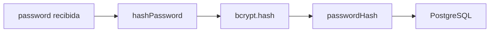

# Día 32 - Contraseñas seguras con bcrypt

## Qué he hecho

- He instalado bcrypt.
- He instalado los tipos de bcrypt para TypeScript.
- He creado password.utils.ts.
- He creado hashPassword.
- He creado comparePassword.
- He sustituido passwordHash temporal por un hash real.
- He actualizado createUserService.
- He actualizado el seed para generar hashes reales.
- He ejecutado el seed.
- He comprobado los hashes en Prisma Studio.
- He creado un usuario desde la API y he comprobado que se guarda con hash bcrypt.

## Dependencias instaladas

```bash
npm install bcrypt
npm install -D @types/bcrypt
```

## Archivo creado

```text
src/utils/password.utils.ts
```

## Funciones creadas

```ts
hashPassword(password);
comparePassword(password, passwordHash);
```

## Diferencia entre password y passwordHash

| Campo          | Significado                                   |
| -------------- | --------------------------------------------- |
| `password`     | Contraseña que llega en la petición           |
| `passwordHash` | Hash seguro que se guarda en la base de datos |

## Regla de seguridad

```text
La contraseña en texto plano nunca se guarda.
passwordHash nunca se devuelve al cliente.
```

## Cambios en el seed

Los usuarios iniciales ya no usan valores temporales como:

```text
hash_temporal_admin123
```

Ahora usan hashes reales generados con bcrypt.

## Explicación personal

bcrypt permite convertir una contraseña en un hash seguro antes de guardarla. De esta forma, aunque alguien accediera a la base de datos, no vería la contraseña original.

## Flujo hash - bycript



## Checklist de comprobación

| Prueba                                       | Resultado |
| -------------------------------------------- | --------- |
| `npm install bcrypt` ejecutado               | Correcto  |
| `password.utils.ts` creado                   | Correcto  |
| `createUserService` usa `hashPassword`       | Correcto  |
| El seed usa bcrypt                           | Correcto  |
| `npm run prisma:seed` funciona               | Correcto  |
| Prisma Studio muestra hashes reales          | Correcto  |
| `POST /api/users` crea usuario con hash real | Correcto  |
| La respuesta no incluye `passwordHash`       | Correcto  |
| `npm run build` funciona                     | Correcto  |

## Por qué no guardamos password

Guardar contraseñas en texto plano (`password`) representa una vulnerabilidad crítica de seguridad. En su lugar, la base de datos siempre debe almacenar un **hash criptográfico irreversible** (`passwordHash`):

---

### Motivos principales

- **Protección ante filtraciones:** Si la base de datos llega a ser comprometida o filtrada, los atacantes solo obtendrán cadenas de hash ilegibles e irreversibles, nunca las contraseñas reales.
- **Privacidad y control interno:** Ni los desarrolladores, administradores de sistemas ni cualquier persona con acceso directo a PostgreSQL o Prisma Studio deben tener la capacidad de leer las credenciales de los usuarios.
- **Mitigación por reutilización de contraseñas:** La mayoría de los usuarios reutilizan la misma clave en múltiples servicios (correo, bancos, redes sociales). Proteger el hash evita que una brecha en nuestra API comprometa la seguridad del usuario en otras plataformas.
- **Resistencia con bcrypt:** Algoritmos como `bcrypt` aplican un _salt_ aleatorio (evitando ataques de diccionario o _rainbow tables_) y un factor de costo computacional ajustable que hace inviables los ataques por fuerza bruta.

## Prueba de validación de contraseñas

Script de prueba para validar la generación de hash y la comparación segura de contraseñas mediante `bcrypt`:

```ts
import { comparePassword, hashPassword } from "./utils/password.utils";

async function main() {
  const password = "123456";
  const hash = await hashPassword(password);

  console.log("Password:", password);
  console.log("Hash:", hash);

  const isCorrect = await comparePassword("123456", hash);
  const isIncorrect = await comparePassword("otra-password", hash);

  console.log("Coincide password correcta:", isCorrect);
  console.log("Coincide password incorrecta:", isIncorrect);
}

main();
```

### Salida por consola

```text
Password: 123456
Hash: $2b$10$D9TdWy5Csj8V8QwUHUhdFuiEpjFFI6YqQ796DYXhYmzc4ZlWQlNPe
Coincide password correcta: true
Coincide password incorrecta: false
```

### Resultados observados

- **Validación de contraseña correcta:** Al evaluar `"123456"` contra el hash almacenado, `bcrypt.compare` extrae el salt del propio hash, procesa el texto plano y devuelve `true`.

- **Rechazo de contraseña incorrecta:** Al pasar `"otra-password"`, el algoritmo detecta la discrepancia y devuelve `false` de forma segura.

- **Seguridad sin reversión:** La verificación se realiza sin necesidad de desencriptar el hash en ningún momento.

## Preparación para registro


### 1. ¿Qué diferencia habrá entre `POST /api/users` y `POST /api/auth/register`?

* **`POST /api/auth/register` (Público):** Endpoint de autoservicio para nuevos usuarios. Cualquiera puede registrarse, y el sistema fija automáticamente `role: "USER"` e `isActive: true` (en el futuro puede emitir un token JWT de bienvenida).
* **`POST /api/users` (Administrativo / CRUD):** Endpoint de gestión interna, pensado para administradores con permisos para crear cuentas asignando roles o estados específicos.

---

### 2. ¿Debe `register` devolver `passwordHash`?

* **No, jamás.** Por principios estrictos de seguridad, ninguna respuesta de la API debe exponer el `passwordHash` (se debe proyectar la salida limpia sin incluir el campo hash).

---

### 3. ¿Qué campos necesitará el registro?

* **Enviados por el cliente (`req.body`):**
  * `name` (string no vacío)
  * `email` (string con formato de email válido)
  * `password` (string de al menos 6 caracteres)
* **Asignados por defecto en el backend:**
  * `role`: `"USER"`
  * `isActive`: `true`

---

### 4. ¿Qué pasará si el email ya existe?

El servicio comprobará si el correo ya está registrado antes de persistir el usuario y lanzará un error de conflicto de dominio (`AppError`), devolviendo una respuesta HTTP con código **`409 Conflict`**:

```json
{
  "error": "El email ya está registrado"
}