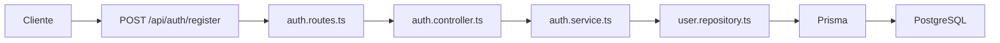

# Día 33 - Registro de usuarios

## Qué he hecho

- He creado auth.service.ts.
- He creado registerService.
- He creado auth.controller.ts.
- He creado registerController.
- He creado auth.routes.ts.
- He montado authRouter en server.ts.
- He creado el endpoint POST /api/auth/register.
- He validado name, email y password.
- He comprobado email duplicado.
- He usado bcrypt mediante hashPassword.
- He comprobado que el usuario se crea como USER.
- He comprobado que el usuario se crea activo.
- He comprobado que passwordHash no se devuelve al cliente.
- He probado errores de validación.
- He ejecutado npm run build.

## Endpoint creado

```text
POST /api/auth/register
```

## Body esperado

```json
{
  "name": "Usuario Nuevo",
  "email": "nuevo@email.com",
  "password": "123456"
}
```

## Respuesta correcta

```text
201 Created
```

## Reglas del registro

```text
name es obligatorio.
email es obligatorio.
password es obligatorio.
email debe tener formato válido.
password debe tener al menos 6 caracteres.
email no puede estar repetido.
password se guarda como passwordHash.
role se asigna como USER por defecto.
isActive se asigna como true por defecto.
passwordHash nunca se devuelve.
```

## Archivos creados

```text
src/routes/auth.routes.ts
src/controllers/auth.controller.ts
src/services/auth.service.ts
```

## Flujo del registro

```text
Route → Controller → Service → Repository → Prisma → PostgreSQL
```

## Diferencia entre endpoints

| Endpoint                  | Uso                                        |
| ------------------------- | ------------------------------------------ |
| `POST /api/auth/register` | Registro público de usuarios               |
| `POST /api/users`         | Creación de usuarios desde gestión interna |

## Explicación personal

El registro permite que un usuario cree su propia cuenta. La contraseña no se guarda en texto plano, sino que se transforma en passwordHash usando bcrypt antes de guardarse en PostgreSQL.

## Diagrama de registro de usuario



## Checklist de pruebas

| Prueba                                          | Resultado                     |
| ----------------------------------------------- | ----------------------------- |
| `POST /api/auth/register` con datos correctos   | 201 Created                   |
| Registro con email duplicado                    | 409 Conflict                  |
| Registro con email inválido                     | 400 Bad Request               |
| Registro con password corta                     | 400 Bad Request               |
| Registro con name vacío                         | 400 Bad Request               |
| Intento de enviar `role: ADMIN`                 | usuario creado con role: USER |
| Prisma Studio muestra `role: USER`              | SI                            |
| Prisma Studio muestra `isActive: true`          | SI                            |
| Prisma Studio muestra `passwordHash` con bcrypt | SI                            |
| La respuesta no devuelve `passwordHash`         | SI                            |
| `npm run build` funciona                        | SI                            |

## Diferencia entre registro y creación de usuarios

Aunque ambos endpoints dan de alta un nuevo registro en la base de datos, responden a **contextos de seguridad, permisos y propósitos de negocio totalmente distintos**:

---

### Tabla comparativa

| Aspecto                   | `POST /api/auth/register`                                       | `POST /api/users`                                           |
| :------------------------ | :-------------------------------------------------------------- | :---------------------------------------------------------- |
| **Propósito**             | Autoservicio de alta para nuevos clientes/usuarios.             | Gestión y administración interna de usuarios (CRUD).        |
| **Acceso / Permisos**     | **Público** (cualquier visitante no autenticado).               | **Protegido** (restringido a administradores).              |
| **Control de `role`**     | Fijo por el sistema: siempre **`USER`**.                        | Flexible: el administrador puede crear `ADMIN` o `USER`.    |
| **Control de `isActive`** | Fijo: siempre **`true`**.                                       | Flexible: el admin puede crear cuentas inactivas (`false`). |
| **Módulo / Dominio**      | **Autenticación (`auth`):** parte del flujo de acceso a la app. | **Recurso (`users`):** parte del mantenimiento del sistema. |

---

### ¿Por qué no usar solo uno?

- **Seguridad y escalada de privilegios:** Si usáramos un único endpoint público para todo, un usuario malintencionado podría enviar `role: "ADMIN"` en el _body_ y obtener privilegios de administrador.
- **Separación de responsabilidades:** `register` responde al flujo de onboarding (acceso), mientras que `POST /api/users` responde a la gestión administrativa de la plataforma.

## Tabla de errores

Completa:

| Caso            | Código esperado | Mensaje                                        |
| --------------- | --------------- | ---------------------------------------------- |
| Name vacío      | 400 Bad Request | El nombre es obligatorio.                      |
| Email vacío     | 400 Bad Request | El email es obligatorio.                       |
| Email inválido  | 400 Bad Request | El formato del email no es válido.             |
| Password vacía  | 400 Bad Request | La contraseña es obligatoria.                  |
| Password corta  | 400 Bad Request | La contraseña debe tener al menos 6 caracteres |
| Email duplicado | 409 Conflict    | El email ya está registrado en el sistema.     |

## Respuesta del endpoint de registro

### 1. ¿Debe `register` devolver solo el usuario?

- **Sí, en esta fase:** Debe devolver únicamente los datos públicos y seguros del usuario recién creado (`id`, `name`, `email`, `role`, `isActive`, `createdAt`), confirmando el alta exitosa con un código **`201 Created`** y omitiendo siempre el `passwordHash`.

---

### 2. ¿Debe devolver token?

- **No es obligatorio en un registro básico:** El propósito principal de `register` es crear la cuenta de forma persistente. Aunque en aplicaciones comerciales a veces se incluye un token para iniciar sesión automáticamente (_auto-login_), la responsabilidad estándar de emitir tokens pertenece al proceso de autenticación (`login`).

---

### 3. ¿Por qué todavía no devolvemos token en el Día 33?

- **Construcción incremental:** El Día 33 se enfoca exclusivamente en la validación de datos de entrada, verificación de unicidad de email y encriptación segura de contraseñas con `bcrypt`.
- **Falta de infraestructura JWT:** La generación, firma y configuración de tokens **JWT** se introduce en los días posteriores.
- **Aislamiento de responsabilidades:** Permite probar y asegurar que el registro de usuarios funciona correctamente antes de acoplarlo al sistema de sesiones y tokens.

## Preparación para login

### 1. ¿Qué necesitará el login?

- Un nuevo endpoint **`POST /api/auth/login`** con su respectivo controlador, servicio y una consulta específica en el repositorio.
- Un flujo de validación de credenciales que verifique la identidad del usuario y devuelva sus datos públicos (preparando la futura entrega del token JWT).

---

### 2. ¿Qué campos enviará el usuario?

Enviados en el cuerpo de la petición (`req.body`):

- **`email`**: Correo electrónico registrado.
- **`password`**: Contraseña en texto plano.

---

### 3. ¿Qué debe comprobar la API?

1. **Validación de entrada:** Que `email` y `password` estén presentes y cumplan el formato mínimo.
2. **Existencia del usuario:** Buscar el usuario por su email normalizado en la base de datos.
3. **Estado de la cuenta:** Verificar que el usuario esté activo (`isActive === true`); si está desactivado, rechazar el acceso.
4. **Coincidencia de contraseña:** Validar la clave enviada contra el hash guardado con `comparePassword`.
5. **Manejo de errores:** Si el correo no existe, la contraseña es incorrecta o la cuenta está inactiva, responder con **`401 Unauthorized`** y un mensaje genérico (_"Credenciales inválidas"_) para no revelar qué dato falló.

---

### 4. ¿Qué función de `password.utils` usaremos?

- **`comparePassword(password, hash)`**: Utiliza internamente `bcrypt.compare` para comprobar si la contraseña en texto plano genera el mismo hash sin necesidad de desencriptar nada.

---

### 5. ¿Por qué necesitaremos acceder a `passwordHash`?

- Nuestras funciones estándar de repositorio (`userSafeSelect`) **omiten `passwordHash`** por seguridad para no exponerlo en las respuestas de la API.
- Para el login se requiere una función especializada en el repositorio (como **`findUserByEmailWithPassword`**) que sí seleccione `passwordHash` internamente, permitiendo que el servicio realice la comparación con `bcrypt`.
