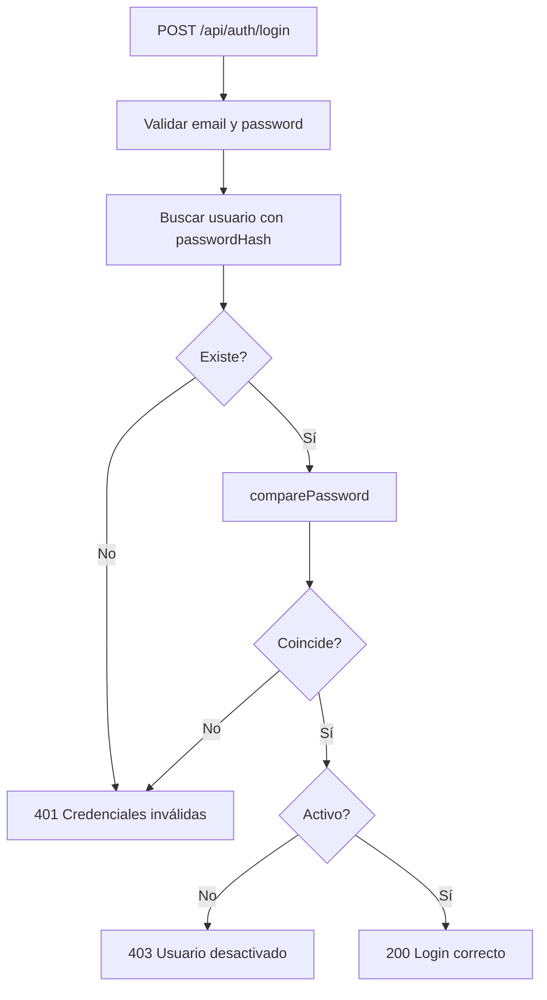
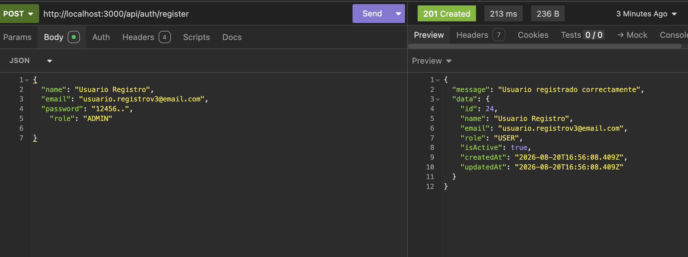
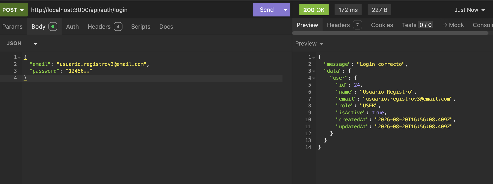

# Día 34 - Login de usuarios

## Qué he hecho

- He creado findUserByEmailWithPassword en el repositorio.
- He creado un selector interno que incluye passwordHash.
- He creado loginService.
- He usado comparePassword para comprobar contraseñas.
- He comprobado si el usuario existe.
- He comprobado si la contraseña es correcta.
- He comprobado si el usuario está activo.
- He creado loginController.
- He añadido POST /api/auth/login.
- He probado login correcto con USER.
- He probado login correcto con ADMIN.
- He probado password incorrecta.
- He probado email inexistente.
- He probado usuario inactivo.
- He comprobado que passwordHash no se devuelve.
- He ejecutado npm run build.

## Endpoint creado

```text
POST /api/auth/login
```

## Body esperado

```json
{
  "email": "user@email.com",
  "password": "user123"
}
```

## Respuesta correcta

```text
200 OK
```

## Respuesta aproximada

```json
{
  "message": "Login correcto",
  "data": {
    "user": {
      "id": 2,
      "name": "Usuario Demo",
      "email": "user@email.com",
      "role": "USER",
      "isActive": true
    }
  }
}
```

## Reglas del login

```text
email es obligatorio.
password es obligatoria.
email debe tener formato válido.
Si el email no existe, se devuelven credenciales inválidas.
Si la password no coincide, se devuelven credenciales inválidas.
Si el usuario está inactivo, no puede iniciar sesión.
passwordHash se usa internamente, pero nunca se devuelve.
Todavía no se genera JWT.
```

## Flujo del login

```text
Route → Controller → Service → Repository → Prisma → PostgreSQL
```

## Función especial del repositorio

```text
findUserByEmailWithPassword
```

Esta función permite leer passwordHash internamente para comparar la contraseña con bcrypt.

## Explicación personal

El login comprueba que un usuario existe, que la contraseña enviada coincide con el hash guardado y que la cuenta está activa. Aunque el backend lee passwordHash internamente, nunca lo devuelve al cliente.

## Diagrama de Login de Usuario



## Checklist de pruebas

| Prueba                                | Resultado        |
| ------------------------------------- | ---------------- |
| Login correcto con USER               | 200 OK           |
| Login correcto con ADMIN              | 200 OK           |
| Password incorrecta                   | 401 Unauthorized |
| Email inexistente                     | 401 Unauthorized |
| Usuario inactivo                      | 403 Forbidden    |
| Email inválido                        | 400 Bad Request  |
| Password vacía                        | 400 Bad Request  |
| La respuesta no devuelve passwordHash | Correcto         |
| `npm run build` funciona              | Correcto         |

## Por qué usamos credenciales inválidas

Responder con mensajes específicos como *"El email no existe"* o *"La contraseña es incorrecta"* genera una vulnerabilidad de seguridad conocida como **enumeración de usuarios**.

---

### Motivos principales

* **Evitar la enumeración de cuentas:** Si la API informa que un correo no existe, un atacante puede automatizar peticiones para descubrir qué emails de una lista filtrada pertenecen a usuarios reales de nuestra plataforma.
* **Frenar ataques dirigidos de fuerza bruta:** Si el sistema confirma que el correo sí existe y que solo falla la clave (*"Contraseña incorrecta"*), el atacante ya tiene el 50% de la autenticación resuelta y concentrará todos sus intentos de fuerza bruta en romper la contraseña de esa cuenta específica.
* **Protección de la privacidad:** Impide que terceros verifiquen si una persona concreta (por ejemplo, mediante su correo personal o corporativo) está registrada en el servicio.
* **Respuesta genérica y unificada:** Ante cualquier fallo en el flujo de autenticación (usuario no encontrado, clave no coincidente o cuenta inactiva), la API debe devolver siempre el mismo código **`401 Unauthorized`** con un mensaje estándar como **`"Credenciales inválidas"`**.

## Prueba Login-registro



## Revisión de `findUserByEmailWithPassword`

---

### 1. ¿Por qué necesitamos una función que sí lea `passwordHash`?

* **Verificación obligatoria en el login:** Durante el inicio de sesión (`POST /api/auth/login`), el servicio debe comparar la contraseña en texto plano enviada por el usuario con el hash almacenado en la base de datos usando `comparePassword(cleanPassword,user.passwordHash)`.
* **Proyecciones seguras por defecto:** Todas las funciones habituales del repositorio utilizan `userSafeSelect`, omitiendo `passwordHash` por defecto. Por tanto, es indispensable disponer de una función especializada y controlada que recupere el hash exclusivamente para el proceso interno de autenticación.

---

### 2. ¿Por qué esa función no debe usarse para respuestas normales?

* **Principio de menor privilegio:** Ningún flujo estándar (listar usuarios, ver perfil, actualizar datos) necesita conocer la contraseña encriptada del usuario.
* **Prevención de fugas accidentales:** Si los controladores o servicios comunes utilizaran esta función, bastaría con olvidar filtrar los datos antes de `res.json(user)` para exponer el hash en la respuesta HTTP.
* **Aislamiento de la lógica de autenticación:** Limita el acceso a datos sensibles únicamente a la capa y momento exacto donde se valida el acceso.

---

### 3. ¿Qué pasaría si devolviéramos `passwordHash` al cliente?

* **Ataques de fuerza bruta offline:** Si un atacante intercepta el hash o consulta la API, puede intentar descifrar la clave original en su propia máquina mediante ataques de diccionario o *rainbow tables* sin límite de intentos ni bloqueos del servidor.
* **Exposición de metadatos de seguridad:** El hash revela el algoritmo utilizado (como `bcrypt`), la versión y el coste computacional (*salt rounds*), facilitando la planificación de ataques dirigidos.
* **Compromiso de cuentas externas:** Dado que muchos usuarios reutilizan contraseñas en otros servicios (correo personal, banca, trabajo), descifrar el hash comprometería la seguridad global del usuario más allá de nuestra aplicación.

## Preparación para JWT

---

### 1. ¿Qué debería devolver el login además del usuario?

* Un **token de acceso firmado (JWT)** (`token` o `accessToken`) junto a los datos seguros del usuario autenticado (`id`, `name`, `email`, `role`). 
* Este token servirá como credencial de sesión para que el cliente lo envíe 
en futuras peticiones.

---

### 2. ¿Qué datos mínimos debería contener un token?

El *payload* del JWT debe incluir únicamente los datos estrictamente necesarios para identificar y autorizar al usuario sin saturar el tamaño del encabezado:
* **`id`** (o `sub`): Identificador único del usuario.
* **`email`**: Correo del usuario.
* **`role`**: Rol asignado (`USER` o `ADMIN`) para validar permisos en los middlewares.

---

### 3. ¿Por qué no debemos meter `passwordHash` en el token?

* **El payload no está cifrado:** Un JWT está firmado criptográficamente para evitar su manipulación, pero sus datos viajan solo codificados en **Base64**. Cualquier persona que tenga el token puede decodificar el payload en segundos.
* **Fuga de datos críticos:** Guardar el `passwordHash` en el token expondría el hash de la contraseña en cada petición HTTP, en el cliente frontend y en los registros del navegador.

---

### 4. ¿Dónde guardaremos `JWT_SECRET`?

* En el archivo de variables de entorno **`.env`** (por ejemplo: `JWT_SECRET=tu_clave_secreta_super_segura`) y referenciado en `.env.example`.
* **Nunca** debe escribirse directamente en el código fuente (*hardcoded*) ni subirse a repositorios públicos de Git.

---

### 5. ¿Qué duración podría tener el token?

* Se configura con la opción **`expiresIn`** al momento de firmar el token con `jwt.sign()`.
* **Duración recomendada:** 
  * `1h` o `2h` para entornos con alta exigencia de seguridad.
  * `1d` o `7d` para desarrollo y flujos estándar de consumo en APIs de backend.