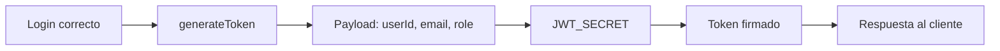

# Día 35 - Generación de token JWT

## Qué he hecho

- He instalado jsonwebtoken.
- He instalado los tipos de jsonwebtoken para TypeScript.
- He añadido JWT_SECRET en .env.
- He añadido JWT_EXPIRES_IN en .env.
- He actualizado .env.example.
- He creado jwt.utils.ts.
- He creado generateToken.
- He modificado loginService para generar token.
- He añadido userId, email y role al payload.
- He comprobado que passwordHash no se mete en el token.
- He probado login correcto con USER.
- He probado login correcto con ADMIN.
- He comprobado que el login incorrecto no devuelve token.
- He ejecutado npm run build.

## Dependencias instaladas

```bash
npm install jsonwebtoken
npm install -D @types/jsonwebtoken
```

## Variables de entorno añadidas

```env
JWT_SECRET="cambia_esta_clave_en_produccion"
JWT_EXPIRES_IN="1h"
```

## Archivo creado

```text
src/utils/jwt.utils.ts
```

## Función creada

```ts
generateToken(payload);
```

## Payload del token

```ts
{
  userId: user.id,
  email: user.email,
  role: user.role
}
```

## Regla de seguridad

```text
El token no debe contener password ni passwordHash.
```

## Respuesta de login actualizada

```json
{
  "message": "Login correcto",
  "data": {
    "user": {
      "id": 2,
      "email": "user@email.com",
      "role": "USER"
    },
    "token": "eyJhbGciOiJIUzI1NiIs..."
  }
}
```

## Explicación personal

JWT permite que el servidor entregue un token firmado tras un login correcto. Ese token podrá usarse más adelante para acceder a rutas protegidas.

## Diagrama de flujo de token JWT



## Checklist de pruebas

| Prueba                                          | Resultado |
| ----------------------------------------------- | --------- |
| `jsonwebtoken` instalado                        | Correcto  |
| `@types/jsonwebtoken` instalado                 | Correcto  |
| `JWT_SECRET` configurado                        | Correcto  |
| `JWT_EXPIRES_IN` configurado                    | Correcto  |
| `jwt.utils.ts` creado                           | Correcto  |
| Login correcto devuelve token                   | Correcto  |
| Login incorrecto no devuelve token              | Correcto  |
| Token contiene tres partes separadas por puntos | Correcto  |
| Token no contiene passwordHash                  | Correcto  |
| `npm run build` funciona                        | Correcto  |

## Payload del JWT

El _payload_ contiene la información mínima y necesaria para identificar al usuario y evaluar sus permisos en cada petición.

---

### Datos que SÍ incluimos

- **`userId` (o `id` / `sub`):** Identificador unívoco para asociar acciones y consultar recursos en la base de datos sin ambigüedad.
- **`email`:** Identificador legible y de contacto rápido para trazabilidad y logs sin necesidad de hacer una consulta previa a la base de datos.
- **`role`:** Permite a los middlewares de autorización comprobar permisos (por ejemplo, si es `ADMIN` o `USER`) de forma inmediata sin consultar la base de datos en cada llamada.

---

### Datos que NO debemos incluir

- **`password` y `passwordHash`:** El JWT está firmado, pero **no cifrado** (el payload solo está codificado en Base64 y cualquiera puede leerlo en herramientas como `jwt.io`). Incluir hashes o contraseñas expone credenciales críticas.
- **Nombre completo u otros datos personales:** Aumentan el peso del token innecesariamente y exponen información personal en las cabeceras HTTP.
- **Todos los datos del usuario (perfil completo):**
  - **Sobrecarga de red (_payload bloat_):** El token viaja en la cabecera `Authorization` de cada petición HTTP; añadir datos extra consume ancho de banda innecesario.
  - **Desincronización de datos:** Si el usuario actualiza sus datos en la base de datos, el token seguirá mostrando información desactualizada hasta que expire y vuelva a iniciar sesión.

## Seguridad de variables de entorno (`.env.example`)

El archivo `.env.example` sirve únicamente como plantilla de referencia y **nunca debe contener secretos reales**.

> **Advertencia sobre `JWT_SECRET`:**
> * **No compartir públicamente:** Jamás subas tu clave secreta real a Git ni la incluyas en `.env.example`.
> * **Clave única por entorno:** `JWT_SECRET` debe definirse con un valor largo, complejo y diferente en cada entorno (*development*, *testing* y *production*).
> * **Exclusión obligatoria:** Asegúrate de que el archivo `.env` real esté añadido en `.gitignore` para prevenir filtraciones de credenciales.


## Preparación para middleware de autenticación

### 1. ¿Cómo enviará el cliente el token y qué cabecera usaremos?

* El cliente enviará el token en cada petición a rutas protegidas mediante la cabecera HTTP estándar **`Authorization`**.

---

### 2. ¿Qué formato tendrá `Authorization`?

* El esquema estándar **Bearer Token**:
  ```http
  Authorization: Bearer <token_jwt_aqui>
  ```
### 3. ¿Qué debe hacer la API con el token?
1. Extraer el token: Separar el prefijo `"Bearer "` del string recibido en `req.headers.authorization`.
2. Verificar firma y expiración: Comprobar la autenticidad del token mediante `jwt.verify(token, JWT_SECRET)`.
3. Inyectar el usuario en la petición: Asignar los datos del payload decodificado al objeto de la solicitud `(req.user = payload)`, dejándolos disponibles para los siguientes middlewares y controladores.  
4. Continuar el flujo: Ejecutar `next() `si la verificación es exitosa.

### 4. ¿Qué pasará si el token falta o es inválido?
- El middleware interceptará la petición, impedirá el acceso a los controladores y lanzará un error de autenticación devolviendo un código `401 Unauthorized`:  
    - Si falta el encabezado: "Token de autenticación no proporcionado".
    - Si la firma o expiración falla: "Token inválido o expirado".
