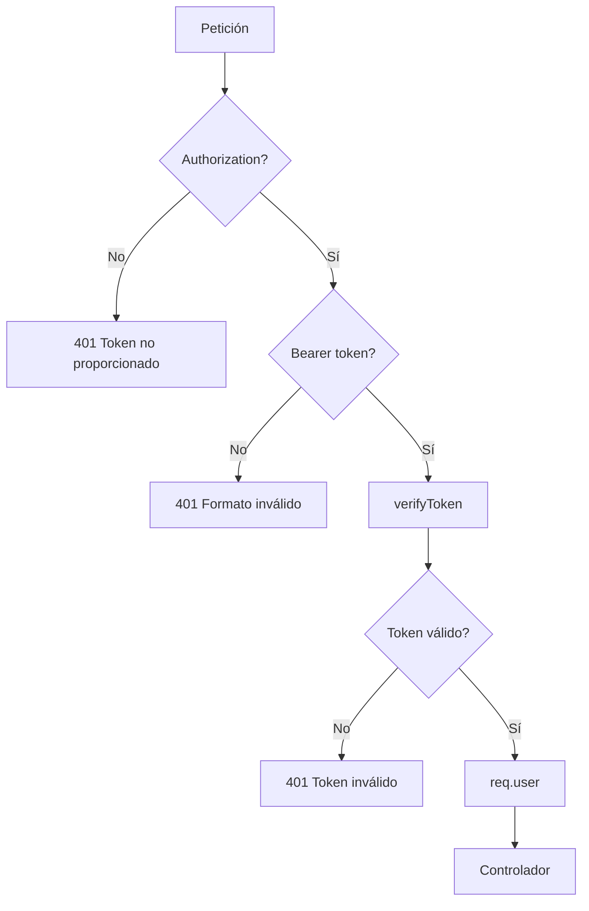
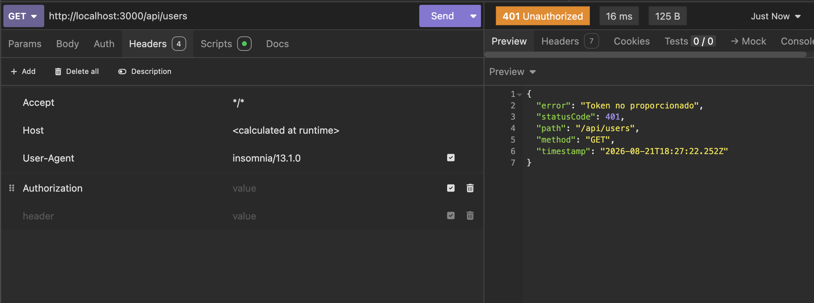
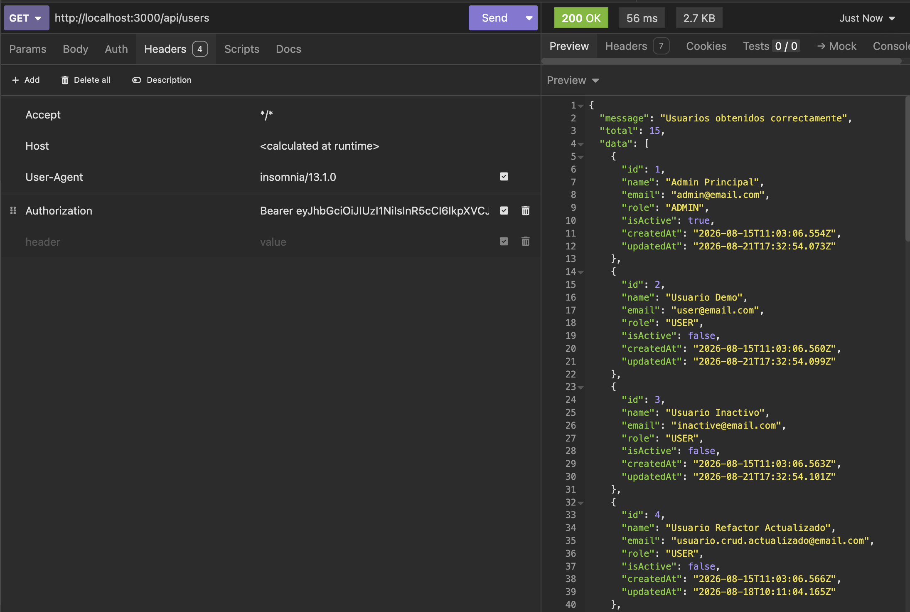
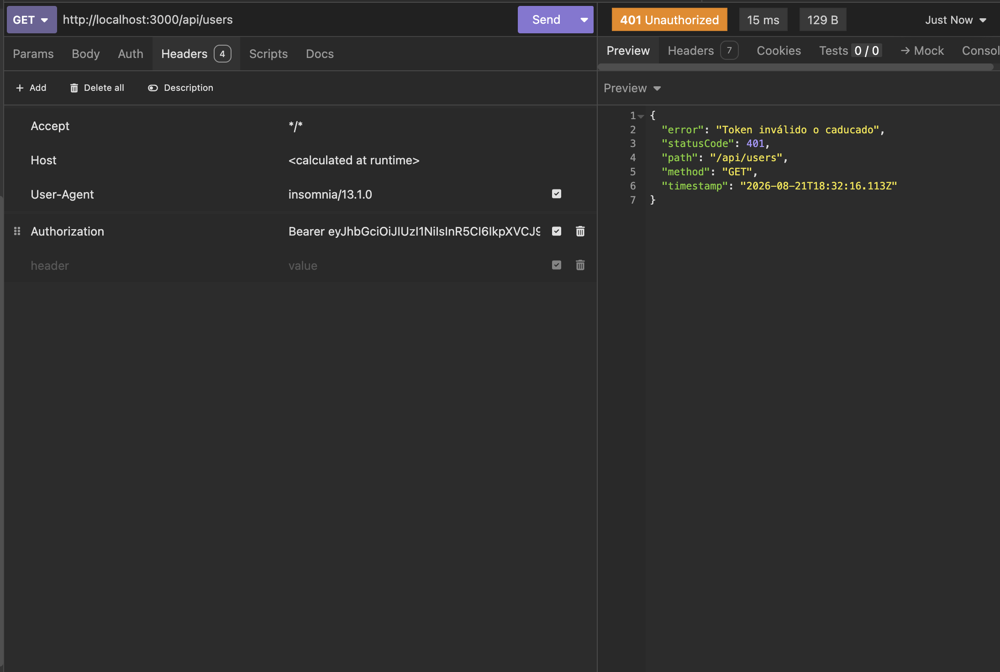

# Día 36 - Middleware de autenticación

## Qué he hecho

- He creado la carpeta src/types.
- He creado auth.types.ts.
- He definido AuthenticatedUser.
- He definido AuthenticatedRequest.
- He añadido verifyToken en jwt.utils.ts.
- He creado la carpeta src/middlewares.
- He creado auth.middleware.ts.
- He creado authMiddleware.
- He leído la cabecera Authorization.
- He comprobado el formato Bearer.
- He verificado tokens con JWT_SECRET.
- He guardado el payload en req.user.
- He creado GET /api/auth/me.
- He protegido las rutas de /api/users.
- He probado rutas sin token.
- He probado rutas con token.
- He ejecutado npm run build.

## Cabecera usada

```text
Authorization: Bearer <token>
```

## Archivos creados

```text
src/types/auth.types.ts
src/middlewares/auth.middleware.ts
```

## Archivos modificados

```text
src/utils/jwt.utils.ts
src/controllers/auth.controller.ts
src/routes/auth.routes.ts
src/routes/user.routes.ts
```

## Middleware creado

```text
authMiddleware
```

## Qué hace el middleware

```text
Lee Authorization.
Comprueba que exista.
Comprueba que use Bearer.
Extrae el token.
Verifica el token.
Guarda el usuario autenticado en req.user.
Permite continuar con next().
```

## Ruta de prueba

```text
GET /api/auth/me
```

## Rutas protegidas

```text
GET    /api/users
GET    /api/users/:id
POST   /api/users
PATCH  /api/users/:id
DELETE /api/users/:id
```

## Flujo

```text
Cliente → Authorization Bearer token → authMiddleware → req.user → controlador
```

## Explicación personal

El middleware de autenticación permite comprobar si una petición pertenece a un usuario autenticado. Si el token es válido, la API guarda sus datos en req.user y deja continuar la petición. Si el token falta o es inválido, responde con 401.

## Flujo middleware de autorización



## Checklist de pruebas

| Prueba                                        | Resultado |
| --------------------------------------------- | --------- |
| Login devuelve token                          | Correcto  |
| `GET /api/auth/me` sin token devuelve 401     | Correcto  |
| `GET /api/auth/me` con token devuelve usuario | Correcto  |
| Token sin Bearer devuelve 401                 | Correcto  |
| Token inventado devuelve 401                  | Correcto  |
| `GET /api/users` sin token devuelve 401       | Correcto  |
| `GET /api/users` con token devuelve 200       | Correcto  |
| `POST /api/users` con token funciona          | Correcto  |
| `npm run build` funciona                      | Correcto  |

## Pruebas

### `GET /api/users` sin token



### `GET /api/users` con token



## Token caducado

Si damos al token un tiempo de validez de 10 segundos comprobaremos que el servidor rechaza la petición al endpoint `/api/auth/me` devolviendonos un error de autenticación, ya que este token ya no nos otorga acceso a rutas protegidas.


## Tabla de errores del middleware

| Caso                     | Código esperado  | Mensaje                             |
| ------------------------ | ---------------- | ----------------------------------- |
| No hay Authorization     | 401 Unauthorized | Token no proporcionado              |
| Authorization sin Bearer | 401 Unauthorized | Formato de token no válido          |
| Bearer sin token         | 401 Unauthorized | Formato de token no válido          |
| Token inventado          | 401 Unauthorized | Token inválido o caducado           |
| Token caducado           | 401 Unauthorized | Token inválido o caducado           |
| Token correcto           | 200 OK           | Devuelve la respuesta a la petición |

## Qué es req.user

**`req.user`** es una propiedad personalizada que inyectamos en el objeto de la petición HTTP (`req`) dentro del middleware de autenticación tras verificar con éxito el token JWT.

---

### ¿Por qué guardamos ahí los datos del token?

* **Disponibilidad en toda la cadena de middlewares:** El objeto `req` viaja a lo largo de todo el ciclo de vida de la petición. Guardar el payload decodificado en `req.user` permite que los siguientes middlewares (autorización de roles) y controladores accedan de inmediato a la identidad del usuario sin tener que volver a extraer ni decodificar el token.
* **Contexto de sesión inmediato:** Permite saber exactamente quién realiza la solicitud (`req.user.userId`, `req.user.role`) en endpoints como `GET /api/users/me` o al registrar auditorías.
* **Aislamiento por petición:** La propiedad `req.user` vive únicamente durante esa petición HTTP específica, garantizando que los datos de un usuario no se mezclen con los de otras conexiones concurrentes.
* **Ahorro de consultas a la base de datos:** Al contener el `role` y el `id` en el propio token, podemos validar permisos de administrador o filtros de usuario sin necesidad de consultar PostgreSQL en cada paso intermedio.

## Pruebas del CRUD con token de rol USER

Pruebas realizadas autenticándonos con `user@email.com` (`role: "USER"`):

* **`GET /api/users`** $\rightarrow$ **`200 OK`** (Lista todos los usuarios).
* **`POST /api/users`** $\rightarrow$ **`201 Created`** (Crea un nuevo usuario).
* **`DELETE /api/users/:id`** $\rightarrow$ **`200 OK`** (Desactiva un usuario).

---

### Observación clave

> **Actualmente todas estas acciones funcionan para un usuario con rol `USER`.**
> 
> Esto ocurre porque la API únicamente valida que el token sea auténtico (**Autenticación**), pero **todavía no cuenta con un middleware de control de acceso por roles** (**Autorización/RBAC**) que restrinja endpoints administrativos exclusivamente a usuarios con rol `ADMIN`.

## Preparación para roles y permisos


### 1. ¿Qué rutas deberían ser exclusivas para `ADMIN`?

Endpoints de administración global y gestión sobre terceros:
* **`GET /api/users`**: Listar todos los usuarios del sistema.
* **`GET /api/users/:id`**: Consultar el perfil de cualquier usuario.
* **`POST /api/users`**: Crear usuarios de forma administrativa con roles o estados asignados.
* **`PATCH /api/users/:id`**: Modificar datos o roles de otros usuarios.
* **`DELETE /api/users/:id`**: Desactivar o dar de baja a cualquier usuario.

---

### 2. ¿Qué rutas puede usar un `USER` estándar?

* **Rutas públicas de acceso:**
  * `POST /api/auth/register`
  * `POST /api/auth/login`
  * `GET /api/health`
* **Rutas de autoservicio y perfil propio:**
  * `GET /api/users/me`: Consultar sus propios datos.
  * `PATCH /api/users/me`: Actualizar su propia información o cambiar su contraseña.

---

### 3. ¿Cómo podemos comprobar el `role` del usuario?

* Creando un **middleware de autorización** (por ejemplo, `requireAdmin` o `requireRole("ADMIN")`).
* Este middleware se coloca después del middleware de autenticación (`authenticateToken`) y evalúa si el rol presente en la petición coincide con el rol requerido antes de permitir el paso al controlador:
  ```typescript
  if (req.user?.role !== "ADMIN") {
    throw new AppError("No tienes permisos para realizar esta acción", 403);
  }
  ````
### 4. ¿Dónde está guardado el `role` después del middleware?
Está almacenado directamente en `req.user.role`, gracias a que el middleware de autenticación decodificó el payload del JWT y lo inyectó en el objeto de la solicitud (req).

### 5. ¿Qué código HTTP debe devolver si no tiene permisos?
`403 Forbidden`:

- `401 Unauthorized`: El usuario no está autenticado (falta token o es inválido).

- `403 Forbidden`: El usuario sí está autenticado, su identidad es conocida, pero no posee los permisos o privilegios necesarios para acceder a ese recurso.