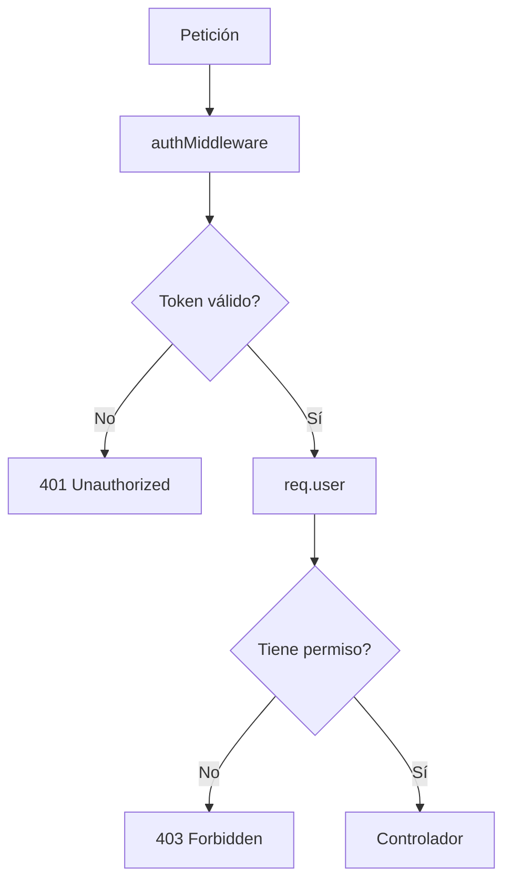

# Día 37 - Roles y permisos

## Qué he hecho

- He diferenciado autenticación y autorización.
- He creado role.middleware.ts.
- He creado requireRole.
- He creado requireSelfOrAdmin.
- He protegido GET /api/users para ADMIN.
- He protegido POST /api/users para ADMIN.
- He protegido DELETE /api/users/:id para ADMIN.
- He permitido GET /api/users/:id al ADMIN o al propio usuario.
- He permitido PATCH /api/users/:id al ADMIN o al propio usuario.
- He creado GET /api/users/me.
- He evitado que USER pueda cambiar isActive.
- He probado rutas con token de ADMIN.
- He probado rutas con token de USER.
- He comprobado respuestas 401 y 403.
- He ejecutado npm run build.

## Roles del proyecto

```text
USER
ADMIN
```

## Reglas de permisos

| Ruta                    | Permiso                   |
| ----------------------- | ------------------------- |
| `GET /api/users`        | Solo ADMIN                |
| `POST /api/users`       | Solo ADMIN                |
| `GET /api/users/me`     | Usuario autenticado       |
| `GET /api/users/:id`    | ADMIN o el propio usuario |
| `PATCH /api/users/:id`  | ADMIN o el propio usuario |
| `DELETE /api/users/:id` | Solo ADMIN                |

## Middlewares creados

```text
requireRole
requireSelfOrAdmin
```

## Diferencia entre 401 y 403

| Código | Significado                   |
| ------ | ----------------------------- |
| 401    | No autenticado                |
| 403    | Autenticado, pero sin permiso |

## Flujo de seguridad

```text
authMiddleware → req.user → middleware de permisos → controlador
```

## Explicación personal

Autenticación significa comprobar quién es el usuario mediante un token. Autorización significa comprobar si ese usuario tiene permiso para realizar una acción concreta.

## Flujo de autenticación



## Checlist de pruebas

| Prueba                                      | Resultado |
| ------------------------------------------- | --------- |
| ADMIN puede hacer `GET /api/users`          | Correcto  |
| USER no puede hacer `GET /api/users`        | Correcto  |
| ADMIN puede hacer `POST /api/users`         | Correcto  |
| USER no puede hacer `POST /api/users`       | Correcto  |
| USER puede hacer `GET /api/users/me`        | Correcto  |
| USER puede consultar su propio ID           | Correcto  |
| USER no puede consultar otro ID             | Correcto  |
| USER puede actualizar su nombre             | Correcto  |
| USER no puede cambiar `isActive`            | Correcto  |
| USER no puede hacer `DELETE /api/users/:id` | Correcto  |
| ADMIN puede hacer `DELETE /api/users/:id`   | Correcto  |
| `npm run build` funciona                    | Correcto  |

## Tabla de permisos completa

| Ruta                  | Sin token   | Token USER           | Token ADMIN |
| --------------------- | ----------- | -------------------- | ----------- |
| `GET /api/users`      | SIN PERMISO | SIN PERMISO          | CON PERMISO |
| `POST /api/users`     | SIN PERMISO | SIN PERMISO          | CON PERMISO |
| `GET /api/users/me`   | SIN PERMISO | CON PERMISO          | CON PERMISO |
| `GET /api/users/1`    | SIN PERMISO | CON PERMISO SI MISMO | CON PERMISO |
| `PATCH /api/users/2`  | SIN PERMISO | CON PERMISO SI MISMO | CON PERMISO |
| `DELETE /api/users/2` | SIN PERMISO | SIN PERMISO          | CON PERMISO |

## 401 frente a 403

La diferencia fundamental reside en si el problema es de **identidad** (autenticación) o de **permisos** (autorización):

---

### 1. `401 Unauthorized` (Falta de Autenticación)

- **Significado:** _"No sé quién eres o tus credenciales no son válidas"_.
- **Cuándo ocurre:**
  - No se ha enviado la cabecera `Authorization`.
  - El token JWT no existe, está mal formado, su firma no coincide o ha expirado.
- **Solución:** El cliente debe iniciar sesión (`login`) o proporcionar un token JWT válido para identificarse.

---

### 2. `403 Forbidden` (Falta de Autorización)

- **Significado:** _"Sé perfectamente quién eres, pero no tienes permiso para realizar esta acción"_.
- **Cuándo ocurre:**
  - El usuario está correctamente autenticado con un token válido, pero su rol (`role: "USER"`) no tiene privilegios suficientes para acceder a un recurso restringido a administradores (`role: "ADMIN"`), como `DELETE /api/users/:id`.
- **Solución:** No basta con volver a iniciar sesión; el usuario requiere que un administrador eleve sus privilegios o roles en el sistema.

---

### Resumen comparativo

| Código HTTP            | Concepto          | Pregunta clave                 | Estado de la identidad                      |
| :--------------------- | :---------------- | :----------------------------- | :------------------------------------------ |
| **`401 Unauthorized`** | **Autenticación** | _¿Quién eres?_                 | Desconocida / No verificada                 |
| **`403 Forbidden`**    | **Autorización**  | _¿Qué tienes permitido hacer?_ | Confirmada, pero con permisos insuficientes |

## Prueba: Modificar otro usuario con rol USER

- **Acción realizada:** Un usuario con rol `USER` autenticado intenta modificar a otro usuario mediante la ruta `PATCH /api/users/1`.
- **Resultado esperado:** La API bloquea la petición devolviendo un error **403 Forbidden** (_"No tienes permisos para realizar esta acción"_).
- **Motivo de seguridad:** Las modificaciones sobre identificadores de terceros (`/api/users/:id`) están reservadas exclusivamente a administradores (`ADMIN`). Los usuarios estándar solo tienen autorización para modificar su propia cuenta a través de `PATCH /api/users/me`.

## Prueba: Crear usuario con rol USER

- **Acción realizada:** Un usuario autenticado con rol `USER` intenta dar de alta una nueva cuenta mediante el endpoint `POST /api/users`.
- **Resultado esperado:** La API bloquea la petición y devuelve un error **403 Forbidden** (_"No tienes permisos para realizar esta acción"_).
- **Por qué debe fallar:**
  - **Ruta administrativa exclusiva:** `POST /api/users` forma parte de la gestión interna y está reservada para que administradores (`ADMIN`) creen usuarios asignando roles o estados personalizados.
  - **Prevención de escalada de privilegios:** Impide que un usuario normal pueda crear cuentas con rol `ADMIN` o manipular el estado `isActive` de nuevos registros.
  - **Canal correcto de registro:** El alta de cuentas estándar debe realizarse exclusivamente a través del flujo público de autoservicio en `POST /api/auth/register`.


## Preparación para conexión con frontend

### 1. ¿Qué URL base tendrá la API?

- En entorno local de desarrollo: **`http://localhost:3000/api`** (o `http://localhost:3000`).

---

### 2. Clasificación de endpoints por nivel de acceso

#### A. Endpoints públicos (sin token)

No requieren autenticación previa; accesibles por cualquier visitante:

- `POST /api/auth/register` (formulario de registro de nuevos usuarios).
- `POST /api/auth/login` (formulario de inicio de sesión).
- `GET /api/health` (comprobación del estado del servidor).

#### B. Endpoints autenticados (requieren token JWT - cualquier rol)

Requieren la cabecera `Authorization: Bearer <token>`:

- `GET /api/users/me` (cargar el perfil y sesión del usuario actual).
- `PATCH /api/users/me` (editar datos propios o cambiar contraseña).

#### C. Endpoints restringidos a administradores (requieren token con `role: "ADMIN"`)

Para vistas y paneles de administración de usuarios:

- `GET /api/users` (tabla/listado global de usuarios).
- `GET /api/users/:id` (detalle de un usuario específico).
- `POST /api/users` (alta manual de usuarios desde panel de admin).
- `PATCH /api/users/:id` (editar roles, estados o datos de terceros).
- `DELETE /api/users/:id` (desactivar cuentas de usuario).

---

### 3. ¿Qué endpoints principales consumirá el frontend según la vista?

- **Pantallas de Auth:** `POST /api/auth/login` y `POST /api/auth/register`.
- **Barra de navegación / Perfil:** `GET /api/users/me` para mostrar el nombre y avatar/rol en la interfaz.
- **Panel de Control / Dashboard Admin:** `GET /api/users` y `DELETE /api/users/:id` para gestionar la lista de usuarios.

---

### 4. ¿Dónde se guardará el token en el cliente?

- **Almacenamiento web del navegador:**
  - Habitualmente en **`localStorage`** (persiste entre sesiones) o **`sessionStorage`** (se borra al cerrar la pestaña).
  - _Alternativa avanzada de seguridad:_ Cookies con flag **`HttpOnly`** para mitigar riesgos de robo por scripts maliciosos (XSS).
- **Envío en cada petición:** El frontend interceptará las llamadas HTTP hacia rutas protegidas e inyectará el token en la cabecera estándar:
  ```http
  Authorization: Bearer <token>
  ```
