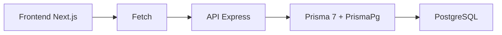
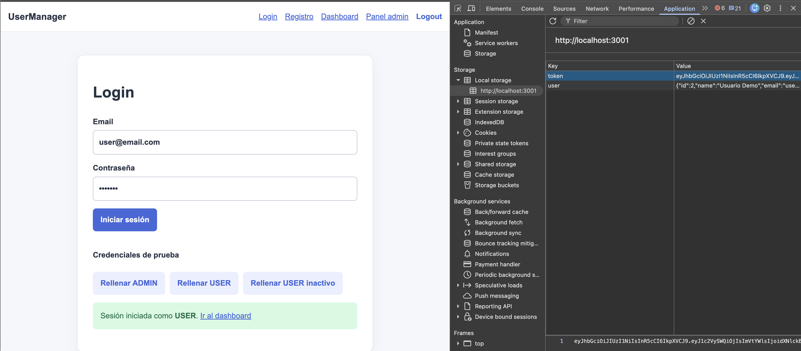
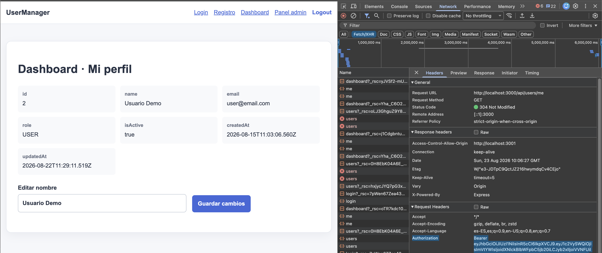
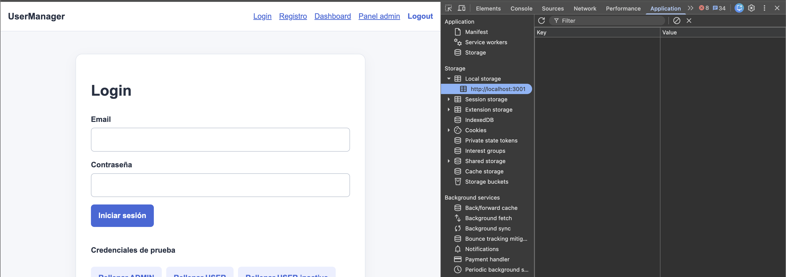

# Día 38 - Frontend entregado y conexión con la API

## Qué he hecho

- He arrancado PostgreSQL.
- He ejecutado el seed de datos iniciales.
- He generado Prisma Client.
- He arrancado el backend.
- He comprobado `/api/health`.
- He configurado CORS si era necesario.
- He entrado en la carpeta frontend.
- He instalado las dependencias del frontend.
- He creado o revisado `.env.local`.
- He configurado `NEXT_PUBLIC_API_URL`.
- He arrancado el frontend.
- He probado login desde la interfaz.
- He comprobado que el token se guarda en `localStorage`.
- He comprobado que el dashboard envía `Authorization`.
- He probado acceso al panel admin con USER.
- He probado acceso al panel admin con ADMIN.

## URLs usadas

| Aplicación | URL                     |
| ---------- | ----------------------- |
| Backend    | `http://localhost:3000` |
| Frontend   | `http://localhost:3001` |
| PostgreSQL | `localhost:5432`        |

## Variable del frontend

```env
NEXT_PUBLIC_API_URL=http://localhost:3000
```

## Cabecera de autenticación

```text
Authorization: Bearer <token>
```

## Pantallas del frontend

| Pantalla    | Ruta           | Objetivo             |
| ----------- | -------------- | -------------------- |
| Inicio      | `/`            | Presentar el cliente |
| Registro    | `/register`    | Crear cuenta         |
| Login       | `/login`       | Obtener token        |
| Dashboard   | `/dashboard`   | Consultar perfil     |
| Panel admin | `/admin/users` | Gestionar usuarios   |

## Endpoints consumidos

| Método   | Endpoint             | Acceso                 |
| -------- | -------------------- | ---------------------- |
| `POST`   | `/api/auth/register` | Público                |
| `POST`   | `/api/auth/login`    | Público                |
| `GET`    | `/api/users/me`      | Autenticado            |
| `PATCH`  | `/api/users/:id`     | Propio usuario o ADMIN |
| `GET`    | `/api/users`         | ADMIN                  |
| `POST`   | `/api/users`         | ADMIN                  |
| `DELETE` | `/api/users/:id`     | ADMIN                  |

## Explicación personal

El frontend y el backend son aplicaciones distintas. El frontend realiza peticiones HTTP a la API y la API responde con JSON. Cuando una ruta está protegida, el frontend debe enviar el token JWT en la cabecera Authorization.

## Pruebas realizadas

| Prueba                                                 | Resultado |
| ------------------------------------------------------ | --------- |
| PostgreSQL aparece como servicio activo                | CORRECTO  |
| `/api/health` responde correctamente                   | CORRECTO  |
| El seed se ejecuta sin errores                         | CORRECTO  |
| El backend arranca en el puerto 3000                   | CORRECTO  |
| El frontend arranca en el puerto 3001                  | CORRECTO  |
| `NEXT_PUBLIC_API_URL` apunta a `http://localhost:3000` | CORRECTO  |
| Registro muestra respuesta de la API                   | CORRECTO  |
| Login guarda `token` en `localStorage`                 | CORRECTO  |
| Dashboard envía `Authorization`                        | CORRECTO  |
| `/api/users/me` devuelve el usuario autenticado        | CORRECTO  |
| USER recibe 403 en panel admin                         | CORRECTO  |
| ADMIN puede ver el panel admin                         | CORRECTO  |
| Logout elimina el token                                | CORRECTO  |

## Diagrama Frontend - Backend



## Checklist de pruebas

| Prueba                          | Resultado |
| ------------------------------- | --------- |
| PostgreSQL activo               | CORRECTO  |
| Backend activo en puerto 3000   | CORRECTO  |
| Frontend activo en puerto 3001  | CORRECTO  |
| `/api/health` responde          | CORRECTO  |
| `.env.local` configurado        | CORRECTO  |
| Login correcto desde frontend   | CORRECTO  |
| Token guardado en localStorage  | CORRECTO  |
| Dashboard carga perfil          | CORRECTO  |
| Se envía cabecera Authorization | CORRECTO  |
| USER recibe 403 en panel admin  | CORRECTO  |
| ADMIN accede al panel admin     | CORRECTO  |
| Logout elimina token            | CORRECTO  |

## Login desde el frontend


## Token guardado en localStorage



## Dashboard usuario


## Cabecera Authorization



## Respuesta `error 403` en panel de admin


## Admin Panel


## Logout elimina el token



## Por qué la seguridad debe estar en la API

Ocultar un botón, enlace o panel de administración en el frontend es una decisión de **experiencia de usuario (UX)**, pero **no constituye una medida de seguridad real**.

---

### Motivos principales

* **El frontend corre en un entorno no confiable:** Todo el código HTML, CSS y JavaScript se ejecuta en el navegador del cliente. Cualquier usuario puede inspeccionar el código, activar botones ocultos o modificar variables locales desde las herramientas de desarrollo (*DevTools*).
* **Peticiones HTTP directas:** Aunque una acción no tenga botón en la interfaz, cualquier persona puede realizar la llamada directamente a la API utilizando herramientas como Postman, cURL, extensiones o la propia consola del navegador (por ejemplo, enviando un `DELETE /api/users/2`).
* **El backend como única barrera de protección:** La API y la base de datos son la verdadera frontera de seguridad. Cada endpoint debe validar de forma autónoma la identidad (**autenticación con JWT**) y los privilegios (**autorización por roles**) antes de permitir cualquier operación, respondiendo con `401` o `403` si la petición no está autorizada.

## Preparación para pruebas de integración


### 1. **¿Qué flujos completos vamos a probar?**
Vamos a comprobar el ciclo completo de seguridad y acceso de la aplicación:
1.  **Registro y Login:** Crear un usuario nuevo y verificar que al iniciar sesión la API devuelve correctamente el token.
2.  **Rutas protegidas:** Usar ese token para intentar acceder a los datos privados del usuario (como `/api/users/me`).
3.  **Control de roles:** Intentar acceder a rutas exclusivas del panel de control con diferentes tipos de usuario para comprobar que la API bloquea a quien no corresponde.
---

### 2. ¿Qué errores pueden aparecer durante las pruebas?

* **`400 Bad Request`:** Datos incompletos, formato de email inválido, contraseña menor a 6 caracteres o ID no numérico.
* **`401 Unauthorized`:** Credenciales incorrectas en login, ausencia de token o token manipulado/expirado.
* **`403 Forbidden`:** Petición con token válido de rol `USER` hacia una ruta protegida para administradores.
* **`404 Not Found`:** Intentar consultar o modificar un ID de usuario inexistente o ruta no mapeada.
* **`409 Conflict`:** Intentar registrar un usuario con un email que ya existe en la base de datos.

---

### 3. ¿Qué diferencia hay entre `401` y `403`?

* **`401 Unauthorized` (Autenticación):** Falta de identidad válida (*"No sé quién eres o no estás autenticado"*).
* **`403 Forbidden` (Autorización):** Falta de privilegios (*"Sé quién eres, pero tu rol no tiene permiso para realizar esta acción"*).

---

### 4. Usuarios de prueba para validación

* **Para probar permisos de `ADMIN`:** `admin@email.com` (usuario del seed con `role: "ADMIN"` para validar el CRUD completo).
* **Para probar restricciones de `USER`:** `user@email.com` (usuario del seed con `role: "USER"` para validar el acceso a perfil propio y el bloqueo de rutas de administración).