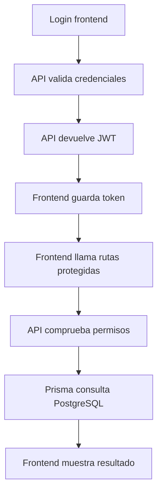

# Día 39 - Pruebas de integración desde el frontend

## Qué he hecho

- He arrancado PostgreSQL.
- He ejecutado el seed.
- He arrancado el backend.
- He arrancado el frontend.
- He probado registro desde el frontend.
- He probado email duplicado.
- He probado login como USER.
- He probado login como ADMIN.
- He probado login con usuario inactivo.
- He comprobado el token en localStorage.
- He comprobado la cabecera Authorization en Network.
- He probado el dashboard.
- He editado mi nombre desde el frontend.
- He comprobado persistencia en Prisma Studio.
- He probado panel admin con USER.
- He probado panel admin con ADMIN.
- He creado un usuario como ADMIN.
- He desactivado un usuario como ADMIN.
- He probado logout.
- He probado una ruta protegida sin token.
- He distinguido códigos 400, 401, 403 y 409.

## Idea principal

```text
Una prueba de integración comprueba que varias piezas del proyecto funcionan correctamente cuando trabajan juntas.
```

## Flujo probado

```text
Frontend → API → JWT → permisos → Prisma → PostgreSQL
```

## Códigos trabajados

| Código | Significado       | Ejemplo                      |
| ------ | ----------------- | ---------------------------- |
| `400`  | Datos incorrectos | Email inválido               |
| `401`  | No autenticado    | Falta token                  |
| `403`  | Sin permiso       | USER intenta listar usuarios |
| `409`  | Conflicto         | Email duplicado              |

## Usuarios usados

| Email                | Rol           | Uso                     |
| -------------------- | ------------- | ----------------------- |
| `user@email.com`     | USER          | Probar usuario normal   |
| `admin@email.com`    | ADMIN         | Probar administración   |
| `inactive@email.com` | USER inactivo | Probar bloqueo de login |

## Evidencias recogidas

| Prueba                | Usuario usado      | Endpoint                  | Código esperado | Código obtenido | Resultado                              |
| :-------------------- | :----------------- | :------------------------ | :-------------- | :-------------- | :------------------------------------- |
| Registro nuevo        | Nuevo              | `POST /api/auth/register` | 201             | 201             | Usuario nuevo                          |
| Email duplicado       | Nuevo              | `POST /api/auth/register` | 409             | 409             | Registro fallido                       |
| Login USER            | user@email.com     | `POST /api/auth/login`    | 200             | 200             | Usuario conectado                      |
| Login ADMIN           | admin@email.com    | `POST /api/auth/login`    | 200             | 200             | Administrador conectado                |
| Login inactivo        | inactive@email.com | `POST /api/auth/login`    | 403             | 403             | Usuario no conectado                   |
| Ver perfil            | USER               | `GET /api/users/me`       | 200             | 200             | Información del usuario                |
| Panel admin con USER  | USER               | `GET /api/users`          | 403             | 403             | Petición denegada                      |
| Panel admin con ADMIN | ADMIN              | `GET /api/users`          | 200             | 200             | Información del panel de administrador |
| Crear usuario admin   | ADMIN              | `POST /api/users`         | 201             | 201             | Usuario nuevo                          |
| Ruta sin token        | Sin sesión         | `GET /api/users/me`       | 401             | 401             | Petición denegada                      |

## Explicación personal

Hoy he usado el frontend como punto de entrada para comprobar que todas las capas funcionan juntas. No basta con que la pantalla muestre datos; también hay que revisar códigos HTTP, cabeceras, respuestas JSON y persistencia en base de datos.

## Diagrama flujo de pruebas



## Matriz de pruebas

| Acción             | Endpoint                  | Rol necesario  | Resultado con USER | Resultado con ADMIN |
| ------------------ | ------------------------- | -------------- | ------------------ | ------------------- |
| Registro           | `POST /api/auth/register` | Público        | `201`              | `201`               |
| Login              | `POST /api/auth/login`    | Público        | `200` + JWT        | `200` + JWT         |
| Ver perfil         | `GET /api/users/me`       | Autenticado    | `200`              | `200`               |
| Editar nombre      | `PATCH /api/users/:id`    | Propio o ADMIN | `200` si es propio | `200`               |
| Listar usuarios    | `GET /api/users`          | ADMIN          | `403`              | `200`               |
| Crear usuario      | `POST /api/users`         | ADMIN          | `403`              | `201`               |
| Desactivar usuario | `DELETE /api/users/:id`   | ADMIN          | `403`              | `200`               |
| Ruta sin token     | `GET /api/users/me`       | Autenticado    | `401`              | `401`               |

## Matriz de pruebas negativas

| Prueba negativa                                               | Resultado esperado                                                                      | Resultado obtenido |
| :------------------------------------------------------------ | :-------------------------------------------------------------------------------------- | :----------------- |
| Registro con **contraseña demasiado corta**                   | 400 (Bad Request) - Mensaje de error de validación indicando la longitud mínima.        | 400                |
| Registro o Login con **email inválido**                       | 400 (Bad Request) - Mensaje de error de validación de formato de email.                 | 400                |
| Buscar o actualizar usuario con un **ID inexistente**         | 404 (Not Found) - Mensaje indicando que el usuario no existe en la base de datos.       | 404                |
| Petición POST con el **body vacío**                           | 400 (Bad Request) - Mensaje de error indicando que faltan campos requeridos.            | 400                |
| Modificar campo **isActive con rol USER**                     | 403 (Forbidden) - Acceso denegado por falta de permisos (solo ADMIN debería poder).     | 403                |
| Acceder a ruta protegida con **token inventado** o malformado | 401 (Unauthorized) - Mensaje de error indicando que el token es inválido o ha expirado. | 401                |

## Prueba: Modificación de `isActive` con rol USER

- **Acción realizada:** Un usuario autenticado con rol `USER` (`user@email.com`) intenta modificar el estado de una cuenta enviando `{"isActive": false}` mediante una petición `PATCH /api/users/:id` (o intentando alterar campos restringidos).
- **Resultado esperado:** La API bloquea la petición y responde con un código **`403 Forbidden`** (_"No tienes permisos para realizar esta acción"_).

---

### Por qué esta acción debe estar reservada para ADMIN

- **Gobernanza y moderación de la plataforma:** La activación, suspensión o baja lógica de cuentas es una potestad administrativa para moderar usuarios, aplicar sanciones o gestionar el ciclo de vida del servicio.
- **Prevención de reactivaciones no autorizadas:** Si los usuarios comunes pudieran alterar `isActive`, un usuario suspendido o penalizado por un administrador podría reactivar su propia cuenta enviando `{"isActive": true}`.
- **Integridad del estado del sistema:** Los usuarios estándar solo tienen autorización para modificar sus datos personales básicos (como nombre o contraseña en `PATCH /api/users/me`). El control de estado operativo (`isActive`) y de privilegios (`role`) pertenece exclusivamente al dominio de administración (**`ADMIN`**).

## Prueba: Token inventado o inválido

- **Acción realizada:** Se realiza una petición a un endpoint protegido enviando un token falso o manipulado en la cabecera Authorization (Bearer token_inventado).
- **Resultado esperado:** La API intercepta la petición y responde con un error **401 Unauthorized** (_"Token inválido o malformado"_).
- **Motivo de seguridad:** El middleware de autenticación valida la firma criptográfica del token contra la clave secreta del servidor. Al no poder verificar la autenticidad ni el formato estándar del JWT, el sistema rechaza el acceso de inmediato e impide que la solicitud llegue a los controladores.

## Documentación de Incidencia: Error 500 al evaluar permisos de rol

### 1. Qué ocurrió

Al realizar una petición a la ruta de listado general de usuarios utilizando un token válido de rol estándar (`USER`), el servidor falló inesperadamente devolviendo un error interno en lugar de denegar el acceso de forma controlada por permisos insuficientes.

---

### 2. Qué esperabas

Esperabas recibir una respuesta con código **403 Forbidden** y un mensaje indicando que el usuario carece de los permisos de administrador necesarios para consultar dicho recurso.

---

### 3. Qué viste en Network

- **Método y URL:** GET /api/users
- **Código de estado:** **500 Internal Server Error**
- **Cuerpo de la respuesta:** Un mensaje genérico de error interno no controlado del servidor en lugar del formato de error de autorización esperado.

---

### 4. Qué parte estaba fallando

- **Causa raíz:** Fallo en el orden de la cadena de middlewares en las rutas de la API.
- **Detalle del fallo:** El middleware encargado de comprobar el rol de administrador se estaba ejecutando antes que el middleware de autenticación del token. Al intentar leer el rol de un usuario que todavía no había sido decodificado ni inyectado en la petición, la aplicación intentaba acceder a una propiedad inexistente y provocaba una excepción no capturada.

---

### 5. Cómo lo resolviste

- **Ajuste del orden de ejecución:** Se reordenaron los middlewares en el archivo de rutas para garantizar que el middleware de autenticación se ejecute siempre en primer lugar.

## Preparación para demo final

### 1. ¿Qué flujo enseñarías en una demo?

- **Registro:** Crear una cuenta nueva.
- **Login:** Iniciar sesión y recibir el token JWT.
- **Autoservicio:** Consultar el perfil propio (`GET /api/users/me`).
- **Seguridad:** Intentar entrar a una ruta de admin con rol normal y ver el bloqueo.
- **Administración:** Entrar como `ADMIN` y listar o borrar usuarios.

---

### 2. ¿Qué usuario usarías primero?

- **El usuario normal (`USER`):** Para mostrar el flujo básico de usuario y demostrar que las rutas protegidas no son accesibles para cualquiera.

---

### 3. ¿Qué error mostrarías para demostrar permisos?

- **`403 Forbidden`:** Al intentar consultar `GET /api/users` o borrar un usuario con el token de `USER`.

---

### 4. ¿Qué captura incluirías?

- Una captura en Postman o Thunder Client haciendo `GET /api/users` con token de `USER` y recibiendo el código **`403 Forbidden`**.

---

### 5. ¿Qué comandos necesita otra persona para arrancar el proyecto?

```bash
npm install
docker compose up -d
npx prisma migrate dev
npx prisma db seed
npm run dev
```
