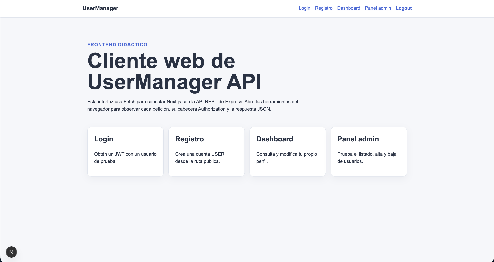
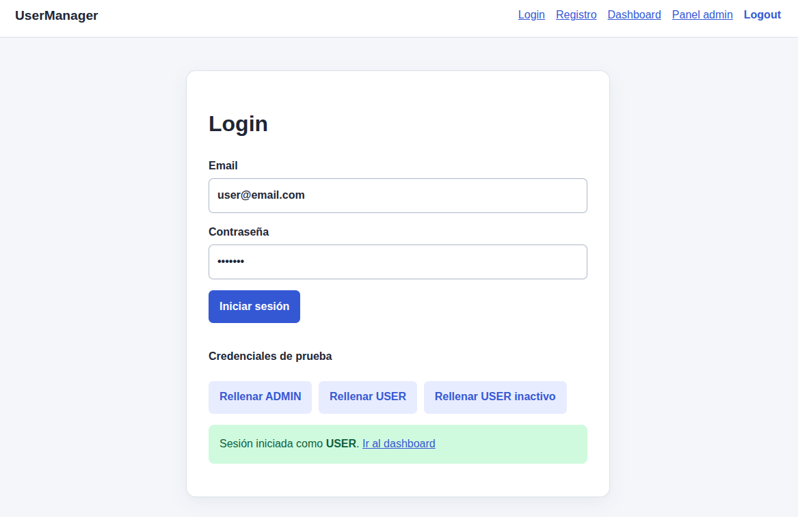
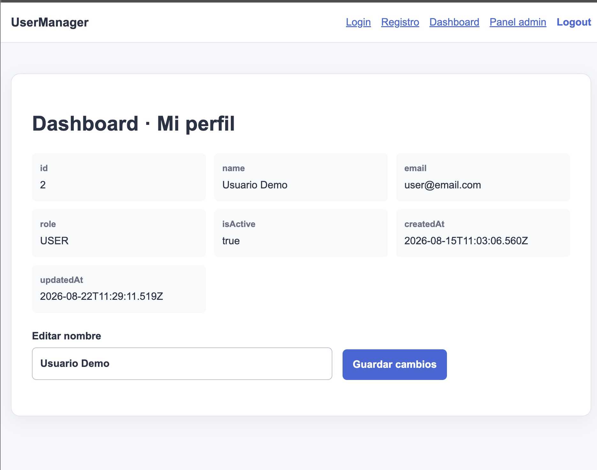
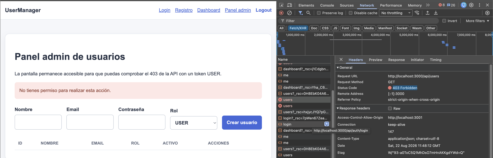
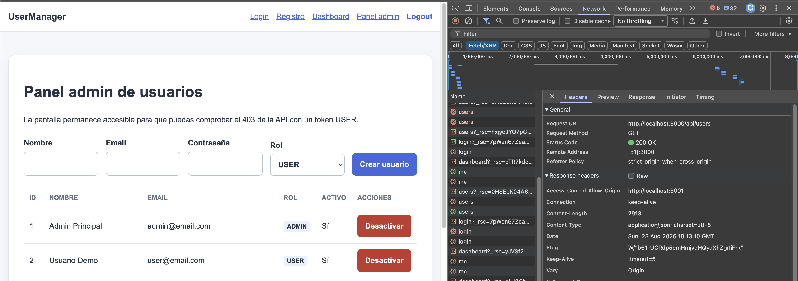
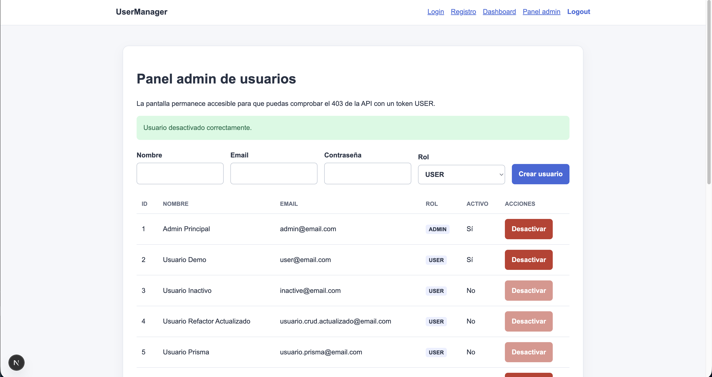
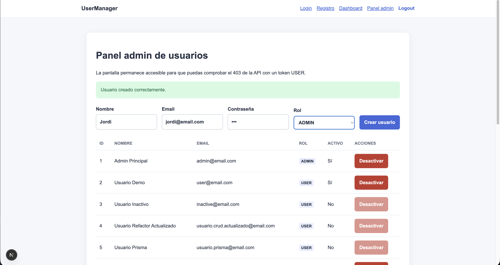
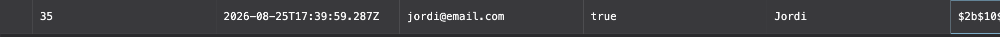

# Día 40 - Revisión final y cierre del proyecto

Hoy revisaremos el producto completo, prepararemos una demo breve y dejaremos instrucciones suficientes para que otra persona pueda arrancarlo desde cero.

A lo largo de estos 40 días, hemos construido desde cero una API RESTful completa y segura para la gestión de usuarios, aplicando principios de arquitectura sólida y buenas prácticas de desarrollo en el ecosistema Node.js.

### 1. Fundamentos y Arquitectura

Comenzamos estableciendo las bases del proyecto inicializando un entorno Node.js con TypeScript, garantizando tipado estático para un desarrollo más robusto. Adoptamos una arquitectura de **capas (Controllers, Services, Repositories)** que favorece la separación de responsabilidades, facilitando la mantenibilidad y la escalabilidad del código. Implementamos flujos completos de peticiones HTTP, manejando métodos (GET, POST, PATCH, DELETE), parámetros por ruta y query params.

### 2. Base de Datos y ORM

Evolucionamos desde el almacenamiento temporal en memoria (arrays) hacia una solución persistente utilizando **PostgreSQL**. Contenerizamos la base de datos con **Docker Compose** para asegurar entornos de desarrollo consistentes. Integramos **Prisma ORM**, definiendo un modelo de datos estructurado para la entidad `User`, gestionando migraciones (schema) y poblando la base de datos inicial con un proceso de `seed`. Las consultas a base de datos se abstrajeron limpiamente en la capa de repositorio.

### 3. Funcionalidades Core (CRUD)

Desarrollamos los endpoints fundamentales para la gestión de recursos:

- **Listar Usuarios:** Con proyecciones seguras que omiten datos sensibles como contraseñas.
- **Consultar por ID:** Manejando casos donde el recurso no existe.
- **Crear Usuarios:** Incorporando validación manual de campos obligatorios, formato de email y verificación de unicidad en la base de datos.
- **Actualizar:** Soportando modificaciones parciales (PATCH).
- **Eliminar (Baja Lógica):** Implementando una desactivación suave (`isActive: false`) en lugar de borrar registros físicos, preservando la integridad referencial.

### 4. Seguridad y Autenticación

La seguridad fue un pilar central en la segunda mitad del proyecto:

- **Hashing de Contraseñas:** Protegimos las credenciales de los usuarios utilizando `bcrypt`.
- **Registro (Register):** Creamos un flujo seguro para el alta de nuevas cuentas.
- **Inicio de Sesión (Login):** Validamos credenciales evitando mensajes específicos que permitieran enumeración de usuarios (usando un genérico `401 Unauthorized`).
- **JSON Web Tokens (JWT):** Implementamos un sistema de sesiones `stateless`. Firmamos tokens con una clave secreta (`JWT_SECRET`) configurada mediante variables de entorno (`.env`), incluyendo en el payload solo datos esenciales y seguros (`userId`, `role`).
- **Middleware de Autenticación:** Creamos un interceptor (`authenticateToken`) para proteger rutas privadas, verificando el encabezado `Authorization` y añadiendo los datos del usuario a la petición (`req.user`).

### 5. Autorización y Control de Acceso (RBAC)

Para restringir las acciones dentro del sistema, implementamos un control basado en roles (User vs. Admin):

- Rutas públicas para registro y login.
- Rutas de autoservicio (`/api/users/me`) donde los usuarios estándar solo pueden gestionar su propia cuenta.
- Rutas administrativas protegidas por un middleware de autorización, asegurando que solo usuarios con rol `ADMIN` puedan modificar a otros usuarios o listar la base de datos completa. Distinguimos claramente los errores de identidad (401) de los de permisos (403).

### 6. Calidad y Manejo de Errores

Estandarizamos las respuestas de la API utilizando códigos de estado HTTP apropiados. Centralizamos el control de excepciones mediante un **middleware de manejo de errores**, asegurando que los fallos imprevistos no expongan detalles del servidor al cliente, devolviendo estructuras JSON predecibles.

### 7. Integración y Pruebas

Finalizamos el proyecto documentando cómo una aplicación frontend (SPA) consumiría estos endpoints. Exploramos el almacenamiento seguro del token (ej. `localStorage`) y cómo el cliente debe inyectarlo en las peticiones. Realizamos pruebas de integración E2E, validando flujos de registro, login, acceso restringido y gestión administrativa, resolviendo incidencias en el orden de ejecución de los middlewares.

| Check | Backend                                                             |
| :---: | :------------------------------------------------------------------ |
|  ✅   | PostgreSQL arranca con Docker Compose.                              |
|  ✅   | `npm run prisma:generate` termina correctamente.                    |
|  ✅   | El seed puede ejecutarse más de una vez sin duplicar datos.         |
|  ✅   | `npm run build` compila.                                            |
|  ✅   | Los errores usan códigos HTTP coherentes.                           |
|  ✅   | `passwordHash` nunca aparece en respuestas.                         |
|  ✅   | Las rutas públicas, autenticadas y ADMIN tienen sus middlewares.    |
|  ✅   | CORS permite `http://localhost:3001`.                               |
|  ✅   | La documentación menciona Prisma 7, el cliente generado y PrismaPg. |

| Check | Frontend                                         |
| :---: | :----------------------------------------------- |
|  ✅   | Existe `frontend/.env.local`.                    |
|  ✅   | `npm run build` compila.                         |
|  ✅   | Registro y login muestran errores legibles.      |
|  ✅   | El JWT se guarda y se envía en `Authorization`.  |
|  ✅   | Dashboard consulta y edita el perfil.            |
|  ✅   | USER recibe 403 en el panel admin.               |
|  ✅   | ADMIN lista, crea y desactiva usuarios.          |
|  ✅   | Logout elimina el estado local.                  |
|  ✅   | La interfaz se puede usar en móvil y escritorio. |

## Capturas de Pantalla

### Inicio del Frontend

### Login correcto como USER

### Dashboard con el perfil.

### Respuesta `403` del panel admin con USER.

### Tabla de usuarios con ADMIN.

### Desactivación de un usuario

### Creación de un usuario

### Prisma Studio confirmando el cambio.

## Posibles mejoras futuras

- Refresh tokens.
- Tests automáticos.
- Paginación.
- Buscador de usuarios.
- Validación con Zod.
- Mejor gestión de errores en frontend.
- Despliegue.
- Dockerizar frontend.
- Roles más avanzados.
- Cambio de contraseña.
- Recuperación de contraseña.

## Cierre del reto y agradecimientos

Quiero expresar mi sincero agradecimiento a mi profesor de DAM, [Jordi Cidoncha](https://www.linkedin.com/in/jordicido/), por la dedicación y el enorme esfuerzo invertidos durante este verano en diseñar este reto día a día.

Esta iniciativa ha supuesto un punto de inflexión en mi formación como desarrollador junior, permitiéndome evolucionar desde una estructura básica en memoria hasta construir una API RESTful robusta, segura y lista para producción (con TypeScript, Docker, PostgreSQL, Prisma, autenticación JWT y control de acceso por roles).
